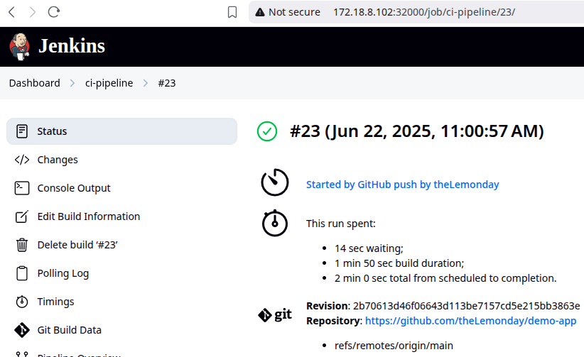
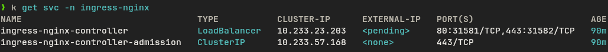

# Luong Nhat Hao phase 01 final report

## Deploy Kubernetes

Clone kubespray repository.

```bash
git clone https://github.com/kubernetes-sigs/kubespray.git
```

Inside this repository, create vagrant/config.rb file to override config for
Vagrantfile.

```rb
$instance_name_prefix = "vdt"
$num_instances = 2
$os = "ubuntu2404"
$vm_memory = 4096
$network_plugin = "calico"
$etcd_instances = 1
$control_plane_instances = 1
$kube_node_instances = 2
```

Create python virtual environment and install required packages.

```bash
python3 -m venv .venv
pip install -r requirements.txt
```

Spawn virtual machines using Vagrant with libvirt on Fedora.


Copy config file to use with `kubectl` installed on host machine.

```bash
cp .vagrant/provisioners/ansible/inventory/artifacts/admin.conf ~/.kube/config
```

Check nodes of K8s cluster.


## Deploy web application using DevOps tools & practices

### Install ArgoCD

```bash
kubectl create namespace argocd
kubectl apply -n argocd -f https://raw.githubusercontent.com/argoproj/argo-cd/stable/manifests/install.yaml
```

Change ArgoCD's service to NodePort type with value of 32001


Access ArgoCD from browser


### Install Jenkins

Manifest file to install Jenkins [jenkins/install.yaml](./jenkins/install.yaml)

Access Jenkins from browser


### Repositories

- [Web app repo](https://github.com/theLemonday/demo-app) Frontend (React) +
  Backend (Go)
  - Folder [helm](https://github.com/theLemonday/demo-app/tree/main/helm)
    contains Helm Chart to deploy app
- [Config repo](https://github.com/theLemonday/demo-app-values)
  - File
    [values.yaml](https://github.com/theLemonday/demo-app-values/blob/main/values.yaml)
    contains required config to run Helm Chart

Manifest for ArgoCD application [cd.yaml](./argocd/cd.yaml).


Install Jenkins' Kubernetes plugin and create new Kubernetes cloud.


In [jenkins.yaml](./jenkins/install.yaml), a ngrok instance is installed as a
sidecar container to expose jenkins' service for Github webhook.


Get the dns provided by ngrok.

```bash
kubectl exec -n devops-tools (k get deployments.apps -n devops-tools -o name) -c jenkins -- curl -s http:/127.0.0.1:4040/api/tunnels | jq '.tunnels[0].public_url'
```


Create Github webhook for Jenkins.


Check Github webhook deliveries


Create Github credentials.


Create credentials for Kaniko pod.

```bash
kubectl create secret docker-registry dockercred \
    --docker-server=https://index.docker.io/v1/ \
    --docker-username=<dockerhub-username> \
    --docker-password=<dockerhub-password>\
    --docker-email=<dockerhub-email>
```

Setup ci-pipeline on Jenkins.


Pipeline in Jenkins autostarted after received Github push



Jenkins' pipeline console output [log.txt](./jenkins/jenkins#23_log.txt)

CI pipeline stage view.


ArgoCD diff after a config change.


## Monitoring

Exporters:

- [nginx-exporter](https://github.com/nginx/nginx-prometheus-exporter)
- [client_golang](https://github.com/prometheus/client_golang)

Prometheus is installed on a virtual machine created by
[Vagrantfile](./monitor/Vagrantfile). [monitor](./monitor/) folder contains
playbook to install Prometheus on this machine.

Access Prometheus from browser.


Targets monitored by Prometheus.


## Logging

Kibana and Elastic search are installed on a virtual machine created by
[Vagrantfile](./logging/Vagrantfile). The directory [logging](./logging/)
contains Ansible playbook to deploy Kibana and Elastic search. Fluent bit is
installed with Helm. [fluent-bit-values.yaml](./logging/fluent-bit-values.yaml)
contains config for fluent bit chart, this file contains additional parsers,
inputs, outputs to parse log from frontend and backend.

Access Kibana from browser.


Query by path in Kibana. Paths without ips are logs from frontend, paths with
ips are logs from backend (redicted by frontend, which is served by nginx).


## Security

### HAProxy

Create a virtual machine with [Vagrantfile](./security/haproxy/Vagrantfile).
This machine has static ip: 172.18.8.1.132. Then install HAProxy package. Add
the configuration to /etc/haproxy/haproxy.cfg file.


Add fullstack-app.com and worker.com to /etc/hosts.


Access app from HAProxy.


### Nginx ingress

Install Nginx ingress controller (via Helm).

```bash
helm repo add ingress-nginx https://kubernetes.github.io/ingress-nginx
helm repo update
helm install ingress-nginx ingress-nginx/ingress-nginx \
  --namespace ingress-nginx --create-namespace
```

Create self-signed cert for my test domain.

```bash
openssl req -x509 -nodes -days 365 \
        -newkey rsa:2048 \
        -out tls.crt -keyout tls.key \
        -subj "/CN=fullstack-app.com/O=fullstack-org"
```

Create secret from this newly created cert.

```bash
kubectl create secret tls tls-secret --cert=tls.crt --key=tls.key
```

The [ingress.yaml](./security/ingress/ingress.yaml) specify 2 rules for
frontend(path: /) and backend(path: /backend) services.

Ingress service.



Access frontend from browser.


Access backend with curl.


### Authentication

List of system users.

| Username | Password  | Role  |
| -------- | --------- | ----- |
| admin    | adminpass | admin |
| user     | userpass  | user  |

#### Experiment 01

| Account   | Action         | Response  |
| --------- | -------------- | --------- |
| admin     | create 2 todos | success   |
| admin     | query todos    | success   |
| anonymous | query todos    | forbidden |


#### Experiment 02

| Account                       | Action      | Response  |
| ----------------------------- | ----------- | --------- |
| Anonymous                     | query todos | forbidden |
| user                          | query todos | success   |
| admin                         | delete      | success   |
| user                          | delete      | forbidden |
| anonymous (wrong credentials) | delete      | forbidden |


### Rate limit

[rate_limit.sh](./security/ratelimit/rate_limit.sh) tests the rate limit of
backend service. It sends 15 requests, the first 5 requests are all POST
requests, the next 10 requests are random between POST and GET method.


