# Báo cáo cuối kỳ chương trình VDT2025 - Cloud

## 1. Triển khai Kubernetes

Cụm Kubernetes được cài đặt bao gồm 1 node master và 2 node worker. 

* **Tài liệu cài đặt chi tiết:** [Kubernetes installation](https://www.notion.so/Kubernetes-installation-11b3061401cb80b3bf01cd017adf9069?source=copy_link)

* **Ảnh chụp Log của các lệnh kiểm tra hệ thống:**

    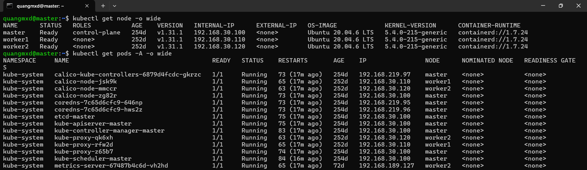

## 2. Triển khai web application sử dụng các DevOps tools

### 2.1. K8S Helm Chart 

#### Output 1:

* **File manifests sử dụng để triển khai ArgoCD lên K8S Cluster:** https://raw.githubusercontent.com/argoproj/argo-cd/stable/manifests/install.yaml

* **Ảnh chụp giao diện màn hình hệ thống ArgoCD khi truy cập qua trình duyệt:**

    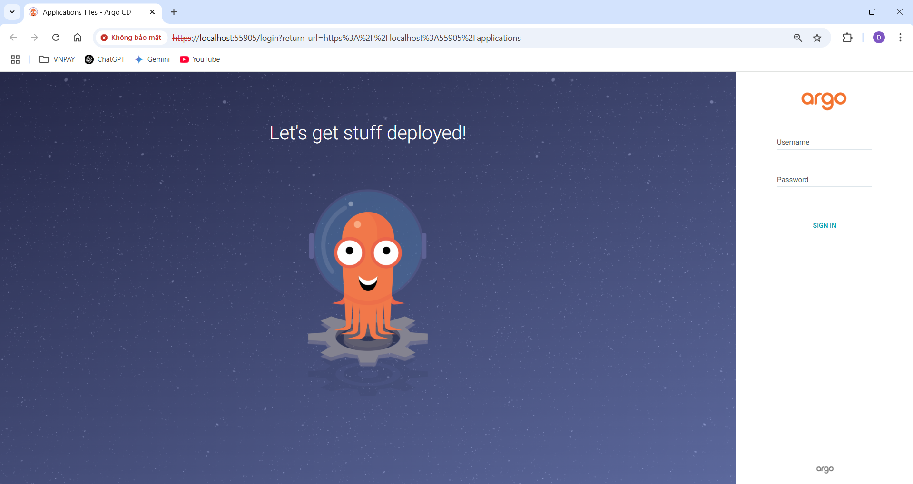

* **File manifests sử dụng để triển khai Jenkins lên K8S Cluster:** [jenkins.yaml](https://github.com/duyquang47/VDT2025/blob/main/manifest/jenkins.yaml)

* **Ảnh chụp giao diện màn hình hệ thống Jenkins khi truy cập qua trình duyệt:**
        
    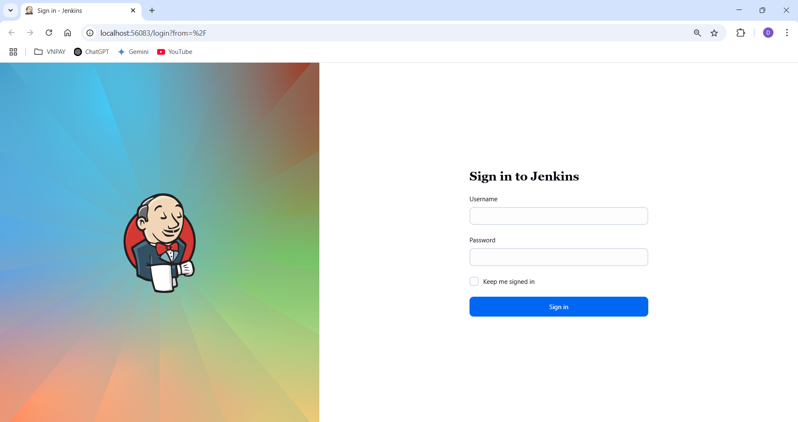

#### Output 2:

* **Các Helm Chart sử dụng để triển khai app lên K8S Cluster:** [helm-repo](https://github.com/duyquang47/VDT2025/tree/main/helm)

* **File cấu hình (values):** [values.yaml](https://github.com/duyquang47/VDT2025/blob/main/helm/values.yaml)

* **Manifest của ArgoCD Application:** [argo-deploy-app.yaml](https://github.com/duyquang47/VDT2025-CD/blob/main/manifest/argo-deploy-app-git.yaml)

* **Manifest định nghĩa ArgoCD Application:** [argo-app.yaml](https://github.com/duyquang47/VDT2025/blob/main/manifest/agro-app.yaml) 

* **Ảnh chụp giao diện màn hình hệ thống ArgoCD trên trình duyệt:**

    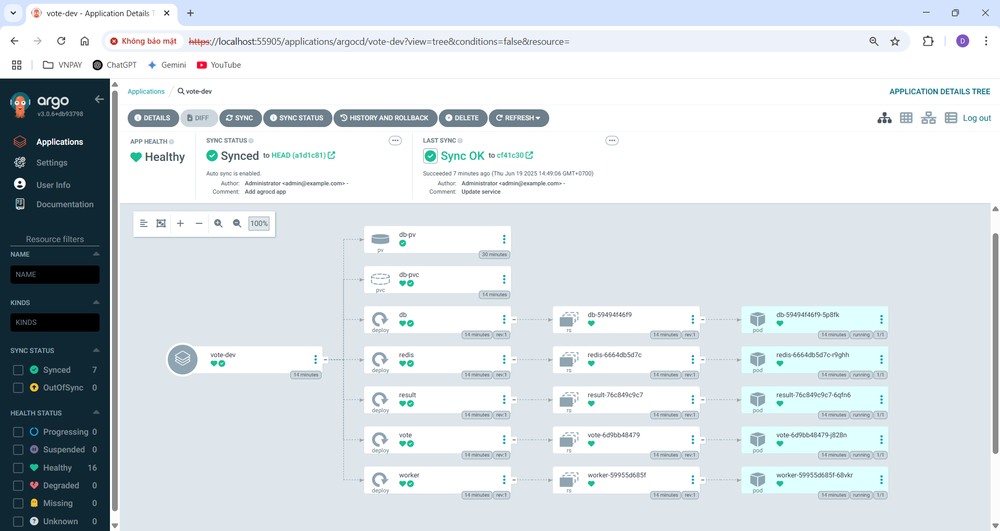

* **Ảnh chụp giao diện màn hình trình duyệt khi truy cập vào Web URL:**

    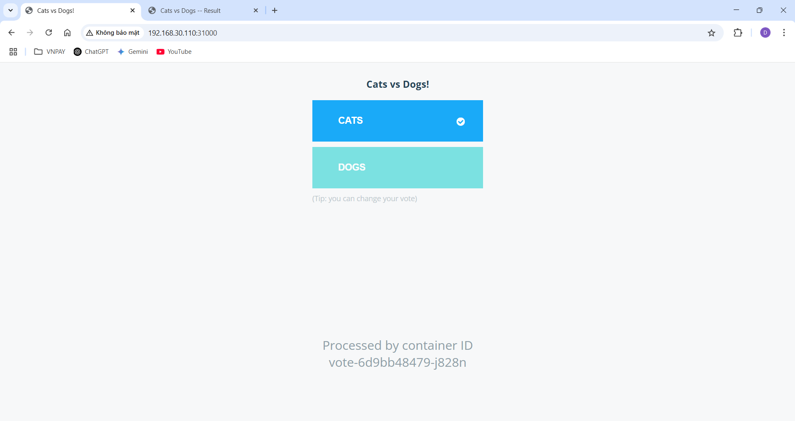

    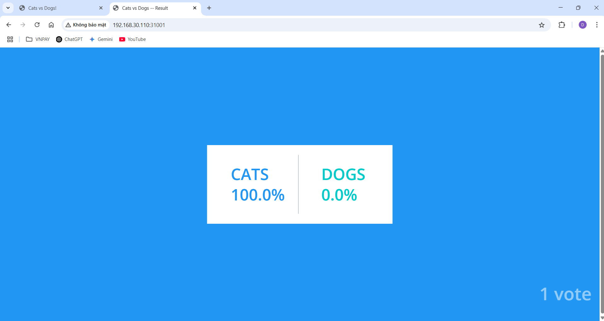

## 3. CICD

* **Các file setup công cụ của luồng CI/CD:** 

    * File manifest Pod thực hiện các job trong pipeline: [jenkins-job-pod.yaml](https://github.com/duyquang47/VDT2025-CI/blob/main/kaniko-pod.yaml)

    Manifest này định nghĩa Pod bao gổm 3 container với chức năng lần lượt:
    -  Container git: Clone, pull và push code từ remote repository.
    -  Container kaniko: Build và push image.
    -  Container yq: Chỉnh sửa file values.yaml của helm.

* **Jenkinsfile định nghĩa pipeline:** [Jenkinsfile](https://github.com/duyquang47/VDT2025-CI/blob/main/Jenkinsfile)

    Jenkinsfile này định nghĩa pipeline bao gồm các stage:
    - Checkout nhánh CI.
    - Lấy mã code của git commit.
    - Build và push image lên DockerHub.
    - Clone từ repo CD, update image với tag mới.
    - Push cập nhật ở values.yaml lên repo CD.

* **Output log của luồng CI/CD khi tạo tag mới trên repo app:** [jenkins-log.txt](https://github.com/duyquang47/VDT2025-CI/blob/main/jenkins-log)

* **Show log chứng minh jenkin đã chạy đúng:** 

    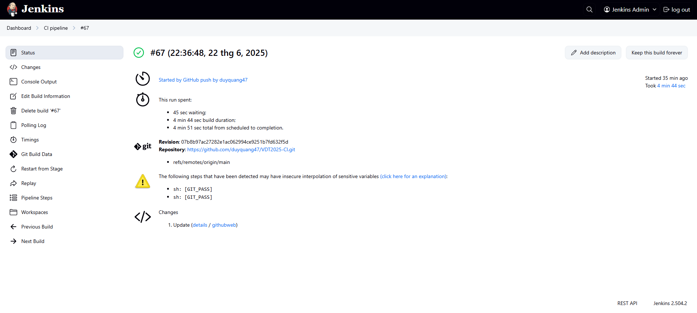

* **Ảnh luồng CI/CD chạy qua các stage trên giao diện Jenkins:**
    
    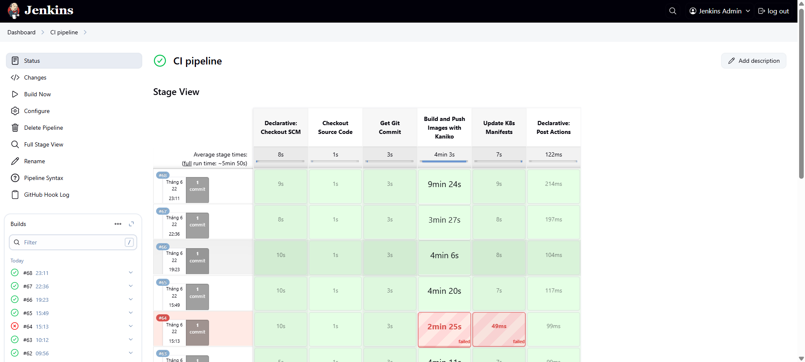

* **Hình ảnh diff khi ArgoCD phát hiện thay đổi ở config repo:**

    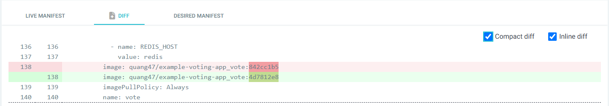

* **Hình ảnh vote app trước khi sửa đổi:**

    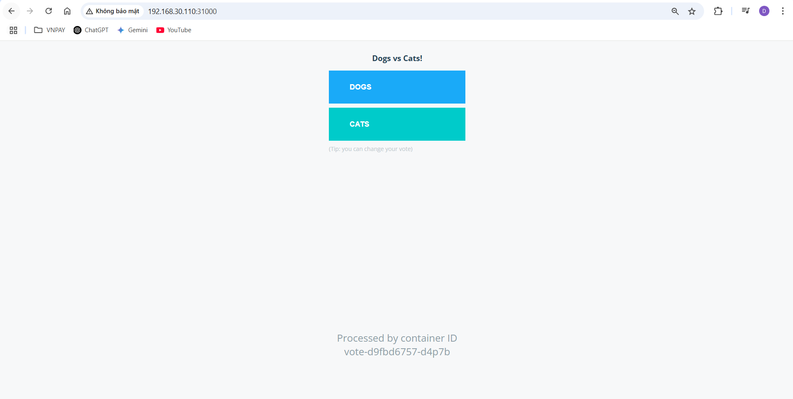

* **Hình ảnh vote app sau khi sửa đổi:**

    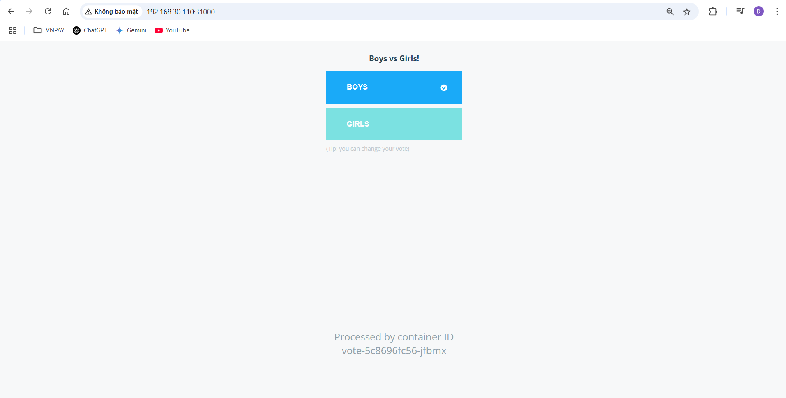

## 4. Monitoring

* **Các file setup để triển khai Prometheus:** 

    * Ansible playbook deploy Prometheus: [prometheus-deploy-playbook](https://github.com/duyquang47/VDT2025-CD/blob/main/manifest/deploy-prometheus.yaml)

    * Service monitor manifest thu thập metric từ app: [service-monitors.yaml](https://github.com/duyquang47/VDT2025-CD/blob/main/manifest/app-monitors.yaml)

* **Hình ảnh khi truy cập vào Prometheus UI thông qua trình duyệt:**

    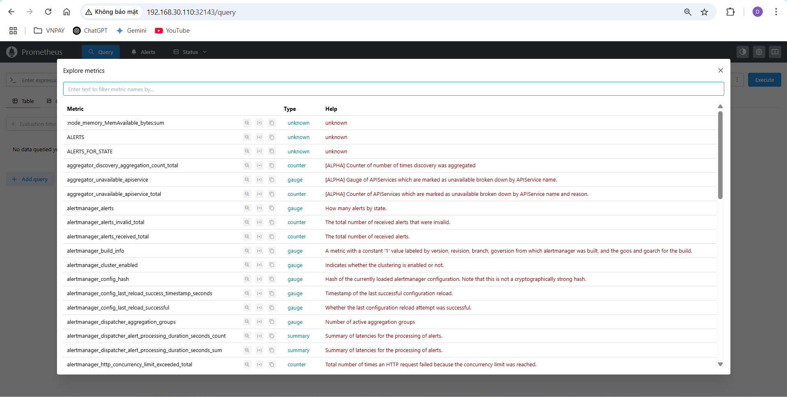

* **Hình ảnh danh sách target của App được giám sát bởi Prometheus:**

    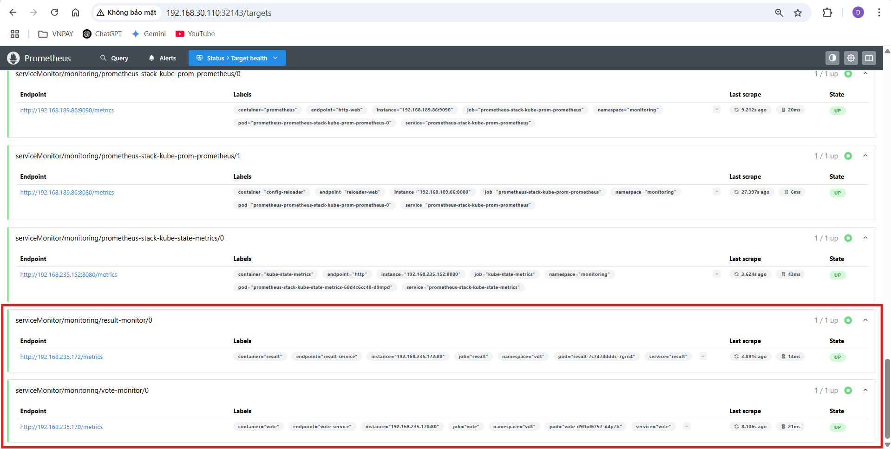

## 5. Logging

* **File ansible playbook cài EFK:** [efk-deploy-playbook](https://github.com/duyquang47/VDT2025-CD/blob/main/manifest/deploy-efk.yaml)

## 6. Security

#### Output 1: 

* **File cấu hình của HAProxy Loadbalancer cho App:** [haproxy.conf](https://github.com/duyquang47/VDT2025-CD/blob/main/manifest/haproxy.conf) 
 
* **File cấu hình Ingress:** [app-ingress.yaml](https://github.com/duyquang47/VDT2025-CD/blob/main/manifest/app-ingress.yaml)

* **Kết quả truy cập vào App từ trình duyệt thông qua giao thức https:** 

    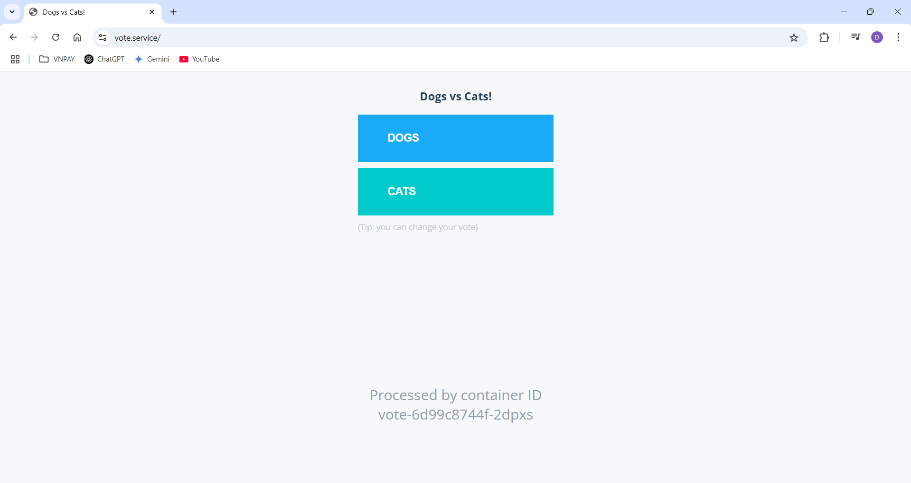

    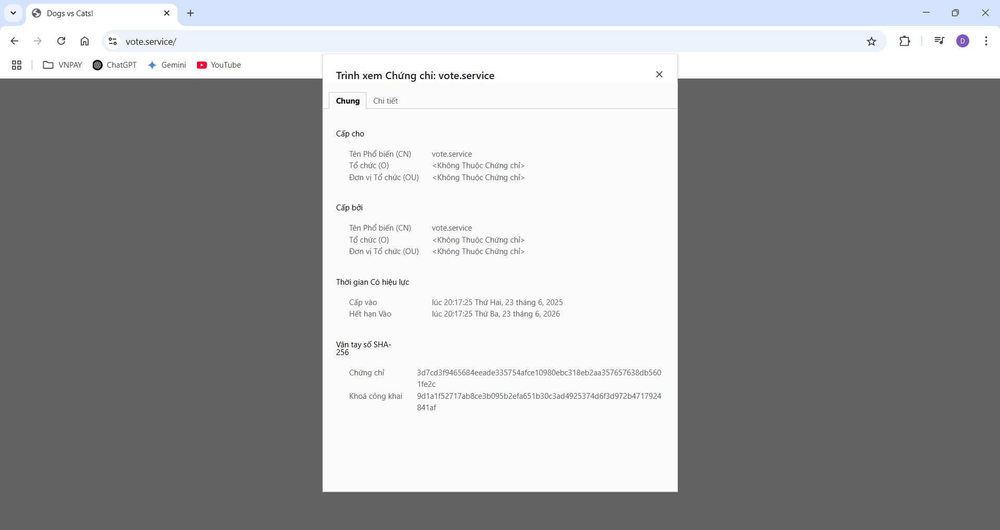