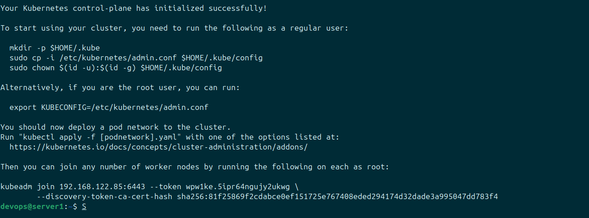
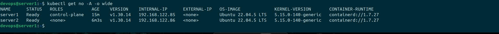

# Triển khai Kubernetes

## Yêu cầu:
### Triển khai được Kubernetes thông qua công cụ kubeadm hoặc kubespray lên 1 master node VM + 1 worker node VM

### Triển khai:
#### Chuẩn bị
- 2 VM có 4Gb ram, 2 core và 20 disk bộ nhớ

### Tiến hành cài đặt kubernetes trên Master và Worker
#### Các bước triển khai:
##### 1. Chuẩn bị cơ bản cho hệ thống
Cập nhật và nâng cấp hệ thống
```
sudo apt update -y && sudo apt upgrade -y
```
Tắt swap
```
sudo swapoff -a
sudo sed -i '/swap.img/s/^/#/' /etc/fstab
```
##### 2. Cấu hình Kernel module
```
# vi /etc/modules-load.d/containerd.conf
```
Viết vào trong file nội dung
```
overlay
br_netfilter
```
Nạp các module kernel
```
# sudo modprobe overlay
# sudo modprobe br_netfilter
```
##### 3. Cấu hình hệ thống mạng 
```
# echo "net.bridge.bridge-nf-call-ip6tables = 1" | sudo tee -a /etc/sysctl.d/kubernetes.conf
# echo "net.bridge.bridge-nf-call-iptables = 1" | sudo tee -a /etc/sysctl.d/kubernetes.conf
# echo "net.ipv4.ip_forward = 1" | sudo tee -a /etc/sysctl.d/kubernetes.conf
```
Sau đó áp dụng cấu hình
```
# sudo sysctl --system
```
##### 4. Cài đặt container runtime
Cài đặt các công cụ hỗ trợ
```
# sudo apt install -y curl gnupg2 software-properties-common apt-transport-https ca-certificates
# sudo curl -fsSL https://download.docker.com/linux/ubuntu/gpg | sudo gpg --dearmour -o /etc/apt/trusted.gpg.d/docker.gpg
# sudo add-apt-repository "deb [arch=amd64] https://download.docker.com/linux/ubuntu $(lsb_release -cs) stable"
```
Cài đặt containerd
```
# sudo apt update -y
# sudo apt install -y containerd.io
```
Cấu hình containerd
```
# containerd config default | sudo tee /etc/containerd/config.toml >/dev/null 2>&1
# sudo sed -i 's/SystemdCgroup = false/SystemdCgroup = true/g' /etc/containerd/config.toml
```
Kích hoạt containerd
```
# sudo systemctl restart containerd
# sudo systemctl enable containerd
```
##### 5. Cài đặt kubernetes
Thêm kho lưu trữ k8s
```
# echo "deb [signed-by=/etc/apt/keyrings/kubernetes-apt-keyring.gpg] https://pkgs.k8s.io/core:/stable:/v1.30/deb/ /" | sudo tee /etc/apt/sources.list.d/kubernetes.list
# curl -fsSL https://pkgs.k8s.io/core:/stable:/v1.30/deb/Release.key | sudo gpg --dearmor -o /etc/apt/keyrings/kubernetes-apt-keyring.gpg
```
Cài đặt k8s và hold lại phiên bản
```
# sudo apt update -y
# sudo apt install -y kubelet kubeadm kubectl
# sudo apt-mark hold kubelet kubeadm kubectl
```

### Cấu hình mô hình 1 Master + 1 Worker
**Trên k8s master, thực hiện init**
```
# sudo kubeadm init
```
Kết quả

Cấu hình quyền truy cập cho k8s master
```
# mkdir -p $HOME/.kube
# sudo cp -i /etc/kubernetes/admin.conf $HOME/.kube/config
# sudo chown $(id -u):$(id -g) $HOME/.kube/config
```

 **Trên node worker tiến hành join vào cụm**
 ```
 kubeadm join 192.168.122.85:6443 --token wpw1ke.5ipr64ngujy2ukwg \
	--discovery-token-ca-cert-hash sha256:81f25869f2cdabce0ef151725e767408eded294174d32dade3a995047dd783f4 
 ```
 **Triển khai plugin mạng cho cụm**
 Ở đây ta sử dụng Calico để các Pod và Node có thể giao tiếp với nhau
```
kubectl apply -f https://raw.githubusercontent.com/projectcalico/calico/v3.25.0/manifests/calico.yaml
```

#### Kết quả triển khai
Kiểm tra hệ thống 
```
kubectl get no -A -o wide
```



