# Triển khai web application sử dụng các DevOps tools & practices

# Yêu cầu 1
- Cài đặt ArgoCD lên Kubernetes Cluster, expose được ArgoCD qua NodePort
- Cài đặt Jenkins lên Kubernetes Cluster, expose được Jenkins qua NodePort
# Output 1
- File manifests sử dụng để triển khai ArgoCD lên K8S Cluster
- Ảnh chụp giao diện màn hình hệ thống ArgoCD khi truy cập qua trình duyệt trình duyệt
- File manifests sử dụng để triển khai Jenkins lên K8S Cluster
- Ảnh chụp giao diện màn hình hệ thống Jenkins khi truy cập qua trình duyệt trình duyệt

[Tài liệu cài đặt argoCD](https://argo-cd.readthedocs.io/en/stable/#quick-start)
### Cài đặt ArgoCD
File manifest được cung cấp bởi ArgoCD
*[File manifest](https://raw.githubusercontent.com/argoproj/argo-cd/stable/manifests/install.yaml)*

Tạo namespace
```
kubectl create namespace argocd
```
Apply file manifest
```
kubectl apply -n argocd -f https://raw.githubusercontent.com/argoproj/argo-cd/stable/manifests/install.yaml
```
Kết quả
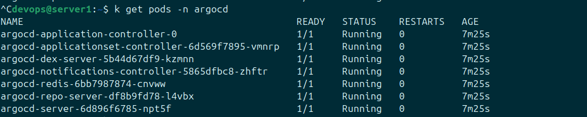

*Mặc định argoCD chỉ tạo sẵn các clusterIP*
Vì vậy ta cần expose argoCD ra ngoài bằng NodePort

File manifest
```
apiVersion: v1
kind: Service
metadata:
  name: argocd-nodeport
  namespace: argocd
spec:
  type: NodePort
  ports:
    - port: 80
      targetPort: 8080
      nodePort: 30001
  selector:
    app.kubernetes.io/name: argocd-server
```
Apply bằng câu lệnh
```
kubectl apply -f argoCD.yaml
```
Kết quả
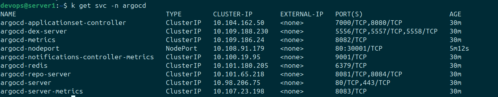

## Hình ảnh giao diện của argoCD khi truy cập qua trình duyệt
*Truy cập vào "https:IP_Node:NodePort"*

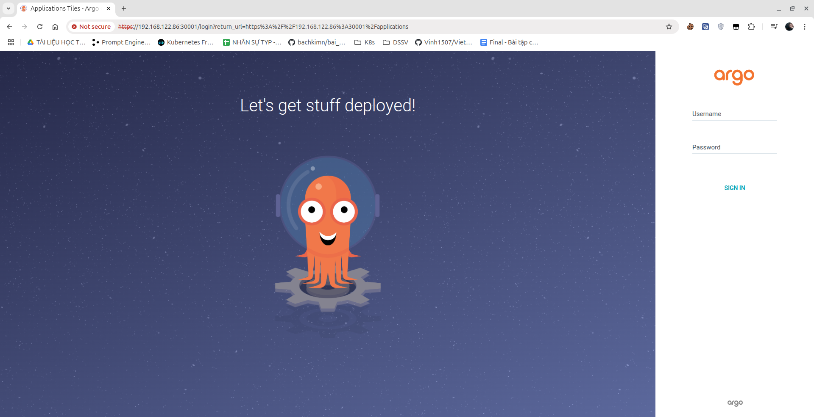

Mặc định ArgoCD cung cấp 1 user với:
- username: admin
- password lấy bằng cách chạy câu lệnh sau
```
kubectl -n argocd get secret argocd-initial-admin-secret -o jsonpath="{.data.password}" | base64 -d
```
Hình ảnh giao diện sau login
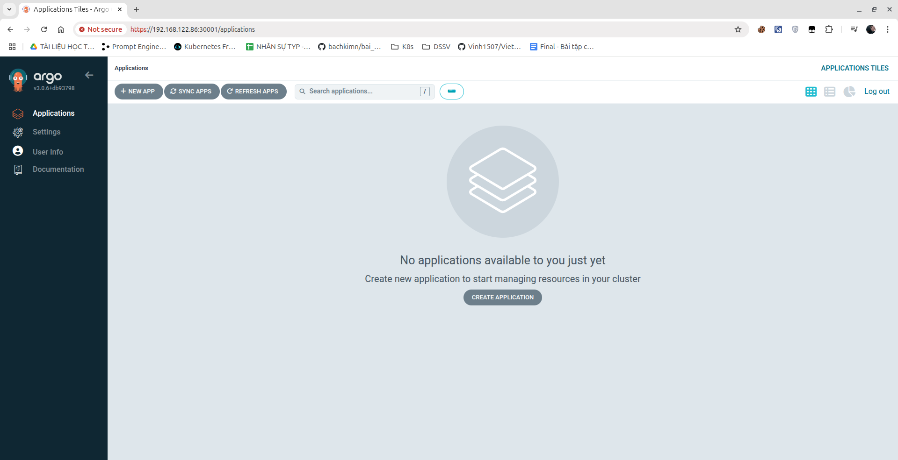

### Cài đặt Jenkins
Vì jenkins yêu cầu 1 PVC, vì vậy ta sẽ chuẩn bị thêm 1 VM để tạo PV dạng NFS-Storage
**Trên VM mới**
```
# sudo apt install nfs-server -y
# sudo mkdir /data
# sudo chown -R nobody:nogroup /data
# sudo chmod -R 777 /data
# sudo vi /etc/exports
/data *(rw,sync,no_subtree_check)
# sudo exportfs -rav
# sudo systemctl restart nfs-server
```
**Trên cả cụm k8s**
Cài NFS common
```
# sudo apt install nfs-common -y
```
**Trên Master**
Tiến hành tạo PV
```
apiVersion: v1
kind: PersistentVolume
metadata:
  name: nfs-pv
spec:
  capacity:
    storage: 8Gi
  accessModes:
    - ReadWriteMany
  nfs:
    path: /data
    server: 192.168.122.87
  persistentVolumeReclaimPolicy: Retain
  storageClassName: nfs-storage
```
Kết quả
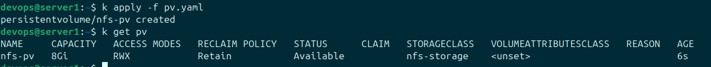

Tạo PVC cho Jenkins
- Tạo namespace jenkins
```
kubectl create namespace jenkins
```
- Tạo PVC
```
apiVersion: v1
kind: PersistentVolumeClaim
metadata:
  name: jenkins-pvc
  namespace: jenkins
spec:
  accessModes:
    - ReadWriteMany
  resources:
    requests:
      storage: 5Gi
  storageClassName: standard
```
Kết quả
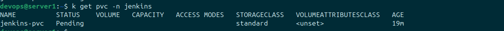


Tiến hành cài đặt helm
```curl https://baltocdn.com/helm/signing.asc | gpg --dearmor | sudo tee /usr/share/keyrings/helm.gpg > /dev/null
sudo apt-get install apt-transport-https --yes
echo "deb [arch=$(dpkg --print-architecture) signed-by=/usr/share/keyrings/helm.gpg] https://baltocdn.com/helm/stable/debian/ all main" | sudo tee /etc/apt/sources.list.d/helm-stable-debian.list
sudo apt-get update
sudo apt-get install helm
```

Thêm repo jenkin
```
helm repo add jenkinsci https://charts.jenkins.io
helm repo update
```

Customize helm chart để sử dụng PVC đã có
Tạo file values.yaml ghi đè cấu hình sẵn 
```
persistence:
  enabled: true
  existingClaim: jenkins-pvc
  storageClass: nfs-storage
```
Cài đặt Jenkins
```
helm install jenkins jenkins/jenkins --namespace jenkins -f values.yaml
```
Tiến hành expose NodePort của jenkins
File manifest [jenkins.yaml](manifests/jenkins.yaml)
```
apiVersion: v1
kind: Service
metadata:
  name: jenkins-nodeport
  namespace: jenkins
spec:
  type: NodePort
  ports:
    - port: 8080
      targetPort: 8080
      nodePort: 30002
  selector:
    app.kubernetes.io/instance: jenkins
```
Apply
```
kubectl apply -f jenkins.yaml
```
Kết quả
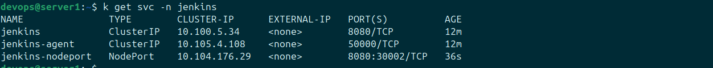

### Hình ảnh trên trình duyệt
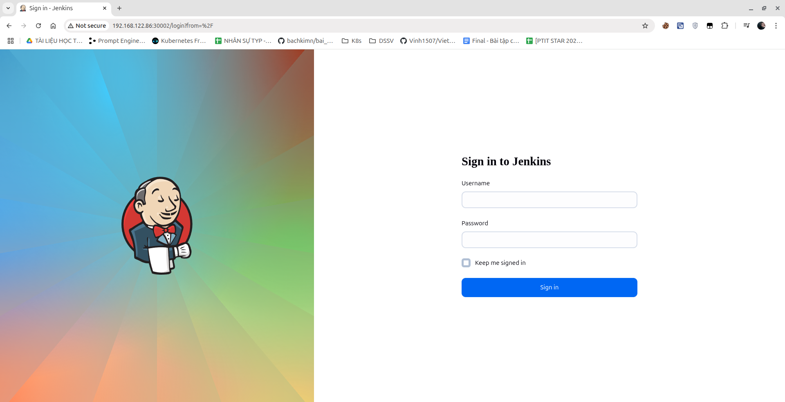

Username: admin
Password được lấy bằng câu lệnh dưới đây
```
kubectl exec --namespace jenkins -it svc/jenkins -c jenkins -- /bin/cat /run/secrets/additional/chart-admin-password && echo
```
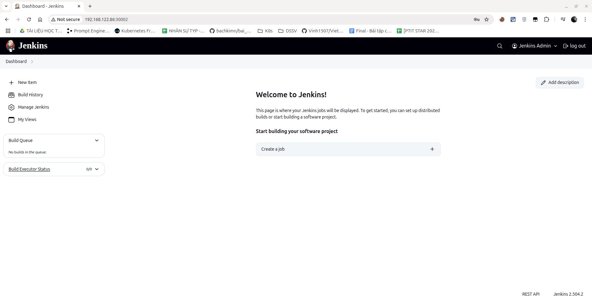

# Yêu cầu 2
- Viết hoặc tìm mẫu Helm Chart cho app bất kỳ, để vào 1 folder riêng trong repo app
- Tạo Repo Config cho app trên, trong repo này chứa các file values.yaml với nội dung của các file values.yaml là các config cần thiết để chạy ứng dụng trên k8s bằng Helm Chart 
# Output 2
- Các Helm Chart sử dụng để triển khai app lên K8S Cluster 
- Các file values.yaml trong config repo của app
- Manifest của ArgoCD Application
- Ảnh chụp giao diện màn hình hệ thống ArgoCD trên trình duyệt
- Ảnh chụp giao diện màn hình trình duyệt khi truy cập vào Web URL, API URL
### Các bước triển khai
**Triển khai database lên cụm k8s**
Trước tiên ta cần lặp lại các bước export NFS-Storage ở trên Server Storage để tạo PV cho MySQL
```
sudo mkdir /mysql
sudo chown -R nobody:nogroup /mysql
sudo chmod -R 777 /mysql
sudo vi /etc/exports
/mysql  *(rw,sync,no_subtree_check,no_root_squash)
sudo exportfs -rav
```
Trên Node Master, tạo file manifest mysql.yaml
```
---
apiVersion: v1
kind: PersistentVolume
metadata:
  name: mysql-nfs-pv
spec:
  capacity:
    storage: 8Gi
  accessModes:
    - ReadWriteMany
  storageClassName: nfs-storage
  persistentVolumeReclaimPolicy: Retain
  nfs:
    server: 192.168.122.87
    path: /mysql
---
apiVersion: v1
kind: PersistentVolumeClaim
metadata:
  name: mysql-nfs-pvc
  namespace: default
spec:
  accessModes:
    - ReadWriteMany
  resources:
    requests:
      storage: 8Gi
  storageClassName: nfs-storage
---
apiVersion: apps/v1
kind: Deployment
metadata:
  name: mysql
  labels:
    app: mysql
spec:
  replicas: 1
  selector:
    matchLabels:
      app: mysql
  template:
    metadata:
      labels:
        app: mysql
    spec:
      containers:
      - name: mysql
        image: mysql:8.0
        env:
          - name: MYSQL_ROOT_PASSWORD
            value: "hoa0976271476"
        ports:
          - name: mysql
            containerPort: 3306
        volumeMounts:
          - name: mysql-storage
            mountPath: /var/lib/mysql
      volumes:
        - name: mysql-storage
          persistentVolumeClaim:
            claimName: mysql-nfs-pvc
---
apiVersion: v1
kind: Service
metadata:
  name: mysql
  labels:
    app: mysql
spec:
  type: ClusterIP
  selector:
    app: mysql
  ports:
    - name: mysql
      port: 3306
      targetPort: 3306
```
Sau đó import database.sql vào trong container mysql
```
kubectl exec -i mysql-7cff8f66f9-bhsrs -- \
  mysql -u root -phoa0976271476 < ./database.sql
```

**Triển khai api và webservice**
### Frontend
Helm Chart nằm trong thư mục Helm của repo
[Repo Frontend](https://github.com/hoango277/vdt-frontend)
[Repo Config Frontend](https://github.com/hoango277/vdt-config-frontend)
### API
Helm Chart nằm trong thư mục Helm của repo
[Repo API](https://github.com/hoango277/vdt-api)
[Repo Config API](https://github.com/hoango277/vdt-config-api)

### Triển khai lên k8s 
File Manifest triển khai Frontend
```
apiVersion: argoproj.io/v1alpha1
kind: Application
metadata:
  name: vdt-frontend
  namespace: argocd
spec:
  project: default
  sources:
  - repoURL: https://github.com/hoango277/vdt-frontend
    path: helm
    targetRevision: HEAD
    helm:
      valueFiles:
        - values.yaml           
        - $values/values.yaml   
  - repoURL: https://github.com/hoango277/vdt-config-frontend
    targetRevision: HEAD
    ref: values
  destination:
    server: 'https://kubernetes.default.svc'
    namespace: default
  syncPolicy:
    syncOptions:
    - CreateNamespace=true
    automated:
      prune: true
      selfHeal: true
```
File manifest triển khai API
```
apiVersion: argoproj.io/v1alpha1
kind: Application
metadata:
  name: vdt-api
  namespace: argocd
spec:
  project: default
  sources:
  - repoURL: https://github.com/hoango277/vdt-api
    path: helm
    targetRevision: HEAD
    helm:
      valueFiles:
        - values.yaml           
        - $values/values.yaml   
  - repoURL: https://github.com/hoango277/vdt-config-api
    targetRevision: HEAD
    ref: values
  destination:
    server: 'https://kubernetes.default.svc'
    namespace: default
  syncPolicy:
    syncOptions:
    - CreateNamespace=true
    automated:
      prune: true
      selfHeal: true
```
Sử dụng lệnh
```
kubectl apply -f frontend_manifest_helm.yaml
```

#### Kết quả
Hình ảnh trên argoCD sau khi triển khai
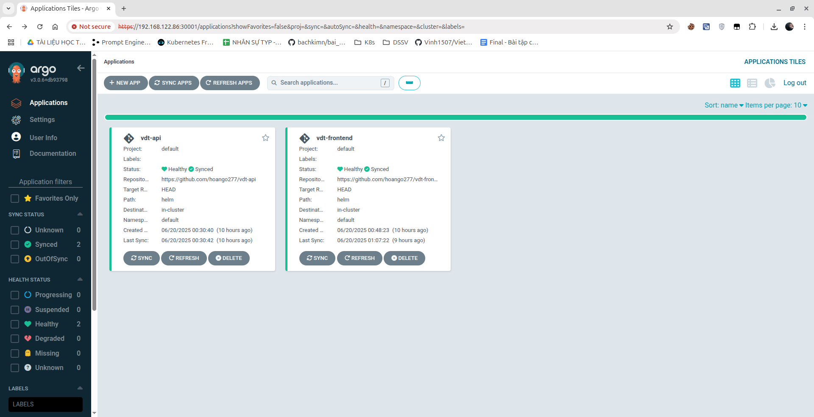
##### Web Service
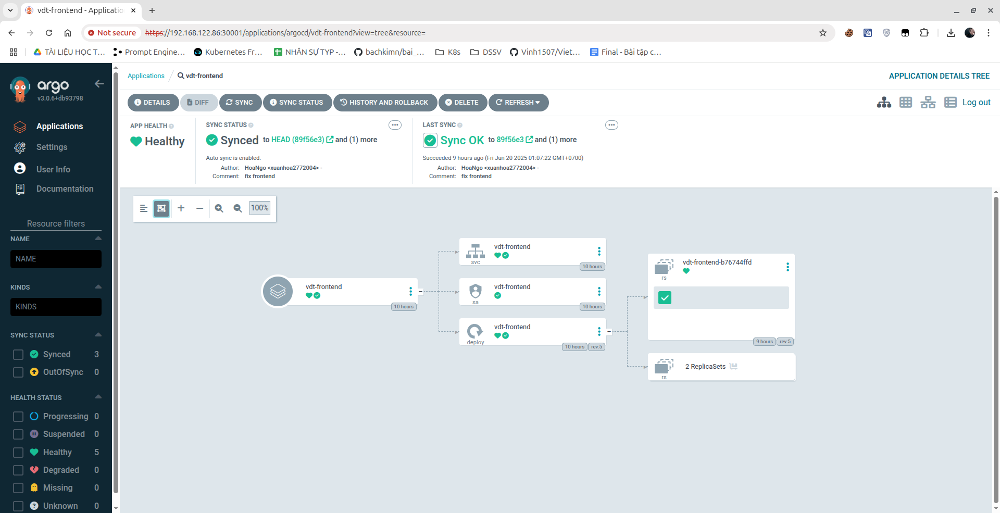
##### API Service
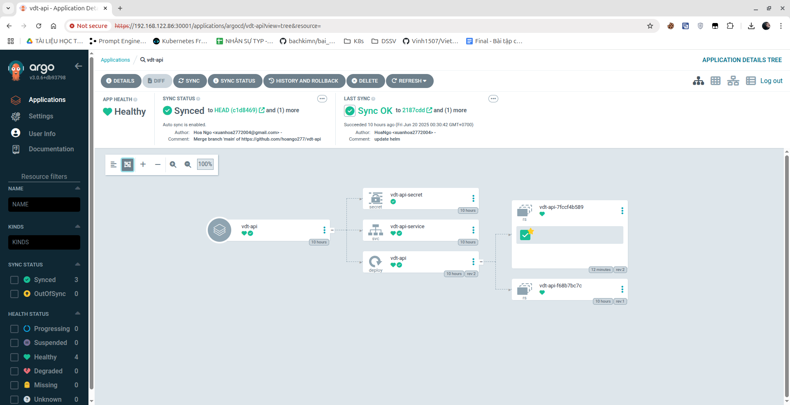
Giao diện ứng dụng trên trình duyệt
##### Web UI
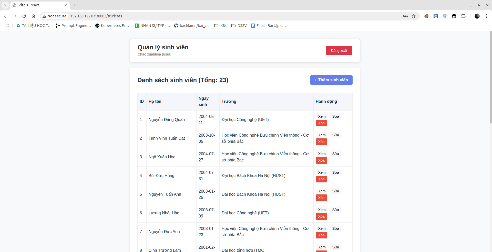
##### API DOCS UI
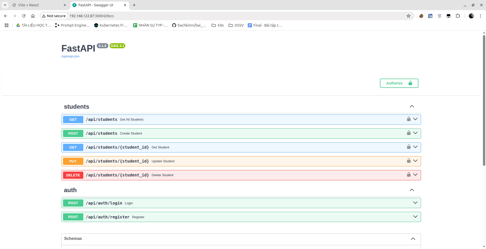


