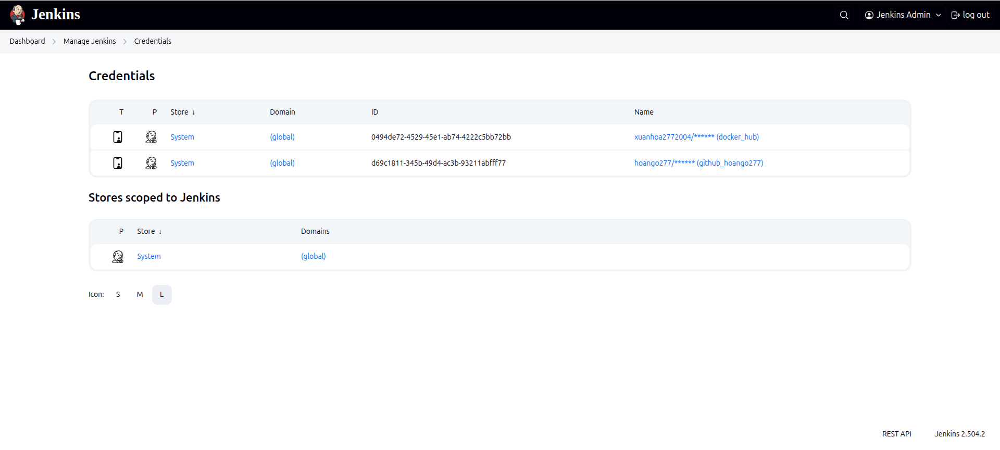
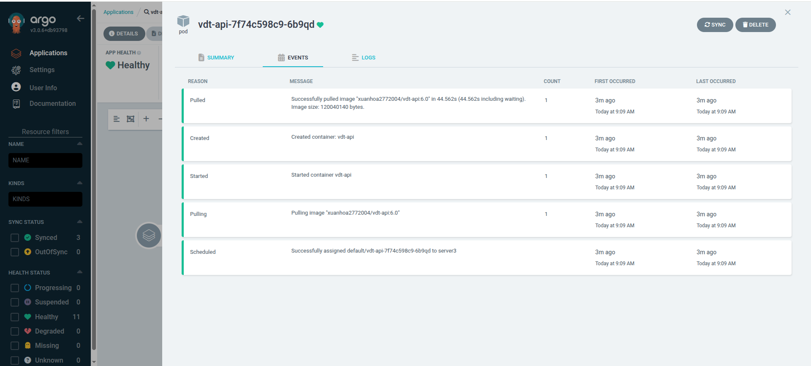

# CI/CD
# Yêu cầu
- Viết 1 luồng CI/CD cho app, khi có thay đổi từ source code, 1 tag mới được tạo ra trên trên repo này thì luồng CI/CD tương ứng của repo đó thực hiện các công việc sau:
    - Sửa code trong source code
    - Thực hiện build source code trên jenkin bằng docker với image tag là tag name đã được tạo ra trên gitlab/github và push docker image sau khi build xong lên Docker Hub
    - Sửa giá trị Image version trong file values.yaml  trong config repo và push thay đổi lên config repo. 
    - Cấu hình ArgoCD tự động triển khai lại web Deployment và api Deployment khi có sự thay đổi trên config repo.
# Output 

### Setup Jenkins
#### Setup credential cho docker-hub và github

#### Setup WebHook trigger cho Jenkins
Cài plugin

Trên vm worker cài đặt ngrok và forward 
```
sudo snap install ngrok
```
```
ngrok http 192.168.122.86:30002
```

### CI/CD cho API Service
Setup Web Hook trên Github


Setup Pipeline


Setup secret để kaniko có thể push được images lên dockerhub
```
kubectl create secret docker-registry dockerhub-secret \
  --docker-server=https://index.docker.io/v1/ \
  --docker-username=xuanhoa2772004 \
// thêm secret vào dòng này
  --docker-email=xuanhoa2772004 \
  -n jenkins
```
[Jenkins File cho API](https://github.com/hoango277/vdt-api/blob/main/Jenkinsfile)
Thực hiện commit

Github gửi 1 HTTP Post tới Jenkins

Hình ảnh pipeline được kích hoạt và chạy thành công

Hình ảnh docker-hub

Hình ảnh repo vdt-api-config

File manifest auto-sync
```
project: default
destination:
  server: https://kubernetes.default.svc
  namespace: default
syncPolicy:
  automated:
    prune: true
    selfHeal: true
  syncOptions:
    - CreateNamespace=true
sources:
  - repoURL: https://github.com/hoango277/vdt-api
    path: helm
    targetRevision: HEAD
    helm:
      valueFiles:
        - values.yaml
        - $values/values.yaml
  - repoURL: https://github.com/hoango277/vdt-config-api
    targetRevision: HEAD
    ref: values

```
Hình ảnh logs

Hình ảnh argoCD UI

Hình ảnh argoCD đã update lên version mới


Chi tiết logs nằm trong file<br>
[File](logs/#16.txt)<br>
Giao diện API Docs của FastAPI sau khi được deploy thành công


#### Test trường hợp không phải là 1 tags
Tiến hành commit

Tương tự github sẽ bắn sự kiện về Jenkins

Pipeline được kích hoạt, fail ở stage check tag on commit

Logs

### CI/CD cho Frontend Service
Set up jenkins pipeline

Set up webhook cho Jenkins 

Jenkins File cho Frontend Service
[File](https://github.com/hoango277/vdt-frontend/blob/main/Jenkinsfile)
Tiến hành commit 

Github gửi 1 HTTP Post

Pipeline được kích hoạt và chạy thành công

[Chi tiết logs](logs/#2.txt)
Hình ảnh dockerhub

Hình ảnh thay đổi của git vdt-config-frontend

File manifest tự động sync khi có thay đổi
```
project: default
destination:
  server: https://kubernetes.default.svc
  namespace: default
syncPolicy:
  automated:
    prune: true
    selfHeal: true
  syncOptions:
    - CreateNamespace=true
sources:
  - repoURL: https://github.com/hoango277/vdt-frontend
    path: helm
    targetRevision: HEAD
    helm:
      valueFiles:
        - values.yaml
        - $values/values.yaml
  - repoURL: https://github.com/hoango277/vdt-config-frontend
    targetRevision: HEAD
    ref: values
```
Hình ảnh logs

ArgoCD tự động sync và deploy lên version mới 

Hình ảnh logs được update lên version mới

Hình ảnh trên trình duyệt

