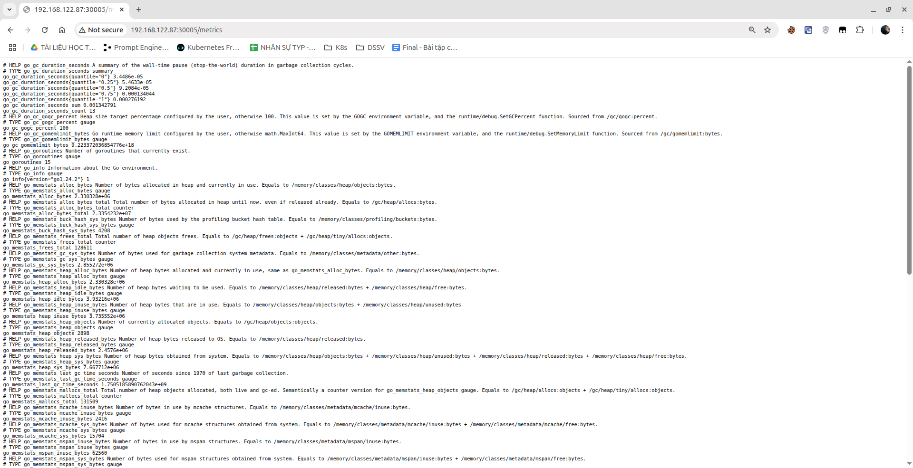
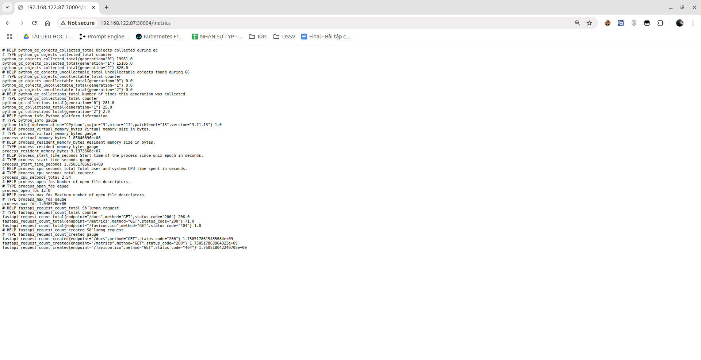
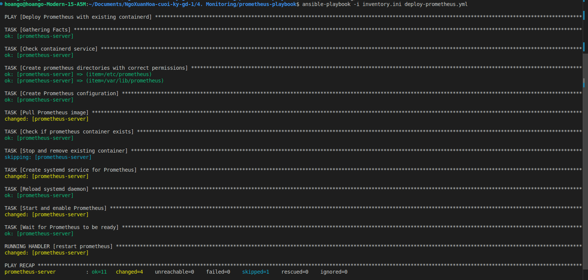
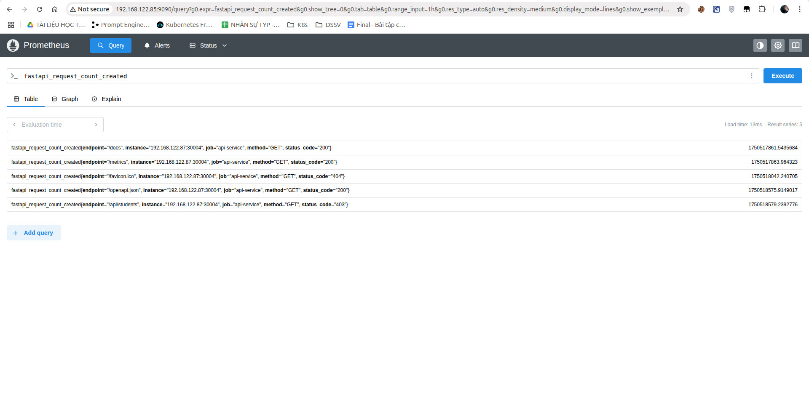
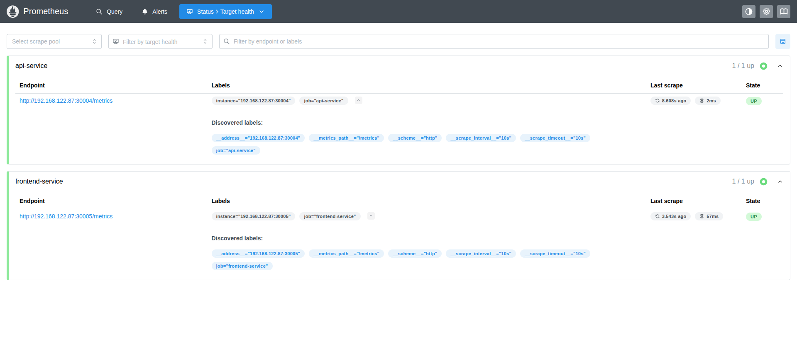

# Monitoring
# Yêu cầu
- Expose metric của app ra 1 http path. Tham khảo:
https://github.com/korfuri/django-prometheus
- Sử dụng ansible playbooks để triển khai container Prometheus server. Sau đó cấu hình prometheus add target giám sát các metrics đã expose ở trên.
# Output
#### Export metrics của Web Service bằng Nginx Prometheus Exporter
Sửa file default.conf của nginx để expose built-in metrics ra /metrics
```
server {
    listen       80;
    server_name  localhost;

    location / {
        root   /usr/share/nginx/html;
        index  index.html index.htm;
    }
    location /metrics {
        stub_status;
    }
}
```
Tuy nhiên định dạng này Prometheus không thể đọc, vì vậy ta cần Nginx Prometheus Exporter vào trong cùng pods<br>
Sửa file [Deployment.yaml](https://github.com/hoango277/vdt-frontend/blob/main/helm/templates/deployment.yaml) trong repo vdt-frontend
```
- name: nginx-prometheus-exporter
          image: nginx/nginx-prometheus-exporter:latest
          args:
            - -nginx.scrape-uri=http://127.0.0.1:8080/metrics
          ports:
            - name: metrics
              containerPort: 9113
          resources:
            requests:
              memory: "32Mi"
              cpu: "10m"
            limits:
              memory: "128Mi"
              cpu: "50m"
```
Sau đó ta cần expose port ra ngoài để Prometheus có thể giám sát metrics<br>
Sửa file [service.yaml](https://github.com/hoango277/vdt-frontend/blob/main/helm/templates/service.yaml) trong repo vdt-frontend<br>
Thêm nodePort : 30005
```
apiVersion: v1
kind: Service
metadata:
  name: {{ include "vdt-frontend.fullname" . }}
spec:
  type: {{ .Values.service.type }}
  ports:
    - name: http
      port: {{ .Values.service.port }}
      targetPort: {{ .Values.service.targetPort }}
      nodePort: {{ .Values.service.nodePort }}
    - name: metrics
      port: 9113
      targetPort: 9113
      nodePort: 30005
  selector:
    {{- include "vdt-frontend.selectorLabels" . | nindent 4 }} 
```
Kết quả

#### Expose metrics của API Service
Đối với API Service, FastAPI hỗ trợ thư viện prometheus_client, vậy nên ta chỉ cần cài đặt và định nghĩa các metrics mong muốn
```
app = FastAPI()

REQUEST_COUNTER = Counter(
    "fastapi_request_count",
    "Số lượng request",
    ["method", "endpoint", "status_code"]
)

class MetricsMiddleware(BaseHTTPMiddleware):
    async def dispatch(self, request: Request, call_next):
        response = await call_next(request)
        REQUEST_COUNTER.labels(
            method=request.method,
            endpoint=request.url.path,
            status_code=response.status_code
        ).inc()
        return response

app.add_middleware(MetricsMiddleware)

@app.get("/metrics")
def metrics():
    return Response(generate_latest(), media_type=CONTENT_TYPE_LATEST)
```
Kết quả

#### Cài đặt Prometheus để giám sát với Ansible playbook
Toàn bộ file nằm trong thư mục [prometheus-playbook](./prometheus-playbook/)<br>
[File Inventory](./prometheus-playbook/inventory.ini)<br>
[File Ansible Playbook](./prometheus-playbook/deploy-prometheus.yml)<br>
[File định nghĩa các Job của Prometheus](./prometheus-playbook/templates/prometheus.yml.j2)<br>
[File chạy Prometheus Container bằng Containerd](./prometheus-playbook/templates/prometheus.service.j2)<br>
Chạy playbook

Giao diện Prometheus

Hình ảnh các target của Prometheus đang giám sát


