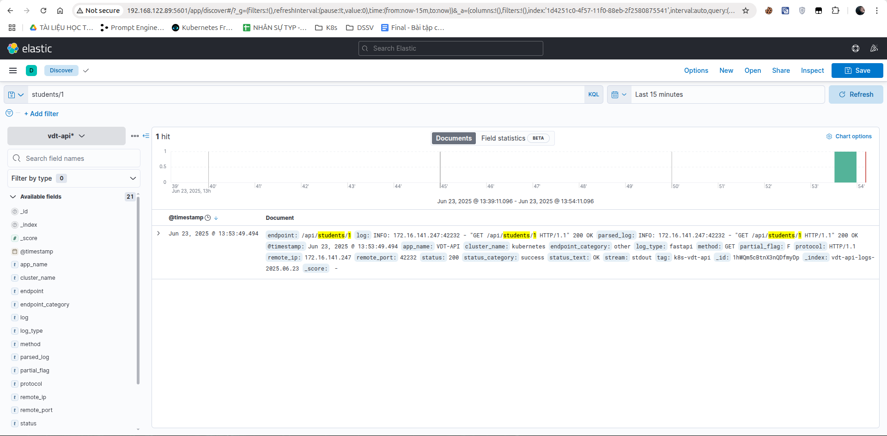

# Yêu cầu
- Sử dụng ansible playbooks để triển khai stack EFK (elasticsearch, fluentd, kibana), sau đó cấu hình logging cho web service và api service, đảm bảo khi có http request gửi vào web service hoặc api service thì trong các log mà các service này sinh ra, có ít nhất 1 log có các thông tin
# Output
[Toàn bộ file ansible-playbook](Ansible)
Hình ảnh chạy ansible-playbook

#### Mô tả triển khai
#### Lưu ý:
- Để Fluentd tương thích với ElasticSearch và Kibana, ta cần cài chính xác 3 bản
    - fluent/fluentd-kubernetes-daemonset:v1.16.2-debian-elasticsearch8-1.1
    - ElasticSearch 8.1.1
    - Kibana 8.1.1
##### Triển khai Docker Compose Elastic Search và Kibana lên máy 192.168.122.89
```
- name: Deploy Elasticsearch and Kibana
  hosts: elasticsearch
  become: yes
  tags: 
    - elasticsearch
    - elk
  vars:
    elasticsearch_version: "8.1.1"
    kibana_version: "8.1.1"
  tasks:
    - name: Install Docker
      apt:
        name:
          - docker.io
          - docker-compose
        state: present
        update_cache: yes

    - name: Start and enable Docker
      systemd:
        name: docker
        state: started
        enabled: yes

    - name: Add user to docker group
      user:
        name: "{{ ansible_user }}"
        groups: docker
        append: yes

    - name: Create elasticsearch directory
      file:
        path: /opt/elasticsearch
        state: directory
        mode: '0755'

    - name: Copy docker-compose file for ELK stack
      template:
        src: docker-compose.yml.j2
        dest: /opt/elasticsearch/docker-compose.yml
        mode: '0644'

    - name: Create .env file for elasticsearch
      template:
        src: env.j2
        dest: /opt/elasticsearch/.env
        mode: '0644'

    - name: Start ELK stack
      community.docker.docker_compose_v2:
        project_src: /opt/elasticsearch
        state: present
```
##### Tạo config cho Fluentd
```
<source>
  @type tail
  @id in_tail_vdt_api
  path /var/log/containers/vdt-api-*.log
  pos_file /var/log/fluentd-vdt-api.log.pos
  tag k8s-vdt-api
  read_from_head true
  <parse>
    @type regexp
    expression /^(?<time>\d{4}-\d{2}-\d{2}T\d{2}:\d{2}:\d{2}\.\d+Z) (?<stream>stdout|stderr) (?<partial_flag>\w) (?<log>.*)$/
    time_key time
    time_format %Y-%m-%dT%H:%M:%S.%NZ
  </parse>
</source>


<source>
  @type tail
  @id in_tail_vdt_frontend
  path /var/log/containers/vdt-frontend-*.log
  pos_file /var/log/fluentd-vdt-frontend.log.pos
  tag k8s-vdt-frontend
  read_from_head true
  <parse>
    @type regexp
    expression /^(?<time>\d{4}-\d{2}-\d{2}T\d{2}:\d{2}:\d{2}\.\d+Z) (?<stream>stdout|stderr) (?<partial_flag>\w) (?<log>.*)$/
    time_key time
    time_format %Y-%m-%dT%H:%M:%S.%NZ
  </parse>
</source>


<filter k8s-vdt-api>
  @type parser
  key_name log
  reserve_data true
  remove_key_name_field false
  emit_invalid_record_to_error false
  <parse>
    @type regexp
    expression /^INFO:\s+(?<remote_ip>\d+\.\d+\.\d+\.\d+):(?<remote_port>\d+) - "(?<method>\w+) (?<endpoint>[^"]*) (?<protocol>[^"]*)" (?<status>\d+) (?<status_text>\w+)$/
  </parse>
</filter>


<filter k8s-vdt-api>
  @type record_transformer
  enable_ruby true
  <record>
    app_name "VDT-API"
    log_type "fastapi"
    cluster_name "kubernetes"

    parsed_log ${begin; record["log"].strip; rescue; record["log"]; end}

    endpoint_category ${begin; endpoint = record["endpoint"] || ""; case endpoint; when /^\/docs/ then "documentation"; when /^\/metrics/ then "monitoring"; when /^\/health/ then "health_check"; when /^\/api\/v\d+/ then "api"; else "other"; end; rescue; "unknown"; end}

    status_category ${begin; status = (record["status"] || "0").to_i; case status; when 200..299 then "success"; when 300..399 then "redirect"; when 400..499 then "client_error"; when 500..599 then "server_error"; else "unknown"; end; rescue; "unknown"; end}
  </record>
</filter>


<filter k8s-vdt-frontend>
  @type parser
  key_name log
  reserve_data true
  remove_key_name_field false
  emit_invalid_record_to_error false
  <parse>
    @type regexp
    expression /^(?<remote_ip>\d+\.\d+\.\d+\.\d+) - - \[(?<time_local>[^\]]+)\] "(?<method>\w+) (?<endpoint>[^"]*) (?<protocol>[^"]*)" (?<status>\d+) (?<body_bytes_sent>\d+|-) "(?<http_referer>[^"]*)" "(?<http_user_agent>[^"]*)" "(?<extra_field>[^"]*)"$/
  </parse>
</filter>

<filter k8s-vdt-frontend>
  @type record_transformer
  enable_ruby true
  <record>
    app_name "VDT-FRONTEND" 
    log_type "nginx"
    cluster_name "kubernetes"

    parsed_log ${begin; record["log"].strip; rescue; record["log"]; end}

    endpoint_category ${begin; endpoint = record["endpoint"] || ""; case endpoint; when /^\/$/ then "home"; when /^\/static/ then "static"; when /^\/assets/ then "assets"; when /^\/api/ then "api_proxy"; when /\.html$/ then "page"; when /\.js$/ then "javascript"; when /\.css$/ then "stylesheet"; else "other"; end; rescue; "unknown"; end}

    status_category ${begin; status = (record["status"] || "0").to_i; case status; when 200..299 then "success"; when 300..399 then "redirect"; when 400..499 then "client_error"; when 500..599 then "server_error"; else "unknown"; end; rescue; "unknown"; end}

    remote_port ${begin; record["remote_port"] || "unknown"; rescue; "unknown"; end}
  </record>
</filter>


<match k8s-vdt-api>
  @type elasticsearch
  @id out_es_api
  @log_level info
  include_tag_key true
  host 192.168.122.89
  port 9200
  scheme http
  ssl_verify false
  reconnect_on_error true
  reload_on_failure true
  reload_connections false
  

  logstash_format true
  logstash_prefix vdt-api-logs
  logstash_dateformat %Y.%m.%d
  
  <buffer>
    flush_thread_count 2
    flush_interval 5s
    chunk_limit_size 2M
    queue_limit_length 32
    retry_max_interval 30
    retry_forever true
  </buffer>
</match>


<match k8s-vdt-frontend>
  @type elasticsearch
  @id out_es_frontend
  @log_level info
  include_tag_key true
  host 192.168.122.89
  port 9200
  scheme http
  ssl_verify false
  reconnect_on_error true
  reload_on_failure true
  reload_connections false
  
  logstash_format true
  logstash_prefix vdt-frontend-logs
  logstash_dateformat %Y.%m.%d
  
  <buffer>
    flush_thread_count 2
    flush_interval 5s
    chunk_limit_size 2M
    queue_limit_length 32
    retry_max_interval 30
    retry_forever true
  </buffer>
</match>


<match **>
  @type stdout
  @id out_debug
</match> 
```
##### Triển khai Fluentd Deamonset lên cụm K8s
```
kubectl apply -f - <<EOF
        apiVersion: apps/v1
        kind: DaemonSet
        metadata:
          name: fluentd
          namespace: fluentd-system
          labels:
            k8s-app: fluentd-logging
            version: v1
        spec:
          selector:
            matchLabels:
              k8s-app: fluentd-logging
          template:
            metadata:
              labels:
                k8s-app: fluentd-logging
                version: v1
            spec:
              serviceAccount: fluentd
              serviceAccountName: fluentd
              tolerations:
              - key: node-role.kubernetes.io/control-plane
                effect: NoSchedule
              - key: node-role.kubernetes.io/master
                effect: NoSchedule
              containers:
              - name: fluentd
                image: fluent/fluentd-kubernetes-daemonset:v1.16.2-debian-elasticsearch8-1.1
                env:
                - name: FLUENT_ELASTICSEARCH_HOST
                  value: "192.168.122.89"
                - name: FLUENT_ELASTICSEARCH_PORT
                  value: "9200"
                - name: FLUENT_ELASTICSEARCH_SCHEME
                  value: "http"
                - name: FLUENTD_SYSTEMD_CONF
                  value: disable
                - name: FLUENT_CONTAINER_TAIL_EXCLUDE_PATH
                  value: /var/log/containers/fluent*
                - name: FLUENT_ELASTICSEARCH_SSL_VERIFY
                  value: "false"
                resources:
                  limits:
                    memory: 512Mi
                    cpu: 100m
                  requests:
                    cpu: 100m
                    memory: 200Mi
                volumeMounts:
                - name: fluentd-config
                  mountPath: /fluentd/etc
                - name: varlog
                  mountPath: /var/log
                - name: varlibdockercontainers
                  mountPath: /var/lib/docker/containers
                  readOnly: true
              volumes:
              - name: fluentd-config
                configMap:
                  name: fluentd-config
              - name: varlog
                hostPath:
                  path: /var/log
              - name: varlibdockercontainers
                hostPath:
                  path: /var/lib/docker/containers
```
# Kết quả
Hình ảnh logs thu thập của vdt-frontend và vdt-api

**Hình ảnh logs view trên kibana của API Service**<br>
- `endpoint là REQUEST_PATH`
- `status_category là phân loại status`
- `status_text và status là HTTP_STATUS_CODE`
- `method là METHOD`

Test gọi thử 1 Get với path là `https://vdt-2025-api.com/api/students/1`

Hình ảnh trên kibana query theo path `students/1`

**Hình ảnh logs view trên Kibana của Web Service**<br>
- `endpoint là REQUEST_PATH`
- `status_category là phân loại status`
- `status_text và status là HTTP_STATUS_CODE`
- `method là METHOD`

Test truy cập `https://vdt-2025-frontend.com/students`

Hình ảnh trên kibana có `@timestamp:Jun 23, 2025 @ 13:20:31.890` và query theo path `student`


