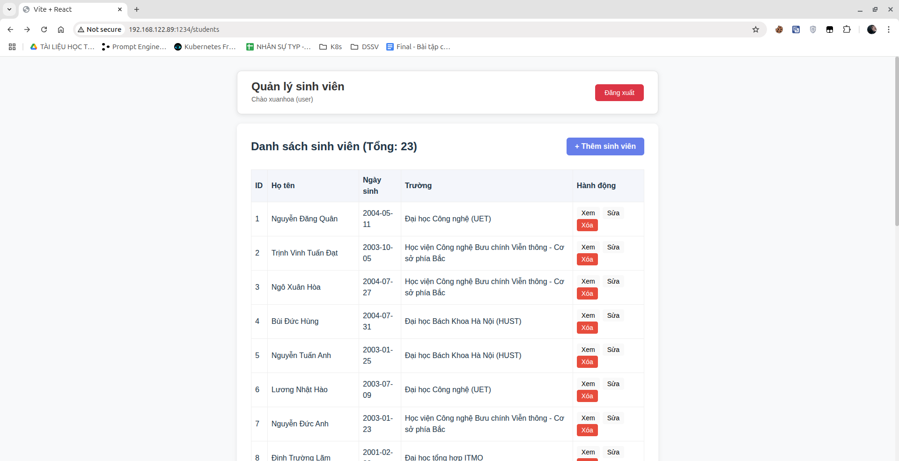
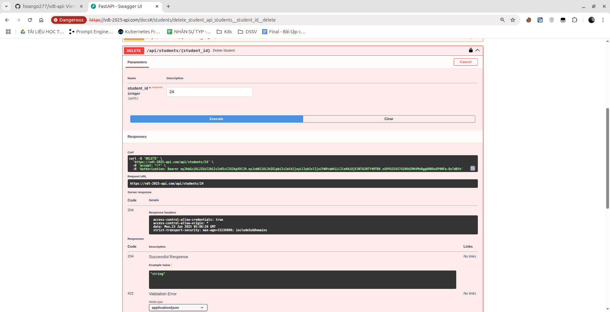
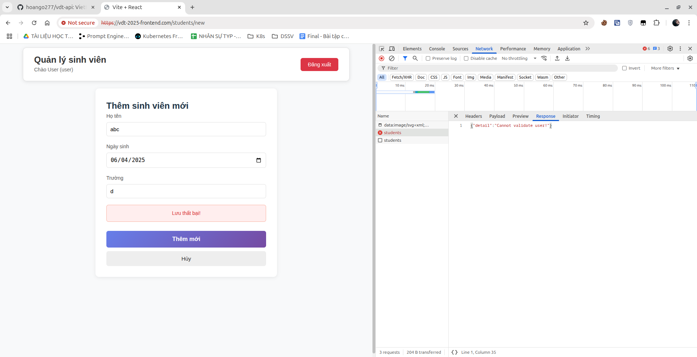

# Yêu cầu 1 
- Dựng HAProxy Loadbalancer trên 1 VM riêng (trong trường hợp cụm lab riêng của sinh viên) với mode TCP, mở port trên LB trỏ đến NodePort của App trên K8S Cluster. 
- Sử dụng giải pháp Ingress cho các deployment, đảm bảo các truy cập đến các port App sử dụng https
- Cho phép sinh viên sử dụng self-signed cert để làm bài

# Output 1: 
#### Dựng HAProxy Loadbalancer và Forward đến NodePort của APP
File cấu hình HAProxy
```
global
    log /dev/log    local0
    log /dev/log    local1 notice
    maxconn 2048
    daemon

defaults
    log     global
    mode    tcp
    option  tcplog
    timeout connect 5000ms
    timeout client  50000ms
    timeout server  50000ms

frontend vdt-frontend
    bind *:1234
    default_backend vdt-frontend-backend

backend vdt-frontend-backend
    server frontend1 192.168.122.87:30003 check

frontend vdt-api
    bind *:1235
    default_backend vdt-api-backend

backend vdt-api-backend
    server backend1 192.168.122.87:30004 check
```
Hình ảnh truy cập Web thông qua Load Balancer

Hình ảnh truy cập API Docs của FastAPI thông qua Load Balancer

#### Sử dụng giải pháp Ingress cho các deployment, đảm bảo các truy cập đến các port App sử dụng https
##### Tạo chứng chỉ  tự kí bằng OpenSSL
Tạo file cấu hình OpenSSL cho Frontend
```
cat > frontend-cert.cnf <<EOF
[req]
default_bits       = 2048
prompt             = no
default_md         = sha256
distinguished_name = dn
x509_extensions    = req_ext

[dn]
CN = vdt-2025-frontend.com
O  = MyOrganization

[req_ext]
subjectAltName = @alt_names

[alt_names]
DNS.1 = vdt-2025-frontend.com
EOF
```
Tạo file cấu hình OpenSSL cho API
```
cat > api-cert.cnf <<EOF
[req]
default_bits       = 2048
prompt             = no
default_md         = sha256
distinguished_name = dn
x509_extensions    = req_ext

[dn]
CN = vdt-2025-api.com
O  = MyOrganization

[req_ext]
subjectAltName = @alt_names

[alt_names]
DNS.1 = vdt-2025-api.com
EOF
```

Tạo cho key và cert cho frontend
```
openssl req -x509 -nodes -days 365 \
  -newkey rsa:2048 \
  -keyout vdt-2025-frontend.key \
  -out vdt-2025-frontend.crt \
  -config frontend-cert.cnf
```
Tạo cho key và cert cho api
```
openssl req -x509 -nodes -days 365 \
  -newkey rsa:2048 \
  -keyout vdt-2025-api.key \
  -out vdt-2025-api.crt \
  -config api-cert.cnf
```
Tạo secret trong k8s
```
kubectl create secret tls frontend-tls \
  --key vdt-2025-frontend.key \
  --cert vdt-2025-frontend.crt

kubectl create secret tls api-tls \
  --key vdt-2025-api.key \
  --cert vdt-2025-api.crt
```
Cài đặt Nginx-Ingress-Controller với file manifest
```
kubectl apply -f https://raw.githubusercontent.com/kubernetes/ingress-nginx/main/deploy/static/provider/cloud/deploy.yaml
```
Đổi type của Service sang NodePort
```
kubectl -n ingress-nginx patch svc ingress-nginx-controller \
  --type='json' \
  -p='[{"op":"replace","path":"/spec/type","value":"NodePort"}]'
kubectl -n ingress-nginx patch svc ingress-nginx-controller \
  --type='json' \
  -p='[{"op":"add","path":"/spec/ports/0/nodePort","value":30080},
      {"op":"add","path":"/spec/ports/1/nodePort","value":30443}]'
```
Tạo Ingress
```
apiVersion: networking.k8s.io/v1
kind: Ingress
metadata:
  name: app-ingress
  namespace: default
spec:
  ingressClassName: nginx            
  tls:
    - hosts:
        - vdt-2025-frontend.com
      secretName: frontend-tls
    - hosts:
        - vdt-2025-api.com
      secretName: api-tls
  rules:
    - host: vdt-2025-frontend.com
      http:
        paths:
          - path: /
            pathType: Prefix
            backend:
              service:
                name: vdt-frontend 
                port:
                  number: 80
    - host: vdt-2025-api.com
      http:
        paths:
          - path: /
            pathType: Prefix
            backend:
              service:
                name: vdt-api-service
                port:
                  number: 8000
```
Patch quyền cho Cluster Role 
```
kubectl patch clusterrole ingress-nginx --type='json' -p='[
  {
    "op": "add",
    "path": "/rules/-",
    "value": {
      "apiGroups": ["discovery.k8s.io"],
      "resources": ["endpointslices"],
      "verbs": ["list", "watch", "get"]
    }
  }
]'
```
File cấu hình HAProxy
```
global
    log stdout format raw local0
    maxconn 2000
    tune.ssl.default-dh-param 2048
    ssl-server-verify none

defaults
    log     global
    mode    tcp
    option  tcplog
    timeout connect 5s
    timeout client  50s
    timeout server  50s

# Force HTTPS
frontend http_redirect
    bind *:80
    mode http
    option httplog
    http-request redirect scheme https code 301


frontend https_in
    bind *:443
    mode tcp
    tcp-request inspect-delay 5s
    tcp-request content accept if { req_ssl_hello_type 1 }

    use_backend bk_frontend if { req_ssl_sni -i vdt-2025-frontend.com }
    use_backend bk_api      if { req_ssl_sni -i vdt-2025-api.com }
    default_backend bk_frontend

backend bk_frontend
    mode tcp
    balance roundrobin
    # Forward đến Ingress-nginx trên NodePort 30443 của 3 Node
    server server1 192.168.122.85:30443 check
    server server2 192.168.122.86:30443 check
    server server3 192.168.122.87:30443 check

backend bk_api
    mode tcp
    balance roundrobin
    server server1 192.168.122.85:30443 check
    server server2 192.168.122.86:30443 check
    server server3 192.168.122.87:30443 check
```
ADD Host để có thể dùng tên miền
```
#sudo nano /etc/hosts
192.168.122.89  vdt-2025-frontend.com
192.168.122.89  vdt-2025-api.com
```
Hình ảnh Web Service gọi qua tên miền `https://vtd-2025-frontend.com` và gọi đến API Service `https://vdt-2025-api.com` thành công trong DevTool

Hình ảnh API DOCS UI qua tên miền `https://vdt-2025-api.com/docs` 

Gọi API thành công


# Yêu cầu 2:
- Đảm bảo 1 số URL của api service  khi truy cập phải có xác thực thông qua 1 trong số các phương thức cookie, basic auth, token auth, nếu không sẽ trả về HTTP response code 403. (0.5)
- Thực hiện phân quyền cho 2 loại người dùng trên API:
- Nếu người dùng có role là user thì truy cập vào GET request trả về code 200, còn truy cập vào POST/DELETE thì trả về 403
- Nếu người dùng có role là admin thì truy cập vào GET request trả về code 200, còn truy cập vào POST/DELETE thì trả về 2xx
# Output 2:
[File tài liệu](outputs/authen-author.md)
# Kết quả
Tài khoản với role `user`<br>
username: xuanhoa<br>
password: 12345678<br>
Tài khoản với role `admin`<br>
username: admin<br>
password: 12345678
#### Hình ảnh trên giao diện SwaggerUI API DOCS mặc định của FastAPI
Trước tiên ta cần đăng nhập để có thể gọi các API cần Authentication<br>
##### Đăng nhập với tài khoản có role user

Gọi API `GET api/students` thành công với `HTTP_STATUS_200_OK`

Gọi API `POST api/students` fail với `HTTP_STATUS_403_FORBIDDEN`

Tương tự với `PUT và DELETE`


##### Đăng nhập với tài khoản có role admin

Gọi API `GET api/students` thành công với `HTTP_STATUS_200_OK`

Gọi API `POST api/students` thành công với `HTTP_STATUS_201_CREATED`

Tương tự với `PUT và DELETE`
PUT em đang để trả về là `HTTP_STATUS_200_OK`

DELETE trả về `HTTP_STATUS_204_NO_CONTENT`


**Trường hợp gửi JWT không hợp lệ**<br>
Ở đây em sẽ sửa access_token trên trực tiếp local storage của trình duyệt

Gọi đến `https://vdt-2025-api.com/api/students` với method `POST`

Chi tiết response khi gửi JWT không hợp lệ

# Yêu cầu 3
Sử dụng 1 trong số các giải pháp để ratelimit cho Endpoint của api Service, sao cho nếu có  quá 10 request trong 1 phút gửi đến Endpoint của api service thì các request sau đó bị trả về HTTP Response 409
# Output
[File tài liệu](/outputs/limit.md)
#### Hình ảnh status 200 trước 10 request

Hình ảnh trên kibana

#### Sau 10 request

Hình ảnh trên kibana

#### Sau 1 phút

Hình ảnh trên kibana


