# 1. Triển khai Kubernetes
Master và Worker Nodes triển khai trên hai máy ảo E2 của Google, mỗi máy có 2vCPUs và 4GiB bộ nhớ. Cả hai máy đều chạy trên nền hệ điều hành Ubuntu 24.04 LTS.

Phương pháp dưới đây sử dụng một máy điều khiển (không phải hai VM trên) để thực hiện điều phối các thao tác cài đặt, cấu hình các nodes bằng kubespray.

## Cấu hình máy ảo Google
Để bắt đầu quá trình cài đặt, trước tiên có thể đổi port của SSH Server để tăng tính bảo mật. Khi đổi port, cần thêm rule vào firewall để từ bên ngoài có thể truy cập vào.

<p align="center">
  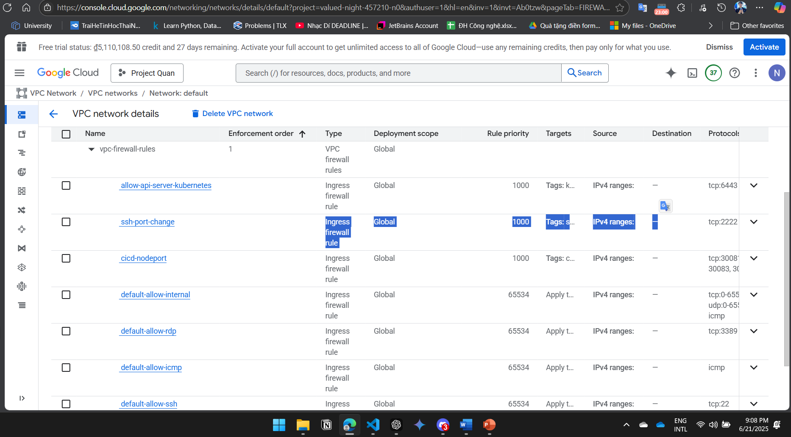
</p>

Trên mỗi VM, tạo một tài khoản (có quyền sudo) để ansible SSH vào và cấu hình cài đặt. Trong báo cáo này:
- Trên máy Master, tạo tài khoản `ssh_user`
- Trên máy Worker, tạo tài khoản `ssh_worker_user`

## Cài đặt kubespray
Trước tiên; trên máy điều khiển, cần tải xuống kubespray từ repository
```bash
git clone https://github.com/kubernetes-sigs/kubespray
```

Sau đó thực hiện chạy container kubespray
```bash
cd kubespray
docker run --rm -it \
  --mount type=bind,source="$(pwd)"/inventory/sample,dst=/inventory \
  --mount type=bind,source="${HOME}"/.ssh/id_rsa,dst=/root/.ssh/id_rsa \
  quay.io/kubespray/kubespray:v2.28.0 bash
```

## Cài đặt ansible

Để đảm bảo tránh tối đa xung đột thư viện, nên cài đặt môi trường ảo python chỉ dùng để chạy ansible:
```bash
python3 -m venv myvenv
source myvenv/bin/activate
```

Sau đó, cài đặt ansible 
```bash
sudo pip install ansible
```

## Cài đặt k8s lên các nodes
Điều hướng tới thư mục kubespray đã tải về phía bên trên, chỉnh sửa lại file inventory theo mẫu tại [kubespray/inventory.ini](kubespray/inventory.ini)

Sau đó thực hiện chạy file playbook thông qua lệnh:

```bash
ansible-playbook -i /inventory/inventory.ini cluster.yml --become --ask-pass --ask-become-pass
```

## Cài kubectl lên máy điều khiển

Tải xuống binary của kubectl theo cú pháp:
```bash
curl -LO "https://dl.k8s.io/release/$(curl -sL https://dl.k8s.io/release/stable.txt)/bin/linux/amd64/kubectl"
```

Sau đó thực hiện cài đặt:
```bash
sudo install -o root -g root -m 0755 kubectl /usr/local/bin/kubectl
```

Tiếp theo, chép nội dung file config trên máy master (địa chỉ `/etc/kubernetes/admin.conf`) vào file `k8s-config.yml` trên máy điều khiển đang sử dụng (Ví dụ như file [kubespray/k8s-config.yml](kubespray/k8s-config.yml)). Sửa lại thông tin clusters server thành `<ip_master>` như trong file inventory của ansible.

Cuối cùng, áp dụng config và kiểm tra:

```bash
export KUBECONFIG=k8s-config.yml
kubectl get nodes -o wide
kubectl get pods -A -o wide
```

*Lưu ý:* Do google firewall chặn port `6443`, cần thêm rule vào để từ máy điều khiển có thể truy cập cụm thông qua `kubectl`. 

Dưới đây là kết quả của hai lệnh trên:

<p align="center">
  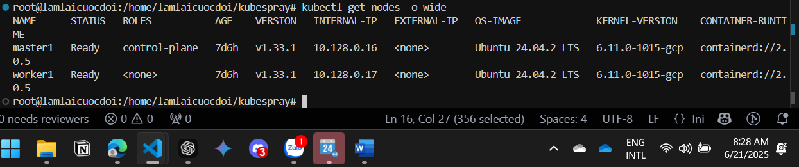
  <br>
  <em>Danh sách nodes</emd>
</p>

<p align="center">
  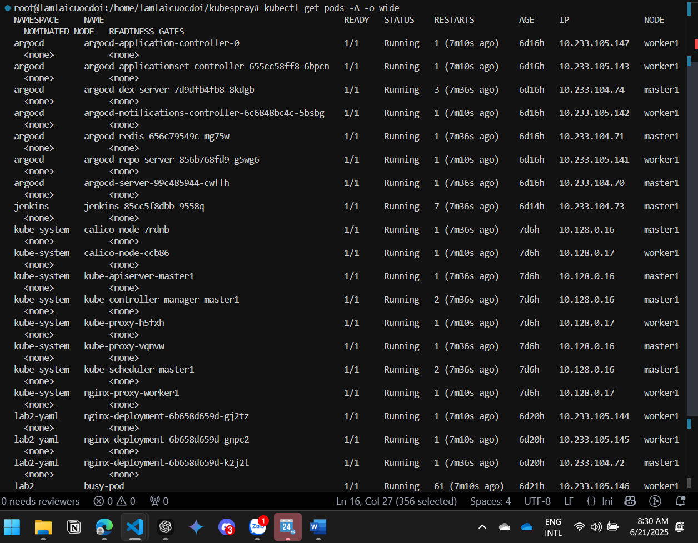
  <br>
  <em>Danh sách pods</em>
</p>

# 2. Triển khai Helm chart cho ứng dụng


## Cài đặt Jenkins

Trước tiên, tạo namespace để chạy riêng các pods của Jenkins để dễ kiểm soát:
```bash
kubectl create namespace jenkins
```

Sau đó cài đặt Jenkins thông qua một số bước:
1. Tạo PV và PVC để lưu trữ thông tin của Jenkins
2. Tải xuống và khởi chạy Jenkins, các pods được mount PV tạo ra phía trên
3. Tạo service NodePort để có thể truy cập từ bên ngoài

Các bước cài đặt đã được mô tả trong file manifest [jenkins/jenkins.yml](jenkins/jenkins.yml), để áp dụng cho chạy lệnh:
```bash
kubectl apply -f jenkins.yml
```

Để truy cập vào giao diện web của Jenkins, cần lấy mật khẩu mặc định của tài khoản `admin` bằng lệnh:
```bash
kubectl exec -it <jenkins-pod-name> -- cat /var/jenkins_home/secrets/initialAdminPassword
```
Sau đó, cần thêm firewall rule để cho phép truy cập vào port `30081` (hoặc port khác nếu đã thay đổi trong file yaml). Đăng nhập với tài khoản `admin` và mật khẩu đã lấy ở trên.

Dưới đây là giao diện web của jenkins khi truy cập thông qua trình duyệt:

<p align="center">
  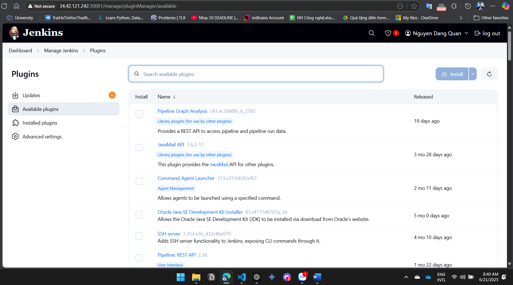
  <br>
  <em>Hình 1: Giao diện Jenkins truy cập từ ip node worker</em>
</p>

<p align="center">
  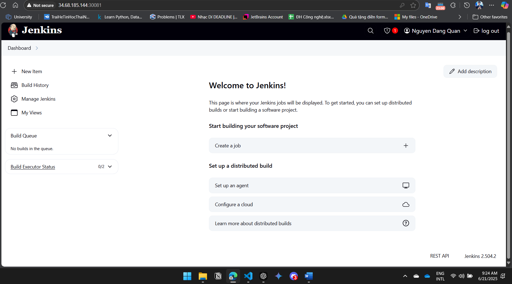
  <br>
  <em>Hình 2: Giao diện Jenkins truy cập từ ip node master</em>
</p>

## Cài đặt ArgoCD

Trước tiên, tạo namespace để chạy riêng các pods của ArgoCD:
```bash
kubectl create namespace argocd
```

Nhà phát hành đã tạo sẵn manifests để cài đặt ArgoCD, sử dụng câu lệnh sau để bắt đầu quá trình cài đặt:
```bash
kubectl apply -n argocd -f https://raw.githubusercontent.com/argoproj/argo-cd/stable/manifests/install.yaml
```

Mặc định ArgoCD sử dụng ClusterIP, để có thể truy cập từ bên ngoài, cần đổi service của ArgoCD thành NodePort. Cần sửa lại kiểu service, áp dụng theo mẫu file yaml tại [argocd/argocd.yml](argocd/argocd.yml):

```bash
kubectl apply -f argocd-service.yaml
```

Để truy cập vào giao diện web của ArgoCD, cần lấy mật khẩu mặc định của tài khoản `admin` bằng lệnh:
```bash
kubectl -n argocd get secret argocd-initial-admin-secret -o jsonpath="{.data.password}" | base64 -d
```

Sau đó, cần thêm firewall rule để cho phép truy cập vào port `30082` (hoặc port khác nếu đã thay đổi trong file yaml). Đăng nhập với tài khoản `admin` và mật khẩu đã lấy ở trên.

Sau khi khởi chạy và đăng nhập được vào ArgoCD, dưới đây là giao diện web của ArgoCD khi truy cập bằng trình duyệt:
<p align="center">
  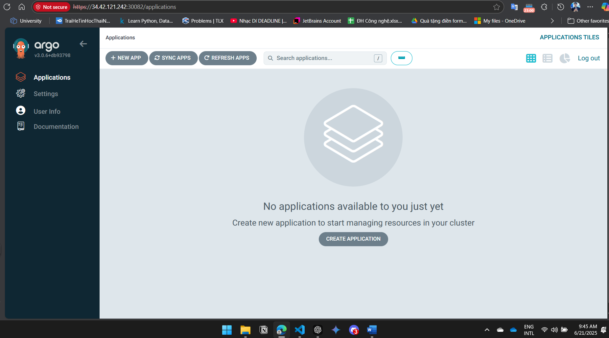
  <br>
  <em>Hình 1: Giao diện ArgoCD truy cập từ ip node worker</em>
</p>

<p align="center">
  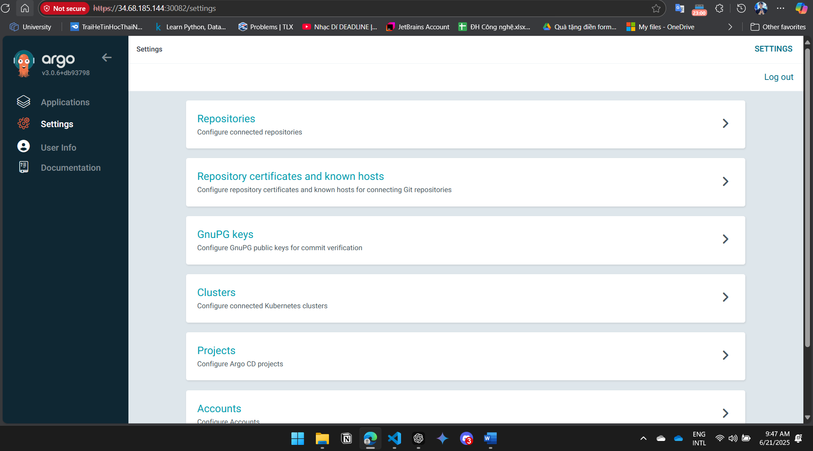
  <br>
  <em>Hình 2: Giao diện ArgoCD truy cập từ ip node master</em>
</p>

## Xây dựng ứng dụng với Helm
Với nội dung này, báo cáo sẽ sử dụng một ứng dụng đơn giản, tách biệt frontend và backend (mã nguồn tại [simple-app](https://github.com/danquan/simple-app), config tại [simple-app-config](https://github.com/danquan/simple-app-config/))

Trước tiên, cần cài đặt Helm trên máy điều khiển để chạy Helm Chart:
```bash
curl https://raw.githubusercontent.com/helm/helm/main/scripts/get-helm-3 | bash
```

Sau khi cài đặt xong, có thể kiểm tra bằng cách sử dụng lệnh:
```bash
helm version
```

Mã nguồn của ứng dụng gồm có hai phần: Frontend và Backend, với mỗi phần cần build riêng và push lên DockerHub:

- Đối với backend:
```bash
docker build -t lamlaicuocdoi1105/simple-backend:latest ./backend
docker push lamlaicuocdoi1105/simple-backend:latest
```

- Đối với frontend:
```bash
docker build -t lamlaicuocdoi1105/simple-frontend:latest ./frontend
docker push lamlaicuocdoi1105/simple-frontend:latest
```

Sau đó, có thể deploy app thông qua lệnh `helm`

```bash
helm install simple-app ./helm/simple-microservice
```

Tại màn hình chính của frontend, trong mã nguồn có đoạn script để fetch dữ liệu từ backend thông qua api; biến nginx thành forward proxy để không phải chìa backend ra ngoài. Để có thể truy cập được ứng dụng, cần thêm rule vào firewall để cho phép port `30083`. Sau khi đã thực hiện, có thể truy cập ứng dụng thông qua địa chỉ IP của một trong các máy.

<p align="center">
  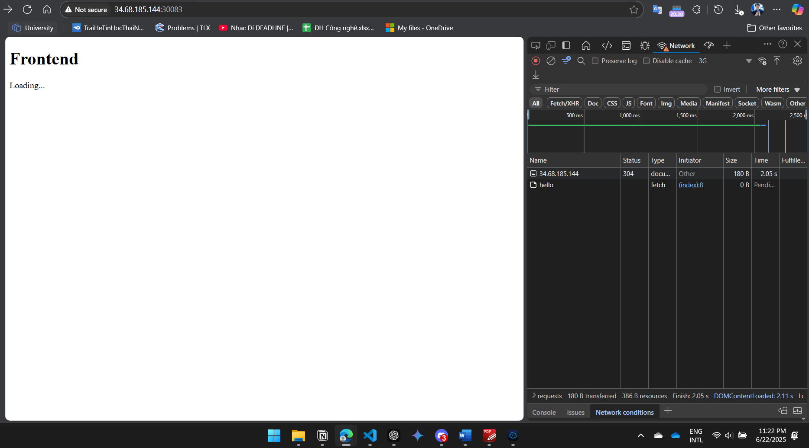
  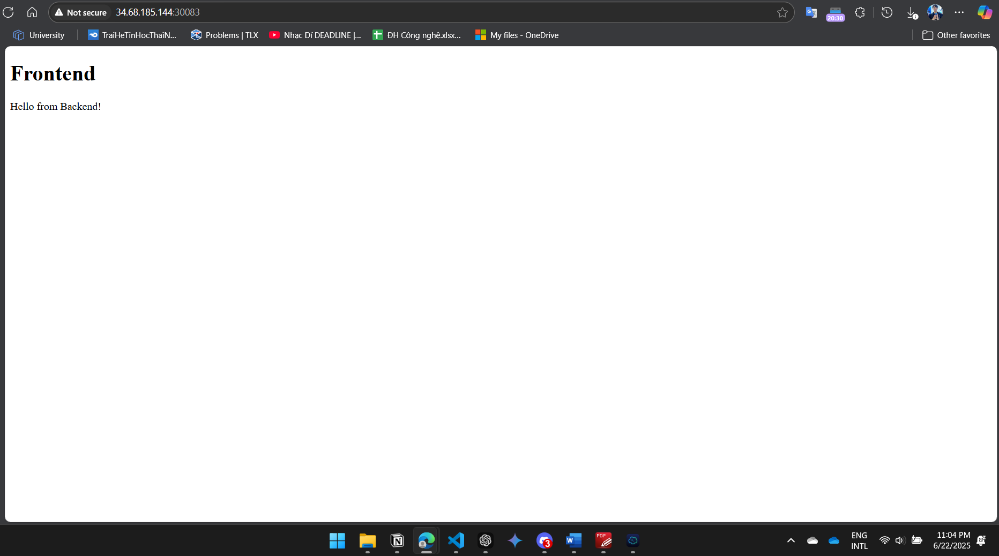
  <br>
  <em>Giao diện app qua trình duyệt</em>
</p>
<p align="center">
  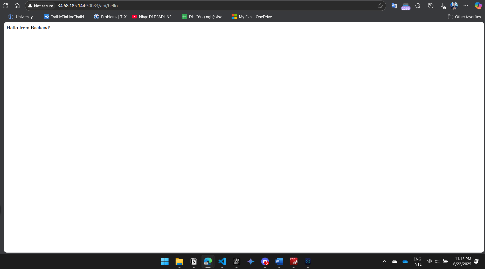
  <br>
  <em>API URL của ứng dụng</em>
</p>

### Sử dụng ArgoCD Application

Tạo một ArgoCD Application, kết hợp:
- Sử dụng Helm Chart từ repo ứng dụng
- Sử dụng `values.yaml` từ repo config

Việc deploy đã được mô tả trong file manifest [app/argocd-app.yaml](app/argocd-app.yaml), bao gồm tất cả configuration: Repo, Config Repo, namespace để cài đặt ứng dụng, ... Chạy lệnh sau để áp dụng cấu hình và tạo ứng dụng trong ArgoCD:

```bash
kubectl apply -f argocd-app.yaml
```

Deploy app sẽ chìa ra port `30084`, để thực hiện, cần thêm rule vào firewall cho phép port `30084`. Sau khi đã thực hiện, có thể truy cập ứng dụng thông qua địa chỉ IP của một trong các máy. Dưới đây là kết quả chạy:

<p align="center">
  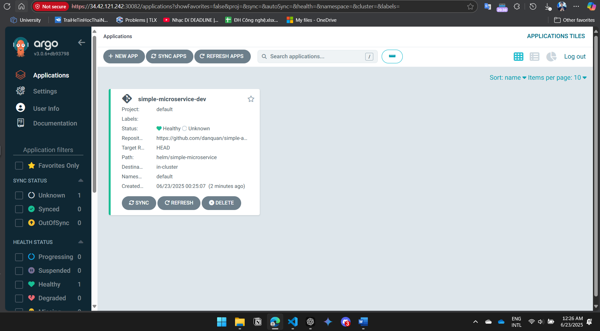
  <br>
  <em>Trạng thái của ứng dụng trong ArgoCD</em>
</p>

<p align="center">
  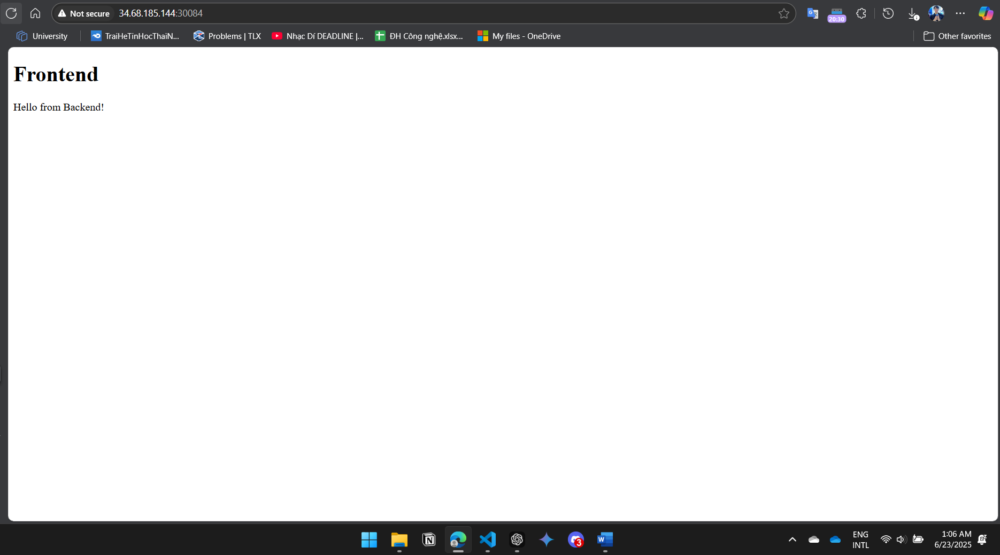
  <br>
  <em>Giao diện ứng dụng thông qua ArgoCD Application</em>
</p>

# 3. Monitoring với Prometheus

Cài đặt Prometheus trên máy `master` sử dụng ansible; thông qua cấu hình playbook tại [prometheus/prometheus-setup.yml](prometheus/prometheus-setup.yml).

Ứng dụng đã export các metrics thông qua endpoint `/metrics`, do đó Prometheus có thể thu thập được các thông tin này. Cấu hình Prometheus đã được mô tả trong file [prometheus/files/prometheus.yml](prometheus/files/prometheus.yml), bao gồm các thông tin về target, scrape interval, ...

Chạy lệnh sau để thực hiện cài đặt:
```bash
ansible-playbook -i prometheus/inventory.ini prometheus-setup.yml --ask-become-pass
```

Dưới đây là kết quả của quá trình cài đặt Prometheus, bao gồm giao diện web và danh sách các target mà Prometheus đang theo dõi. Để truy cập vào giao diện Prometheus, cần thêm firewall rule cho phép port `9090` trên máy master. Dưới đây là kết quả của quá trình truy cập:

<p align="center">
  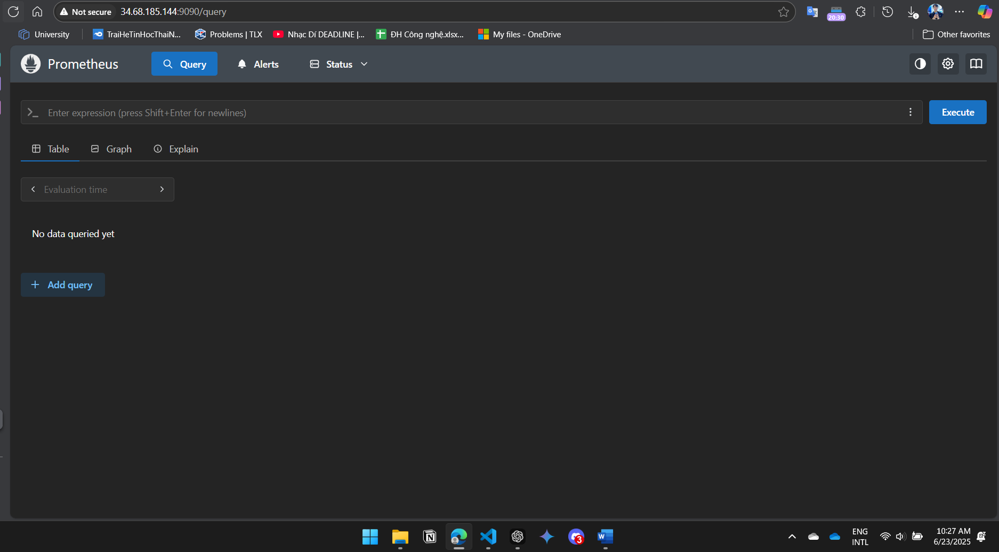
  <br>
  <em>Giao diện Prometheus khi truy cập thông qua trình duyệt</em>
</p>

<p align="center">
  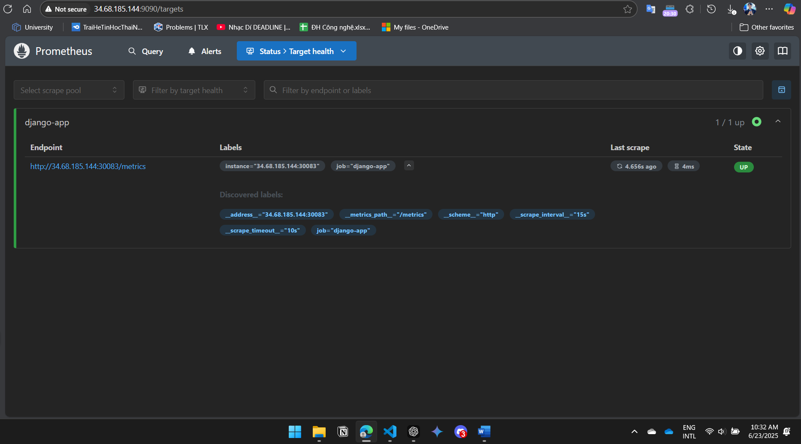
  <br>
  <em>Danh sách các target của Prometheus</em>
</p>

# 4. Logging với EFK Stack

Cài đặt EFK Stack trên máy `master` sử dụng ansible; thông qua cấu hình playbook tại [efk/efk-setup.yml](efk/efk-setup.yml). Vì Fluentd mặc định không có plugin elasticsearch, báo cáo này đã sử dụng một image đã được build sẵn với plugin này, có thể tìm thấy tại [lamlaicuocdoi1105/custom-fluentd:latest](https://hub.docker.com/repository/docker/lamlaicuocdoi1105/custom-fluentd/tags/latest/sha256-e198c269a52cee5800f902a947a2f49f4754a203cfea437d9587779af9dca873). Thực hiện cài đặt EFK Stack bằng lệnh sau:

```bash
ansible-playbook -i efk/inventory.ini efk-setup.yml --ask-become-pass
```

Để truy cập vào giao diện Kibana, cần thêm firewall rule cho phép port `5601` trên máy master; ngoài ra, cũng có thể thêm rule cho phép port `9200` để truy cập vào Elasticsearch. Bên cạnh đó, cần thêm rule vào firewall cho phép port `24224` để Flutentd nhận log từ ứng dụng trong cụm K8s. 

Sau đó cài đặt Fluentd forwarder để gom các logs trả ra trên cụm k8s, các thiết lập đã được mô tả trong file [efk/fluentd-forwarder-configmap.yaml](efk/fluentd-forwarder-configmap.yaml) và [efk/fluentd-forwarder-deamonset.yaml](efk/fluentd-forwarder-deamonset.yaml), chạy lệnh sau để áp dụng cấu hình và tạo Fluentd forwarder:
```bash
kubectl apply -f efk/fluentd-forwarder-configmap.yaml
kubectl apply -f efk/fluentd-forwarder-deamonset.yaml
```

<p align="center">
  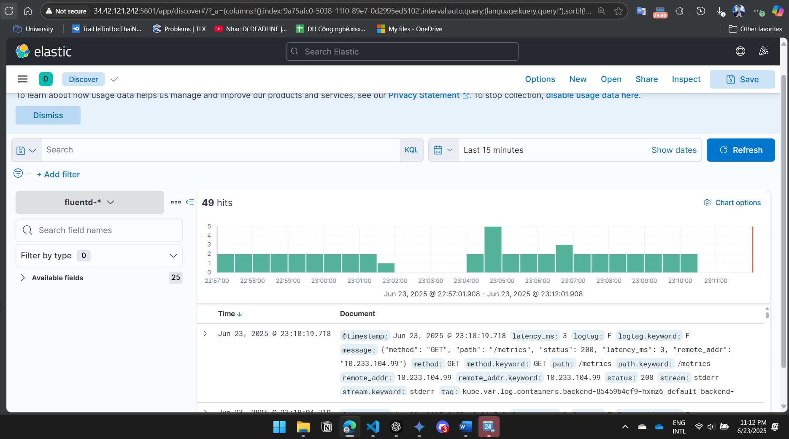
  <br>
  <em>Màn hình giao diện Kibana với index fluentd</em>
</p>

<p align="center">
  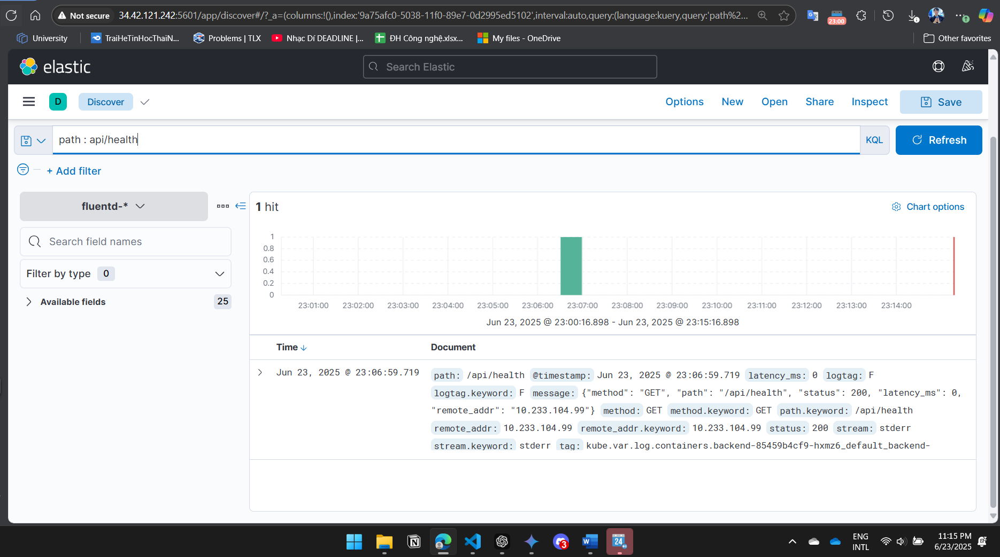
  <br>
  <em>Giao diện tìm kiếm log trong Kibana</em>
</p>

