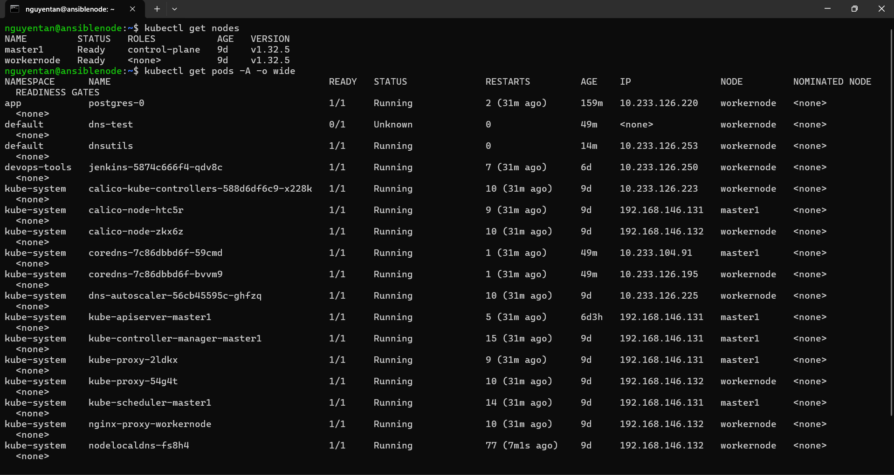

# Tài liệu Cài đặt Kubernetes bằng Kubespray

## 1. Môi trường và Công cụ Cài đặt

- **Công cụ triển khai**: [Kubespray](https://github.com/kubernetes-sigs/kubespray)  
- **Nền tảng ảo hóa**: VMware với 3 máy ảo (VM)

| Node       | RAM  | Disk   | Vai trò                          |
|------------|------|--------|----------------------------------|
| Controller | 2GB  | 20GB   | Cài đặt và điều phối Kubespray   |
| Master     | 3GB  | 30GB   | Control Plane                     |
| Worker     | 4GB  | 40GB   | Node xử lý tác vụ (Worker Node)  |

---

## 2. Các Bước Cài Đặt

### Bước 1: Chuẩn bị môi trường

Tại node **Controller**, cài đặt Docker và clone repository Kubespray:

```bash
git clone https://github.com/kubernetes-sigs/kubespray
```  
### Bước 2: Cấu hình file inventory.ini
Truy cập thư mục repo đã clone và chỉnh sửa file inventory.ini tại: `/inventory/sample/inventory.ini` theo đúng cấu hình cần thiết để kết nối đến các node, ví dụ:
```ini
[kube_control_plane]
master1 ansible_host=192.168.146.131 ansible_port=22 ansible_user=nguyentan

[etcd:children]
kube_control_plane

[kube_node]
workernode ansible_host=192.168.146.132 ansible_port=22 ansible_user=nguyentan

[k8s_cluster:children]
kube_control_plane
kube_node
```

### Bước 3: Chạy Docker container với Kubespray
Chạy docker container và mount các file cần thiết vào container: 
```bash
docker run --rm -it \
  --mount type=bind,source="$(pwd)"/inventory/sample,dst=/inventory \
  --mount type=bind,source="${HOME}"/.ssh/id_rsa,dst=/root/.ssh/id_rsa \
  quay.io/kubespray/kubespray:v2.28.0 bash
```
### Bước 4: Kiểm tra kết nối SSH giữa container và các node
Đảm bảo từ docker container có thể ssh đến các node của cụm K8s bằng lệnh (Nhập đúng password ssh và password user):  
 ```bash
 ansible all -i /inventory/inventory.ini -m ping --become --ask-pass --ask-become-pass
```   
### Bước 5: Triển khai cụm Kubernetes
Sau khi kiểm tra thành công, tiến hành cài cài cụm K8s lên 2 node bằng kubespray qua ansible playbook `cluster.yml`:  
```bash 
ansible-playbook -i /inventory/inventory.ini cluster.yml --become --ask-pass --ask-become-pass
```
  - Nhập đúng password ssh và password user
  - Chờ playbook chạy xong nếu không có task nào fail nghĩa là đã cài thành công

### Bước 6: Kiểm tra cụm Kubernetes
Sau khi cài thành công, kiểm tra lại bằng cách vào master node hoặc export file `kubeconfig` từ masternode và cấu hình nó trên node controller để kiểm tra việc cài đặt:   
```bash
kubectl get nodes -o wide
kubectl get pods -A -o wide
```

