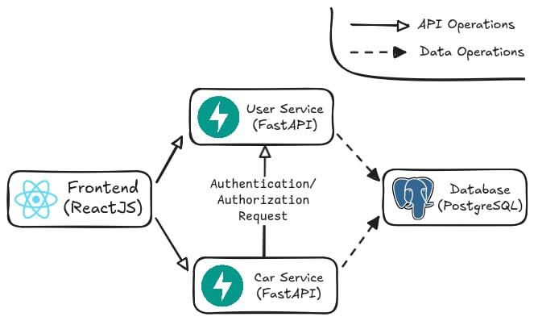

# Tổng quan về web app
Đây là web app hiển thị danh sách các xe oto của 1 showroom, các xe có các thông tin cơ bản như tên, mô tả, giá và tình trạng của xe.   
Kiến trúc của web app theo mô hình microservices như sau:

Frontend của webapp được viết bằng ReactJS, 2 api backend service được viết bằng FastAPI. API user service có nhiệm vụ quản lý account, API car service có nhiệm vụ quản lý danh sách oto, car service có kết nối đến user service để authen/authorize các request.
- Repo src code frontend: https://github.com/nguyentankdb17/microservice_app-frontend
- Repo src code API backend: 
https://github.com/nguyentankdb17/microservice_app-api
- Repo chứa các file config helm chart values: https://github.com/nguyentankdb17/microservice_app-config  

Web app phân quyền người dùng thành hai loại người dùng: user và admin. User chỉ có quyền xem danh sách còn admin sẽ có quyền thêm xe mới, chỉnh sửa xe trong danh sách hoặc xóa một xe từ danh sách.

- Trang web khi được truy cập với role admin:

- Trang web khi được truy cập với role user:

