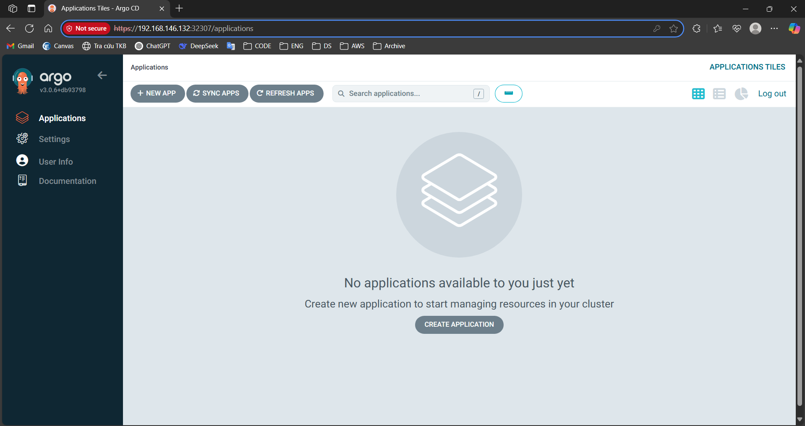
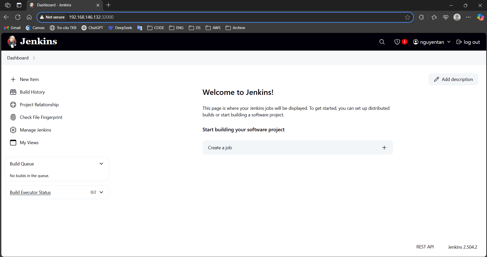

# Kết quả yêu cầu 1
#### Yêu cầu 1: 
- Cài đặt ArgoCD lên Kubernetes Cluster, expose được ArgoCD qua NodePort 
- Cài đặt Jenkins lên Kubernetes Cluster, expose được Jenkins qua NodePort

#### Output 1: 
- File manifests sử dụng để triển khai ArgoCD lên K8S Cluster: 
    - File manifest: [argocd-setup-manifest.yml](./argocd-setup-manifest.yml)
- Ảnh chụp giao diện màn hình hệ thống ArgoCD khi truy cập qua trình duyệt trình duyệt 

- File manifests sử dụng để triển khai Jenkins lên K8S Cluster:
    - Các file manifest: [jenkins-manifests](2.%20Deploy%20web%20application/2.1.%20K8s%20Helm%20Chart/jenkins-manifest/)
- Ảnh chụp giao diện màn hình hệ thống Jenkins khi truy cập qua trình duyệt trình duyệt
