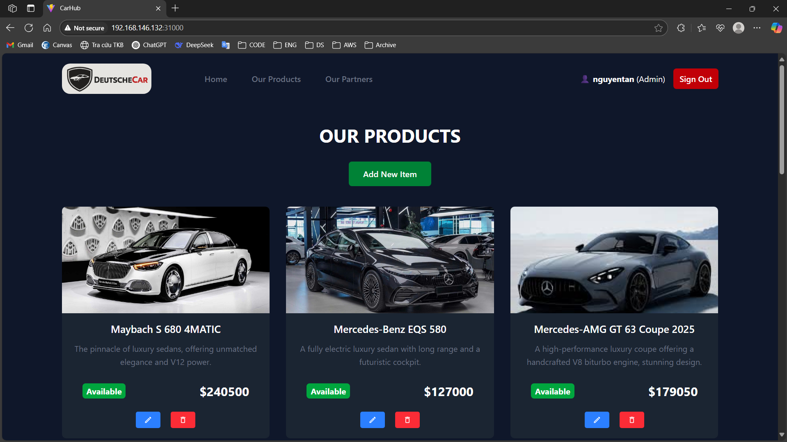
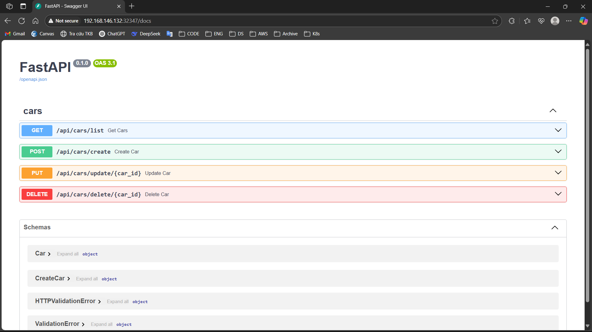

# Kết quả yêu cầu 2
#### Yêu cầu 2:
- Viết hoặc tìm mẫu Helm Chart cho app bất kỳ, để vào 1 folder riêng trong repo app
- Tạo Repo Config cho app trên, trong repo này chứa các file values.yaml với nội dung của cá file values.yaml là các config cần thiết để chạy ứng dụng 
trên k8s bằng Helm Chart  
#### Output 2:
- Các Helm Chart sử dụng để triển khai app lên K8S Cluster  
    - Helm Chart cho frontend: https://github.com/nguyentankdb17/microservice_app-frontend/tree/main/helm-chart
    - Helm Chart chung cho 2 api service của backend: https://github.com/nguyentankdb17/microservice_app-api/tree/main/helm-chart
- Các file values.yaml trong config repo của app
    - Repo config: https://github.com/nguyentankdb17/microservice_app-config
- Manifest của ArgoCD Application 
    - Manifest file: [argocd-application-manifest](./argocd-application-manifest.yml)
- Ảnh chụp giao diện màn hình hệ thống ArgoCD trên trình duyệt
 
- Ảnh chụp giao diện màn hình trình duyệt khi truy cập vào Web URL, API URL
    - Web URL (truy cập vào trang chủ)
    
    - API URL (truy cập vào docs của API)
    
