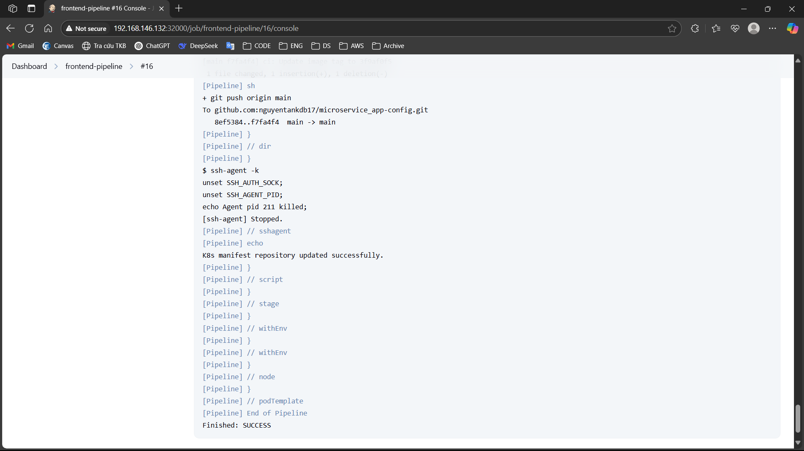
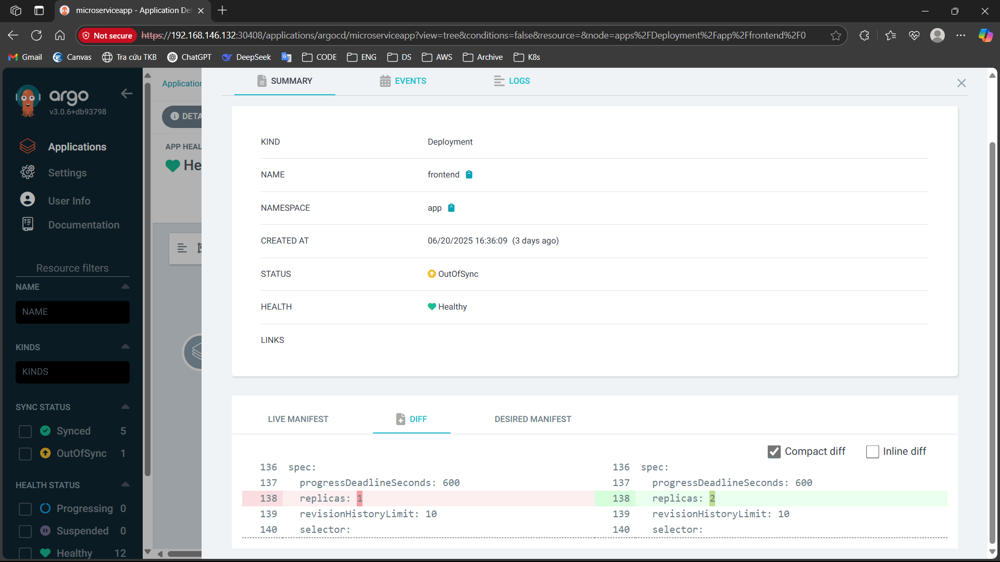
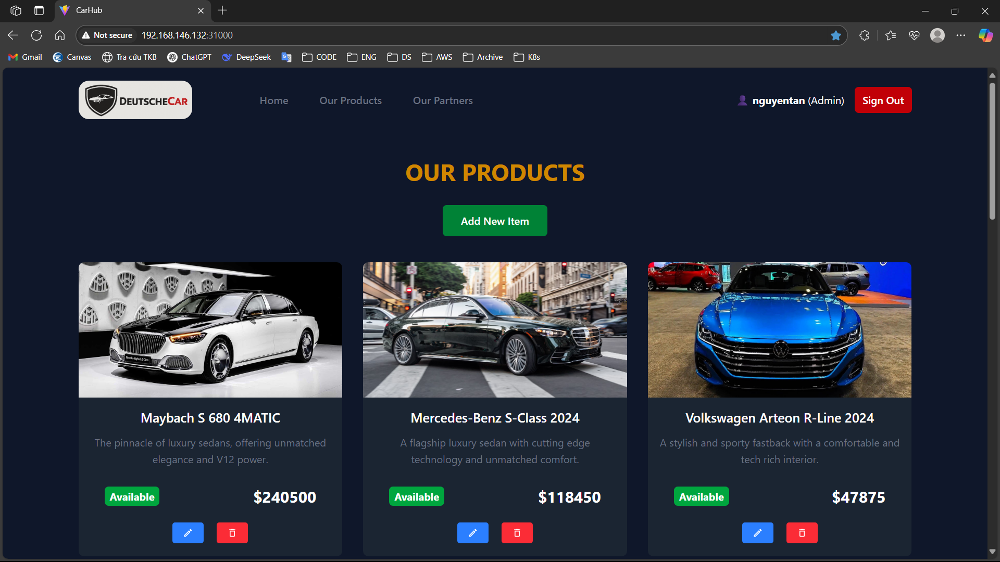

#### Yêu cầu:
- Viết 1 luồng CI/CD cho app, khi có thay đổi từ source code, 1 tag mới được tạo ra trên trên repo này thì luồng CI/CD tương ứng của repo đó 
thực hiện các công việc sau: 
- Sửa code trong source code 
- Thực hiện build source code trên jenkin bằng docker với image tag là tag name đã được tạo ra trên gitlab/github và push docker image 
sau khi build xong lên Docker Hub 
- Sửa giá trị Image version trong file values.yaml  trong config repo và push thay đổi lên config repo.  
- Cấu hình ArgoCD tự động triển khai lại web Deployment và api Deployment khi có sự thay đổi trên config repo. 
#### Output: 
- Các file setup công cụ của luồng CI/CD: [Tài liệu & file setup](SetupCICD.md)
- Output log của luồng CI/CD khi tạo tag mới trên repo app 
- Show log chứng minh jenkin đã chạy đúng
 
- Jenkinsfile cấu hình các luồng:
    - Luồng frontend: [Jenkinsfile](https://github.com/nguyentankdb17/microservice_app-frontend/blob/main/Jenkinsfile)
    - Luồng backend api 1 (user-service): [Jenkinsfile](https://github.com/nguyentankdb17/microservice_app-api/blob/main/user_service/Jenkinsfile) 
    - Luồng backend api 2 (car-service): [Jenkinsfile](https://github.com/nguyentankdb17/microservice_app-api/blob/main/car_service/Jenkinsfile)
- Ảnh luồng CI/CD chạy qua các stage trên giao diện Jenkins ( sử dụng Plugin Pipeline Stage View)
 

- Hình ảnh app triển khai argoCD, hình ảnh diff khi argoCD phát hiện thay đổi ở config repo

    - App triển khai ArgoCD:
    

    - Diff khi argoCD phát hiện thay đổi ở config repo:
    

- Hình ảnh app trước khi sửa code và sau khi sửa code. 
    - Trước khi sửa (chữ '**OUR PRODUCTS**') màu vàng:
    
    - Sau khi sửa (chữ '**OUR PRODUCTS**') màu trắng:
    