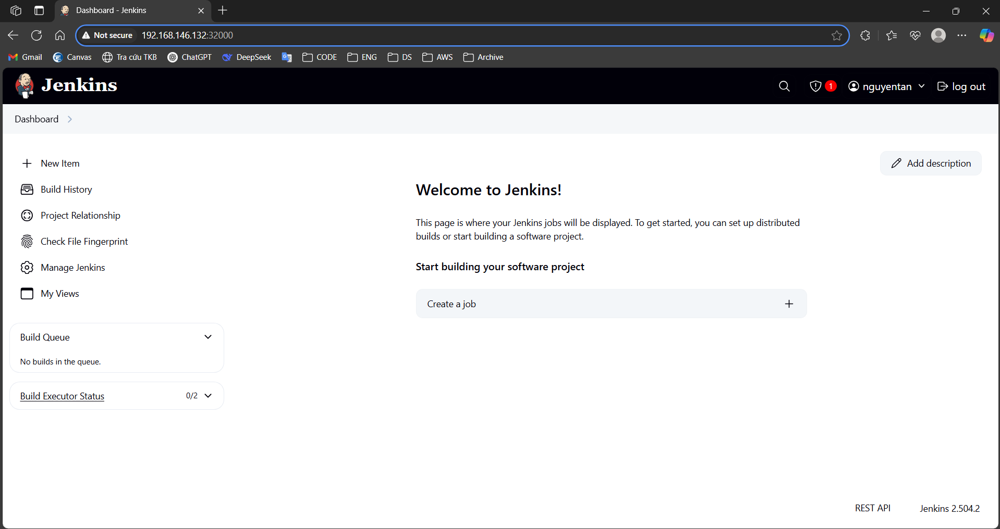
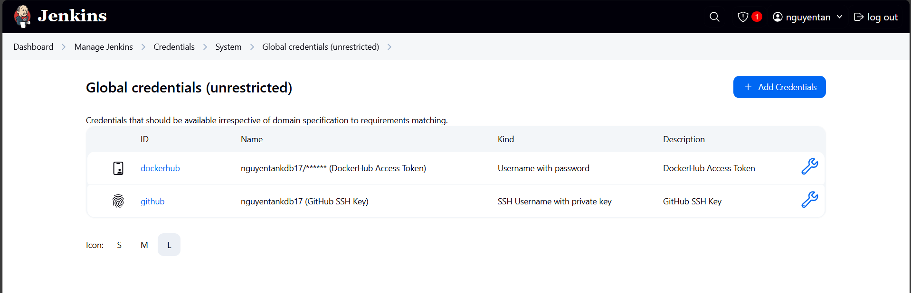
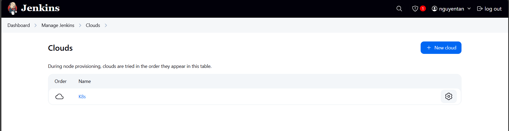
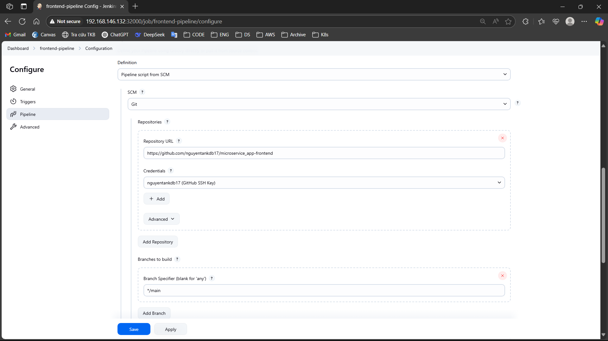
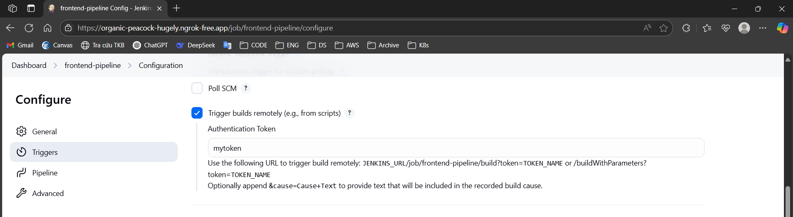
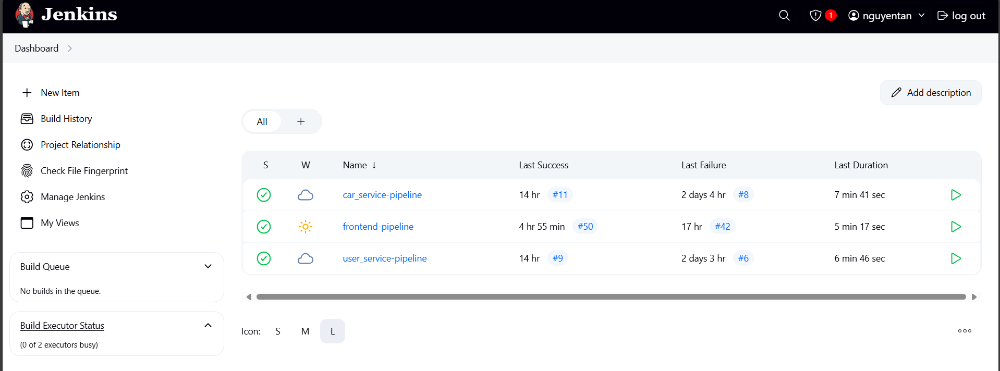
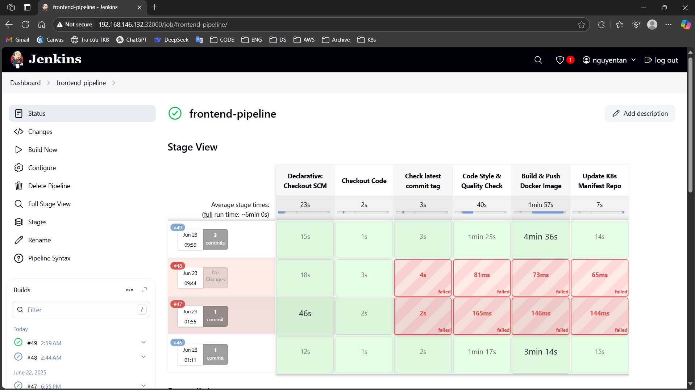
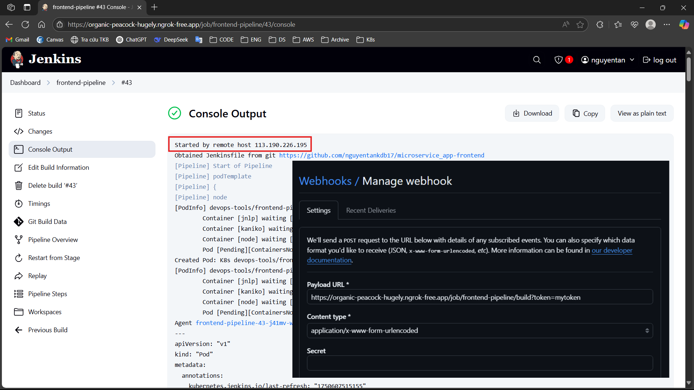
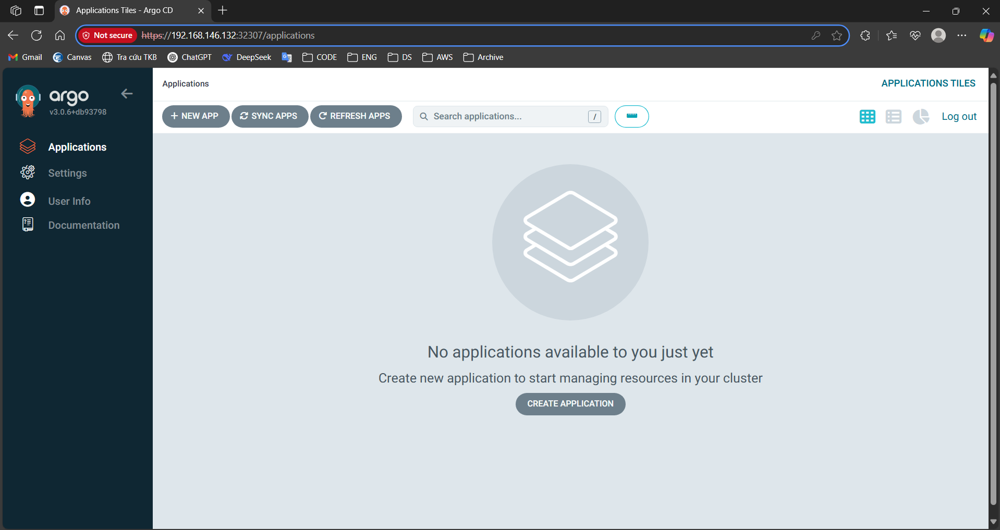
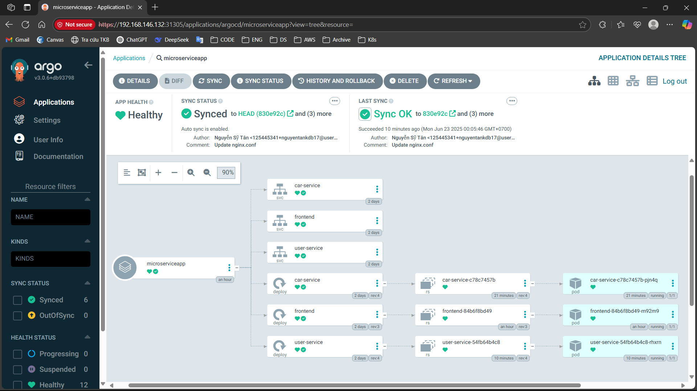

# Luồng setup công cụ CI/CD
## Luồng CI (Jenkins)
### Cài đặt Jenkins
- Cài đặt Jenkins vào K8s cluster qua các file manifests trong folder [jenkins-manifest](../2.1.%20K8s%20Helm%20Chart/jenkins-manifest/) bao gồm 4 file manifest với các chức năng:
    - Tạo service account service cho jenkins master
    - Tạo storageclass, persistent volume, persistent volume claim
    - Tạo deployment service cho jenkins master
    - Tạo service cho jenkins master
- Sau khi cài xong, do service của jenkins master mặc định là NodePort cổng 32000 nên truy cập jenkins UI qua <ip của node>:32000
- Exec vào pod chạy jenkins để lấy admin password theo đường dẫn chỉ trên UI, tiếp theo tạo một user mới và login vào dashboard của jenkins
- Giao diện dashboard của jenkins:

- Để có một pipeline có thể làm được các yêu cầu theo đề bài, cần phải cấu hình Jenkins như sau:
    - Tải plugin cần thiết: **Pipeline Stage View**
    - Thêm các credentials cho jenkinds (**Manage Jenkins** -> **Credentials**) của github và dockerhub, khi jenkins cần các credentials này để checkout, build, đẩy image và thay đổi image tag trong config repo
    
    - Thêm cloud cho  jenkins (**Manage Jenkins** -> **Clouds**), cấu hình một cloud để jenkins có thể tạo các jenkins agent thực hiện job trên đó. Ở đây em chọn luôn K8s cluster đang chạy Jenkins master làm cloud. Lưu ý khi cấu hình cloud nên bật WebSocket để jenkins master có thể giao tiếp với jenkins agent qua giao thức jnlp (theo khuyến nghị từ Jenkins)
    
### Tạo pipeline
- Các bước tạo pipeline:
    - Từ trang chủ vào **New Item** -> **Pipeline**
    - Tạo một script để chạy pipeline, ở đây em lựa chọn là sẽ poll pipeline từ SCM (Github Repo) để lấy Jenkinsfile:
    
    - Để pipeline được tự động kích hoạt, cần sử dụng webhook để trigger pipeline, tuy nhiên do jenkins thuộc mạng nội bộ nên một giải pháp là sử dụng `ngrok` để tạm thời export jenkins ra public:
    
    - Tổng cộng web app có 3 pipeline CI, một pipeline cho frontend và 2 pipepline cho 2 API backend, tương ứng sẽ có 3 Jenkinsfile:
    
### Chạy pipeline
Mặc dù có 3 pipeline khác nhau, tuy nhiên các Jenkinsfile đều chung các stage trong pipeline, khác nhau đến ở agent và script để run test. Đây là ví dụ [Jenkinsfile](https://github.com/nguyentankdb17/microservice_app-frontend/blob/main/Jenkinsfile) của frontend. 

Các bước chạy pipeline Jenkins:
- Sau khi src code được thay đổi, github sẽ push một webhook trigger đến Jenkins qua public url từ ngrok, từ đó Jenkins sẽ trigger pipeline:

- Khởi tạo agent: Để chạy được pipeline, cần khởi tạo agent trong cloud được config trước đó và tạo 3 container trong agent đó tương ứng với các nhiệm vụ khác nhau
    - Container jnlp: nơi để Jenkins agent kết nối với Jenkins master
    - Container kaniko: Dùng để push image lên dockerhub, trước đó phải tạo 1 secret dockerhub credentials ở jenkins master namespace và mount vào container này
    - Container node(frontend)/python(backend): Container này phục vụ cho việc check code quality, do frontend và API backend viết bằng ngôn ngữ khác nhau nên cần loại container khác nhau
- Checkout Code: checkout đến target repository
- Check latest commit tag: kiểm tra xem commit gần nhất có tag hay không, nếu có thì tiếp tục các bước sau, nếu không thì sẽ abort pipeline.
- Code Style & Quality check: kiểm tra và phát hiện lỗi về style cũng như lỗi tiềm ẩn trong code
- Build & Push Docker Image: thực hiện lấy tag của commit gần nhất, build image và push image lên DockerHub với tag đúng với tag của commit gần nhất
- Update K8s Manifest Repo: thay đổi giá trị tag của image trong repo config, từ đó ArgoCD sẽ phát hiện thay đổi và pull image mới

## Luồng CD (ArgoCD)
- Cài ArgoCD qua manifest file: [argocd-setup-manifest](../2.1.%20K8s%20Helm%20Chart/argocd-setup-manifest.yml) (manifest file được lấy từ trang chủ của ArgoCD)
- Sau khi cài xong, patch service type của argocd-server thành type NodePort để có thể truy cập được dashboard:
```bash
kubectl patch svc argocd-server -n argocd -p '{"spec": {"type": "NodePort"}}'
```
- Truy cập dashboard, đăng nhập với user là `admin` và password lấy từ secret:
```bash
kubectl -n argocd get secret argocd-initial-admin-secret -o jsonpath="{.data.password}" | base64 -d
```
- Sau khi đăng nhập xong thì sẽ vào được trang chủ của ArgoCD:

- Tạo một app ArgoCD cho web application sử dụng manifest file sử dụng ArgoCD Multiple Sources
```yaml
apiVersion: argoproj.io/v1alpha1
kind: Application
metadata:
  name: microserviceapp
spec:
  project: default
  sources:
    - repoURL: https://github.com/nguyentankdb17/microservice_app-frontend
      targetRevision: HEAD
      path: helm-chart
      helm:
        valueFiles:
          - $valuesrepo/frontend_values.yaml

    - repoURL: https://github.com/nguyentankdb17/microservice_app-api
      targetRevision: HEAD
      path: helm-chart
      helm:
        valueFiles:
          - $valuesrepo/user_service_values.yaml

    - repoURL: https://github.com/nguyentankdb17/microservice_app-api
      targetRevision: HEAD
      path: helm-chart
      helm:
        valueFiles:
          - $valuesrepo/car_service_values.yaml
      
    - repoURL: https://github.com/nguyentankdb17/microservice_app-config
      targetRevision: HEAD
      ref: valuesrepo

  destination:
    server: https://kubernetes.default.svc
    namespace: app

  syncPolicy:
    automated:
      prune: true
      selfHeal: true
```
Dựa vào file manifest có thể cấy có 1 repo dùng để làm valuesrepo, các repo còn lại chứa helm chart và sử dụng values file từ valuesrepo. Các options ở syncPolicy là để ArgoCD tự động sync state cho đúng với các values và helm chart được định nghĩa trong manifest file.
- Kết quả khi chạy app ArgoCD:
