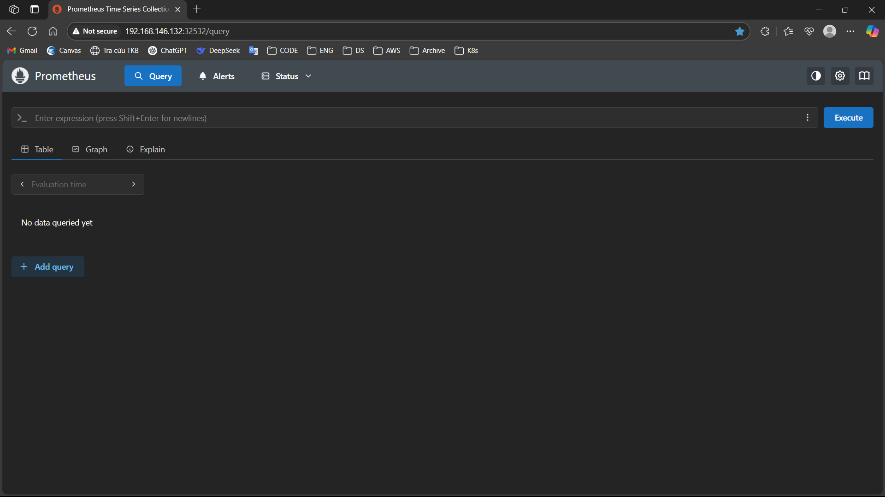

# Output cho yêu cầu về Monitoring
#### Yêu cầu:
- Expose metric của app ra 1 http path.
- Sử dụng ansible playbooks để triển khai container Prometheus server. Sau đó cấu hình prometheus add target giám sát các metrics đã expose ở trên. 
#### Output: 
- Các file setup để triển khai Prometheus: [Tài liệu & file setup](./Setup.md)
- Hình ảnh khi truy cập vào Prometheus UI thông qua trình duyệt
 
- Hình ảnh danh sách target của App được giám sát bởi Prometheus
