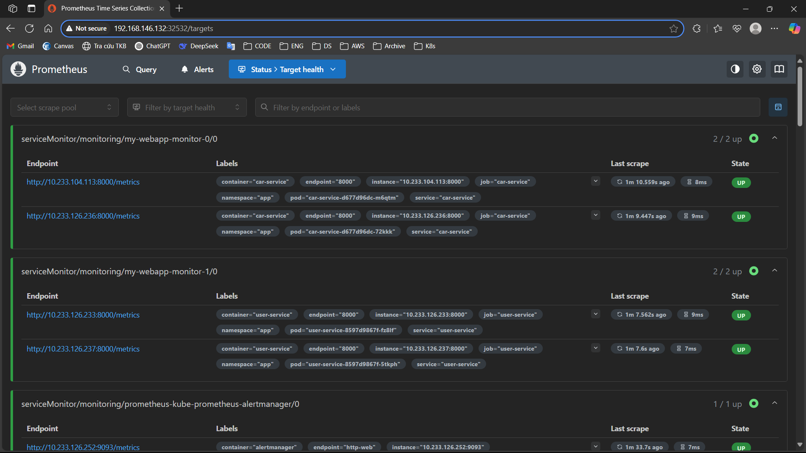

# Các bước thiết lập Prometheus để giám sát các target của ứng dụng web

## Bước 1: Expose metric của app ra 1 path.
- Cấu hình các api service sao cho expose các metric ra 1 http path để Prometheus có thể lấy được các metric này, path này phải có định dạng phù hợp để Prometheus có thể scrape được.
- Do các API của web được viết bằng API, nên có thể sử dụng thư viện `prometheus_client` của Python để export các metrics ra path /metrics. 
- Các metrics ở đây là thời gian phản hồi request, số lượng request và số lượng request bị error, src code [metrics.py](https://github.com/nguyentankdb17/microservice_app-api/blob/main/user_service/src/middleware/metrics.py):
```python
# Summary for request duration in milliseconds
REQUEST_TIME_MS = Summary(
    "api_request_duration",
    "Request duration in milliseconds",
    ["method", "handler"],
)

# Counter for total requests
REQUEST_COUNTER = Counter(
    "api_requests_total",
    "Total number of requests to the api",
    ["method", "handler", "status_code"],
)

# Counter for errors (4xx/5xx)
ERROR_COUNTER = Counter(
    "api_error_total",
    "Total number of 4xx/5xx errors",
    ["method", "handler", "status_code"],
)
```
- Hình ảnh các metrics được export ra /metrics:


## Bước 2: Cài đặt Prometheus vào K8s cluster bằng Ansible Playbook
-  File ansible playbook để cài Prometheus: [install-prom.yml](./setup_files/ansible-playbook/install-prom.yml)
### Yêu cầu:
- Nơi chạy playbook có thể là từ master node hoặc từ một máy bất kỳ có thể ssh được đến các node trong cluster, nếu từ máy remote phải import file `kubeconfig` từ masternode và cài sẵn ansible cùng với python để có thể chạy script.
- File playbook phải được đặt cùng folder với file [inventory.ini](./setup_files/ansible-playbook/inventory.ini)

### Cấu trúc playbook:
Playbook thực hiện việc cài Prometheus vào cluster gồm các bước chính sau:
- Tạo namespace `monitoring`
- Tải thư viện `kubernetes` từ pip để có thể sử dụng các module của kubernetes trong playbook
- Tải repo `prometheus-community` từ Helm
- Cài đặt Prometheus server bằng Helm Chart từ release `prometheus-community/kube-prometheus-stack` vào namespace `monitoring`
- Chờ các pods của Prometheus ở trạng thái `Running` và kết thúc playbook
Kết quả khi chạy xong playbook:


## Bước 3: Cấu hình ServiceMonitor để giám sát các pod của app thông qua service:
- Manifest files:
    - User service: [user-service-monitor.yml](./setup_files/service-monitor/user-service-monitor.yml)
    - Car service: [car-service-monitor.yml](./setup_files/service-monitor/car-service-monitor.yml)
- Các resource này ở dạng `ServiceMonitor` - 1 CRDs của release `kube-prometheus-stack` được cài qua Helm được sử dụng để cấu hình Prometheus tự động phát hiện và giám sát các service được select.

- Các file manifest trên sẽ được áp dụng vào cluster để tạo các ServiceMonitor cho các service của app, từ đó Prometheus sẽ tự động phát hiện và giám sát các pod của app thông qua các service này.

- Các bước thực hiện:
    - Chạy lệnh sau để áp dụng các manifest file trên vào cluster:
    ```
    kubectl apply -f user-service-monitor.yml
    kubectl apply -f car-service-monitor.yml
    ```
    - Kiểm tra các ServiceMonitor đã được tạo thành công:
    ```
    kubectl get servicemonitor -n monitoring
    ```
- Kết quả các target của app được Prometheus giám sát:

- Kết quả query `api_requests_total` từ các target:
