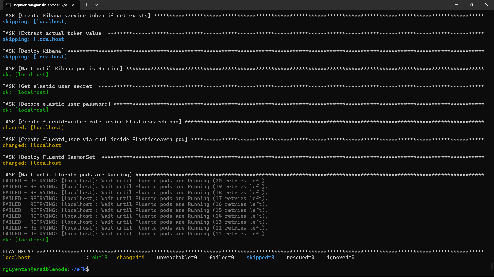
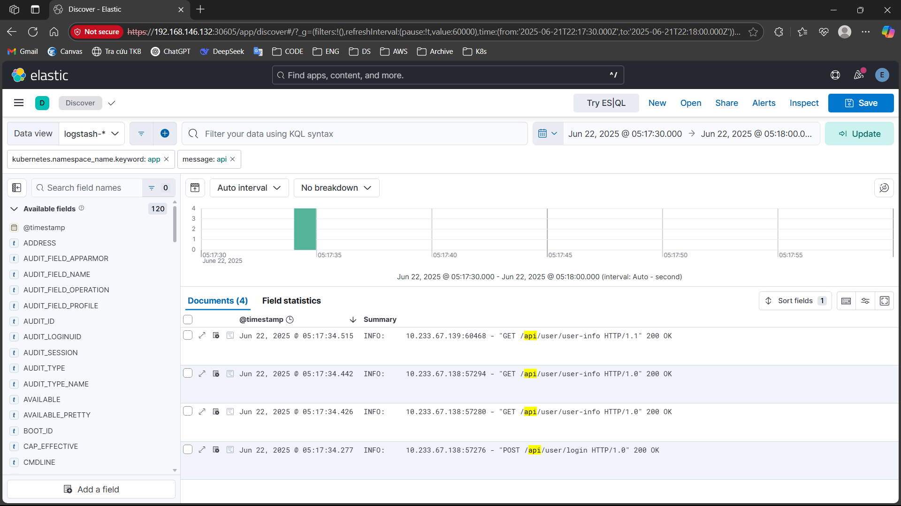

# Các bước cài đặt EFK vào K8s cluster
- Playbook để cài ansible vào K8s cluster: [install-efk.yml](./ansible/install-efk.yml)
- Yêu cầu:
    - Nơi chạy playbook có thể là từ master node hoặc từ một máy bất kỳ có thể ssh được đến các node trong cluster, nếu từ máy remote phải import file `kubeconfig` từ masternode và cài sẵn ansible cùng với python để có thể chạy script.
    - Phải có đầy đủ các file `inventory.ini`, `elasticsearch.yml`, `fluentd.yml` như trong folder [ansible](./ansible/), để cùng thư mục với file ansible playbook
- Cấu trúc playbook: 
    Cấu trúc của playbook cài EFK gồm các bước chính sau:
    - Tạo namespace
    - Cài ECK Operator để sử dụng các CRDs của elasticsearch và kibana
    - Tạo storageclass, pv, pvc cho elasticsearch
    - Cài elasticsearch qua CRDs từ ECK Operator bằng file `elasticsearch.yml`, chờ để các pod ở trạng thái running
    - Tạo service account token cho Kibana bằng lệnh exec vào pods chạy elasticsearch
    - Cài Kibana qua CRDs từ ECK Operator, với service account token lấy được từ bước trên và đợi cho pod chạy Kibana ở trạng thái running
    - Lấy mật khẩu của user `elastic` qua secret `elasticsearch-es-elastic-user`
    - Tạo role và user cho Fluentd bằng các lệnh exec vào pod chạy elasticsearch với authen bằng user `elastic`
    - Cài Fluentd qua DaemonSet từ file `fluentd.yml` ở namespace `kube-system` và chờ cho các pods chạy fluentd ở trạng thái running
    
- Các bước:
    - Chạy playbook:

    ```
    ansible-playbook -i inventory.ini install-efk.yml
    ```
    - Sau khi chạy xong script, nếu không có task nào bị fail tức là đã cài thành công, kết quả chạy playbook trên cụm:
    
    - Vào dashboard của Kibana ở địa chỉ `https://<ip của node>:<NodePort của kibana service>`, đăng nhập với user mặc định là `elastic`, mật khẩu được lấy qua secret `elasticsearch-es-elastic-user`:

    ```
    kubectl get secret elastic-es-elastic-user -n elastic-system -o jsonpath="{.data.elastic}" | base64 -d
    ```
    - Đăng nhập vào dashboard, vào **Discovers** -> **Create New Data View**, lúc này sẽ thấy các log được từ fluentd vào elasticsearch dưới dạng index pattern `logstash-*` hoặc `fluentd-*`
    - Filter các log theo atrribute nào đó, ví dụ filter các log của api service trong web application theo pattern `api`:
    

