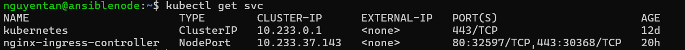
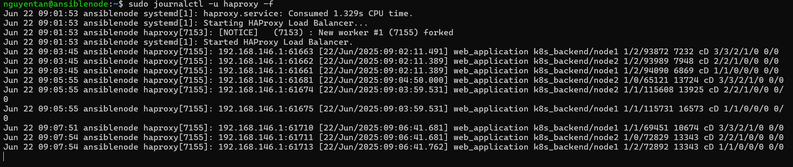

# Quy trình cấu hình giải pháp HA và HTTPS

- Đầu tiên tạo một VM mới để làm node HA, sau khi tạo thành công tiến hành cài đặt haproxy:
    ```bash
    sudo apt update
    sudo apt install haproxy -y
    ```
- Để có thể sử dụng được ingress trong K8s cluster, yêu cầu phải có một ingress controller, giải pháp được lựa chọn là `nginx-ingress-controller`, được cài vào cụm K8s qua lệnh:
    ```bash
    kubectl apply -f kubectl apply -f https://raw.githubusercontent.com/kubernetes/ingress-nginx/controller-v1.12.3/deploy/static/provider/cloud/deploy.yaml

    ```
- Để có thể cấu hình ingress với https, đầu tiên tạo một tên miền ảo `nguyentan.cloud` với self-sign cert:
    ```bash
    openssl req -x509 -nodes -days 365 -newkey rsa:2048 \
    -keyout tls.key -out tls.crt \
    -subj "/CN=nguyentan.cloud" \
    -addext "subjectAltName=DNS:nguyentan.cloud"

    ```
- Export cert này dưới dạng một secret tại namespace mà ingress sẽ chạy, ở trong phạm vi cluster này đó là name space `app`:
    ```bash
    kubectl create secret tls webapp-tls -n app \
    --cert=tls.crt \
    --key=tls.key
    ```
- Do mặc định của service ingress controller là LoadBalancer, tuy nhiên trên bare-metal khó có thể cấu hình service LB, do đó ta sẽ chuyển nó về dạng NodePort.
    ```
    kubectl patch svc nginx-ingress-controller -p '{"spec": {"type": "NodePort"}}'
    ```
- Sau khi patch thành công sẽ có kết quả như hình:

- Từ service của `nginx-ingress-controller`, chúng ta sẽ lấy port map với port 443 (https) của service và bind vào file `haproxy.cfg` ở node HA Proxy, lưu ý điền ip của node1 và node2 đúng với ip của các node trong cụm K8s:
    ```cfg
    global
        log /dev/log local0
        daemon
        maxconn 2048

    defaults
        log     global
        mode    tcp
        option  tcplog
        timeout connect 10s
        timeout client  1m
        timeout server  1m

    frontend web_application
        bind *:443
        mode tcp
        default_backend k8s_backend

    backend k8s_backend
        mode tcp
        balance roundrobin
        server node1 192.168.146.131:30368 check
        server node2 192.168.146.132:30368 check
    ```

- Restart dịch vụ haproxy ở node HA:
    ```
    sudo systemctl restart haproxy
    ```
- Cấu hình file manifest của ingress ([ingress.yaml](ingress.yaml)), chú ý hosts đúng với domain ảo được tạo, `ingressClassName` là `nginx` do sử dụng nginx làm ingress controller, các path tương ứng forward tới các service của webapp.
- Trên máy client để test, phải thêm hostname của domain ảo vào file `hosts` ở system, ip chính là ip của node HA.
- Trên máy client để test, import cert `tls.crt` để không bị lỗi do đây là self-signed cert.
- Sau khi hoàn tất các bước, truy cập vào domain `https://nguyentan.cloud` sẽ ra được kết quả chính là web app:

- Log của HAProxy cho thấy request được chuyển tiếp liên tục giữa các node, đảm bảo tính HA và vai trò của 1 LB:
