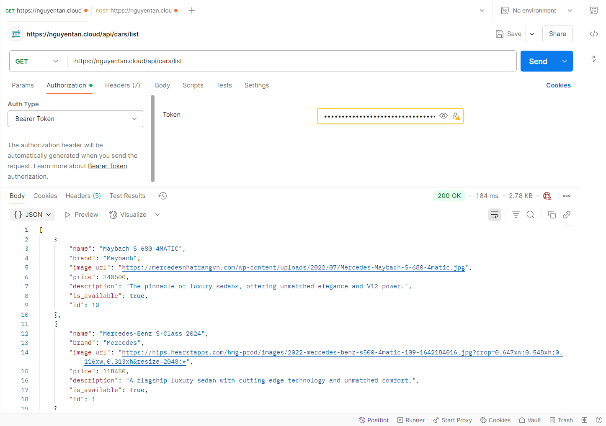
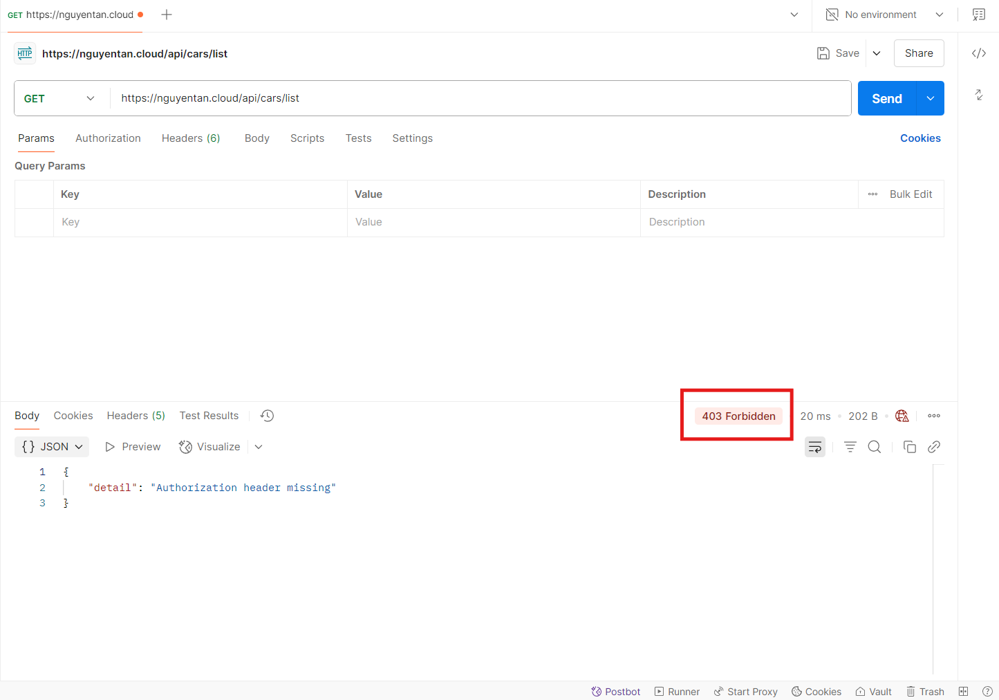
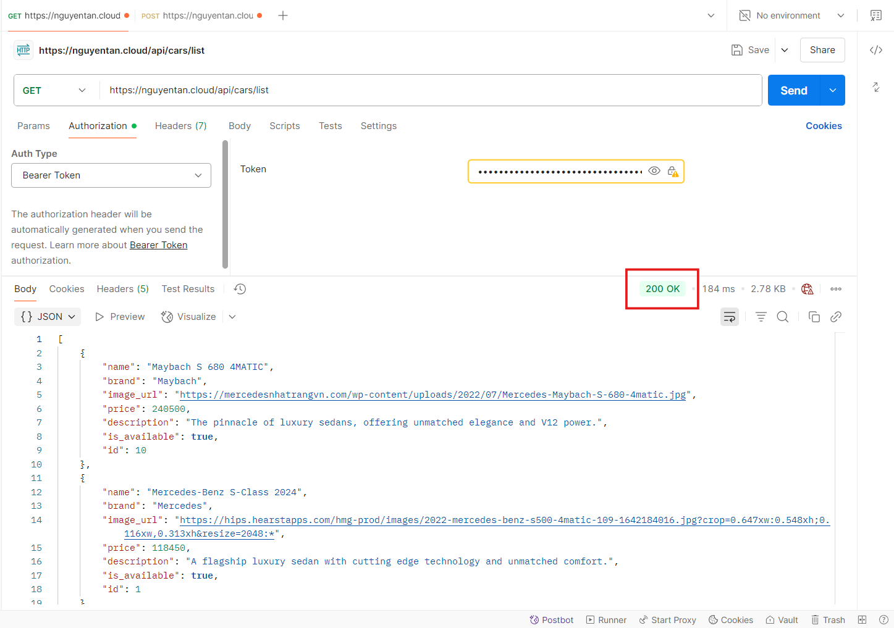
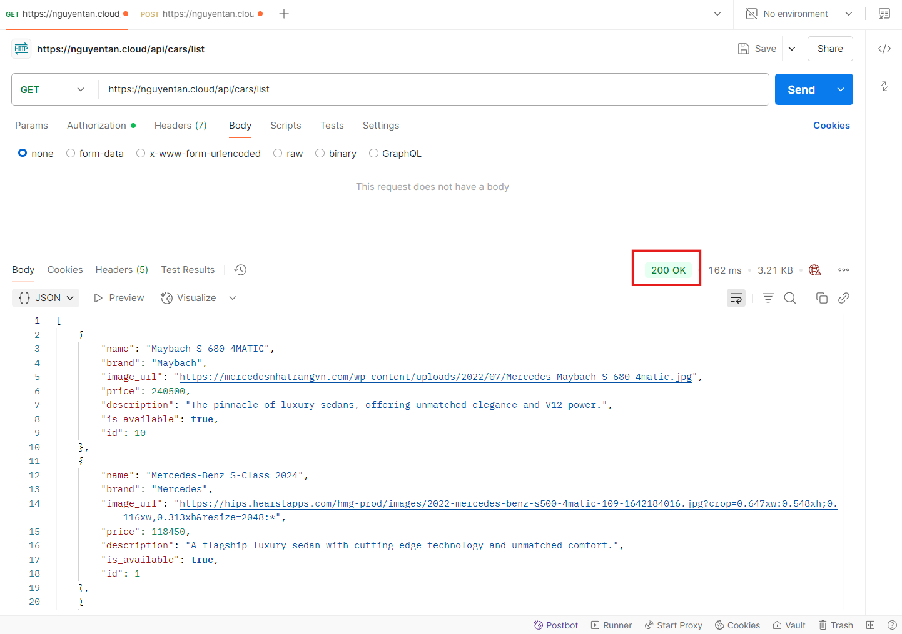
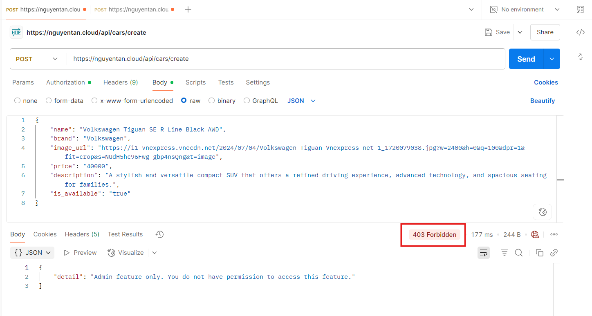
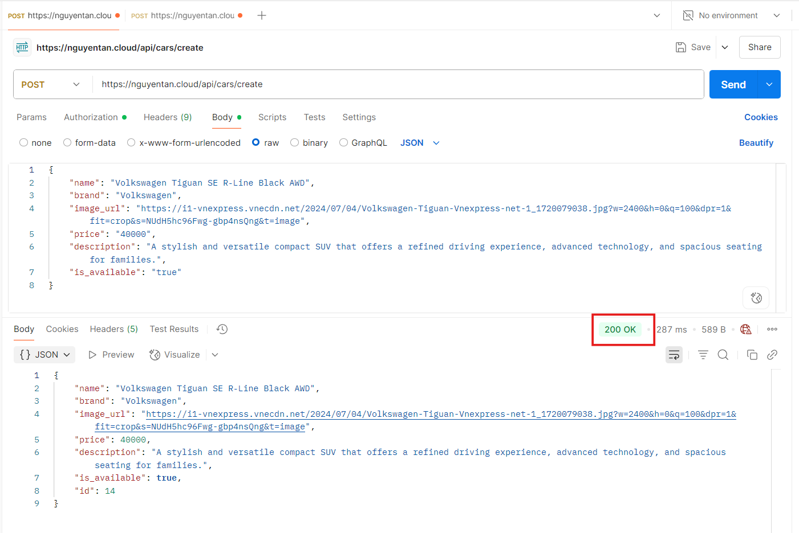

# Ouput yêu cầu 2
#### Yêu cầu 2: 
- Đảm bảo 1 số URL của api service  khi truy cập phải có xác thực thông qua 1 trong số các phương thức cookie, basic auth, token auth, nếu không sẽ trả về HTTP response code 403. 
- Thực hiện phân quyền cho 2 loại người dùng trên API:
    - Nếu người dùng có role là user thì truy cập vào GET request trả về code 200, còn truy cập vào POST/DELETE thì trả về 403 -
    -  Nếu người dùng có role là admin thì truy cập vào GET request trả về code 200, còn truy cập vào POST/DELETE thì trả về 2xx 
#### Output 2: 
- File trình bày giải pháp sử dụng để authen/authorization cho các service: [Giải pháp](./Solution.md)
- Kết quả HTTP Response khi curl hoặc dùng postman gọi vào các URL khi truyền thêm thông tin xác thực và khi không truyền thông tin xác thực 
    - Môi trường test: 
        - Công cụ: Postman
        - url của api là url https được cấu hình từ yêu cầu 1
        - request lựa chọn là request để lấy danh sách ô tô có trong showroom 
    - Khi truyền thông tin xác thực:
    
    - Khi không truyền thông tin xác thực:
    
    
- Kết quả HTTP Response khi curl hoặc dùng postman vào các URL với các method GET/POST/DELETE  khi lần lượt dùng thông tin xác thực của các user có role là user và admin
    - Môi trường test: 
        - Công cụ: Postman
        - url của api là url https được cấu hình từ yêu cầu 1

    - Đối với method `GET`: request lựa chọn là request để lấy danh sách ô tô có trong showroom 
        - Đối với role là user:
        
        - Khi role là admin:
        
    
    - Đối với method `POST/DELETE`: request lựa chọn là request thêm 1 xe mới vào danh sách xe của showroom:
        - Đối với role là user:
        
        - Đối với role là admin:
        