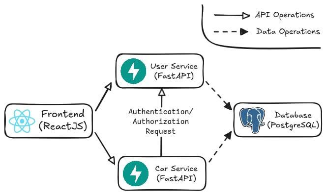

# Giải pháp cho yêu cầu 2
Nhìn lại kiến trúc của web app:

## Giải pháp authentication
- Sử dụng JWT Token để làm giải pháp authentication, khi người dùng đăng nhập thành công, server sẽ trả về 1 JWT token cho người dùng. Token này sẽ được lưu trữ trên trình duyệt của người dùng và sẽ được gửi kèm theo các request đến api backend.
- Để thực hiện giải pháp này, api user-service sẽ sử dụng thư viện `fastapi.security` để xác thực token. Cụ thể, api user-service sẽ sử dụng `OAuth2PasswordBearer` để lấy token từ header của request để xác thực token.
- Khi người dùng đăng nhập thành công bằng cách nhập username và password khớp với dữ liệu trong database, api user-service sẽ tạo ra token và trả về cho người dùng. Token này sẽ được mã hóa bằng thuật toán HS256 và sẽ có thời gian sống là 1 giờ.
- Khi người dùng gửi request đến api car-service hoặc các route trong user-service khác đăng nhập/đăng ký, token sẽ được gửi kèm theo trong header của request với định dạng `Bearer <token>`. Nếu requets đến api car-service thì api car-service sẽ lấy header và gửi qua api user-service để xác thực token.
- Nếu token được user-service xác nhận là hợp lệ, api car-service sẽ cho phép truy cập vào các endpoint của api, nếu không hợp lệ hoặc không có token thì sẽ trả về HTTP response code 403 (Forbidden).
- Kết quả thử nghiệm khi gọi vào API URL khi truyền thông tin xác thực và khi không truyền thông tin xác thựcđược trình bày trong file [Output.md](./Output.md).
## Giải pháp authorization
- Khi nhận được một request mới, api car-service sẽ gọi đến api user-service nếu token hợp lệ sẽ trả về thông tin người dùng đó bao gồm role của người dùng.
- Api user-service sẽ kiểm tra role của người dùng, nếu role là `user` thì sẽ chỉ cho phép truy cập vào các endpoint GET, nếu role là `admin` thì sẽ cho phép truy cập vào tất cả các endpoint (GET/POST/DELETE).
- Nếu người dùng không có quyền truy cập vào endpoint thì api user-service sẽ trả về HTTP response code 403 (Forbidden).
- Kết quả thử nghiệm khi gọi vào API URL của với các role và method khác nhau được trình bày trong file [Output.md](./Output.md).