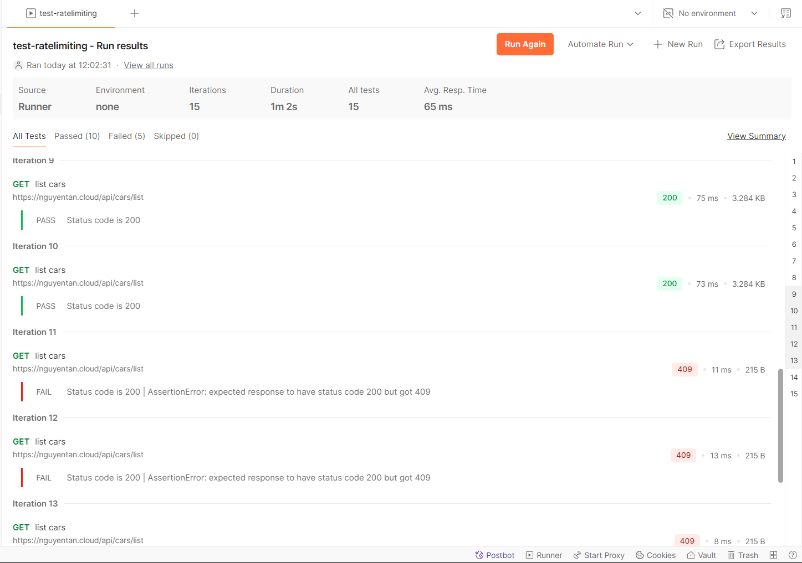

# Output yêu cầu 3
#### Yêu cầu 3: 
- Sử dụng 1 trong số các giải pháp để ratelimit cho Endpoint của api Service, sao cho nếu có  quá 10 request trong 1 phút gửi đến Endpoint của api service thì 
các request sau đó bị trả về HTTP Response 409  
#### Output 3: 
- File tài liệu trình bày giải pháp: [Giải pháp](Solution.md)
- File ghi lại kết quả thử nghiệm khi gọi quá 10 request trong 1 phút vào Endpoint của API Service. 
    - Môi trường thử nghiệm:
        - Công cụ: Postman
        - url của api là url https được cấu hình từ yêu cầu 1
        - request lựa chọn là request để lấy danh sách oto có trong showroom
        - Số request trong 1 phút là 15, bước nhảy là 4s cho 1 request
    - File kết quả thử nghiệm: [test-ratelimiting.postman_test_run.json](test-ratelimiting.postman_test_run.json)
    - Từ request số 11 thì sẽ báo lỗi với response trả về status code là `409`:
    