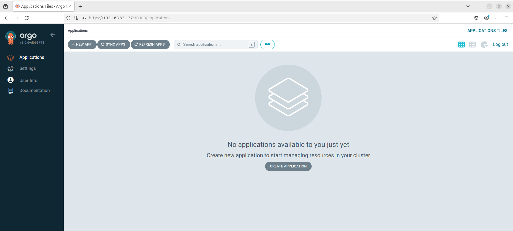

# ArgoCD Deployment Report

## 1. ArgoCD Manifest

```yaml
apiVersion: v1
kind: Namespace
metadata:
  name: argocd
---
apiVersion: v1
kind: ServiceAccount
metadata:
  name: argocd-server
  namespace: argocd
---
apiVersion: v1
kind: Service
metadata:
  name: argocd-server-nodeport
  namespace: argocd
spec:
  type: NodePort
  selector:
    app.kubernetes.io/name: argocd-server
  ports:
    - name: https
      port: 443
      targetPort: 8080
      nodePort: 30080
```

## 2. Cài đặt ArgoCD

```bash
# Tạo namespace cho ArgoCD
kubectl create namespace argocd

# Cài đặt ArgoCD từ manifest chính thức
kubectl apply -n argocd -f https://raw.githubusercontent.com/argoproj/argo-cd/stable/manifests/install.yaml

# Apply thêm Service NodePort để expose ArgoCD
kubectl apply -f argocd-install.yaml
```

## 3. Truy cập ArgoCD qua trình duyệt

- Địa chỉ truy cập: `https://<NodeIP>:30080`
- Username: `admin`
- Lấy mật khẩu mặc định bằng lệnh:

```bash
kubectl -n argocd get secret argocd-initial-admin-secret -o jsonpath="{.data.password}" | base64 -d
```

## 4. Giao diện ArgoCD

Dưới đây là ảnh chụp màn hình giao diện ArgoCD sau khi truy cập thành công:

<p align="center">
  
</p>
