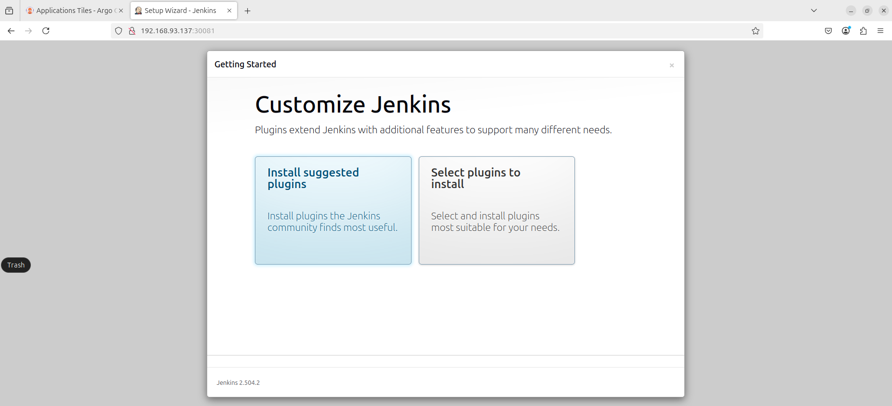

# Jenkins Deployment Report

## 1. Jenkins Manifest

```yaml
apiVersion: v1
kind: Namespace
metadata:
  name: jenkins
---
apiVersion: apps/v1
kind: Deployment
metadata:
  name: jenkins
  namespace: jenkins
spec:
  replicas: 1
  selector:
    matchLabels:
      app: jenkins
  template:
    metadata:
      labels:
        app: jenkins
    spec:
      containers:
        - name: jenkins
          image: jenkins/jenkins:lts
          ports:
            - containerPort: 8080
          volumeMounts:
            - name: jenkins-home
              mountPath: /var/jenkins_home
      volumes:
        - name: jenkins-home
          emptyDir: {}
---
apiVersion: v1
kind: Service
metadata:
  name: jenkins-nodeport
  namespace: jenkins
spec:
  type: NodePort
  selector:
    app: jenkins
  ports:
    - port: 8080
      targetPort: 8080
      nodePort: 30081
```

## 2. Cài đặt Jenkins

```bash
kubectl apply -f jenkins-deployment.yaml
```

## 3. Truy cập Jenkins

- Truy cập URL: `http://<NodeIP>:30081`
- Username: `admin`
- Lấy mật khẩu bằng lệnh:

```bash
kubectl -n jenkins exec -it $(kubectl -n jenkins get pod -l app=jenkins -o jsonpath="{.items[0].metadata.name}") -- cat /var/jenkins_home/secrets/initialAdminPassword
```

## 4. Giao diện Jenkins

Ảnh chụp màn hình giao diện Jenkins sau khi truy cập thành công:

<p align="center">
  
</p>
