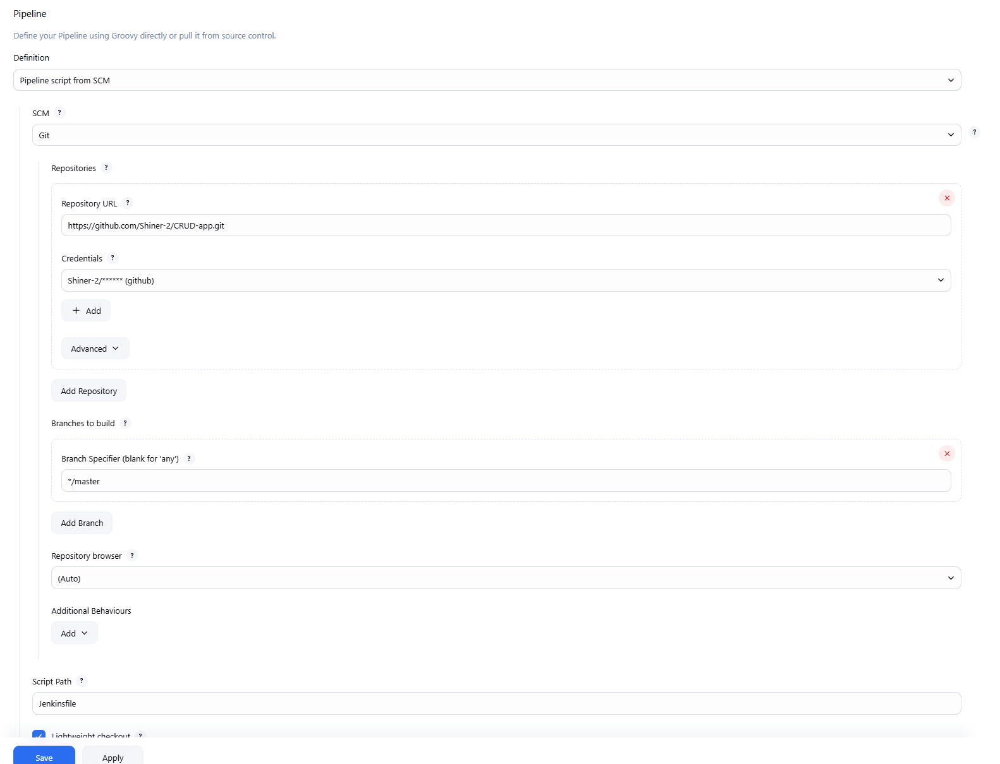
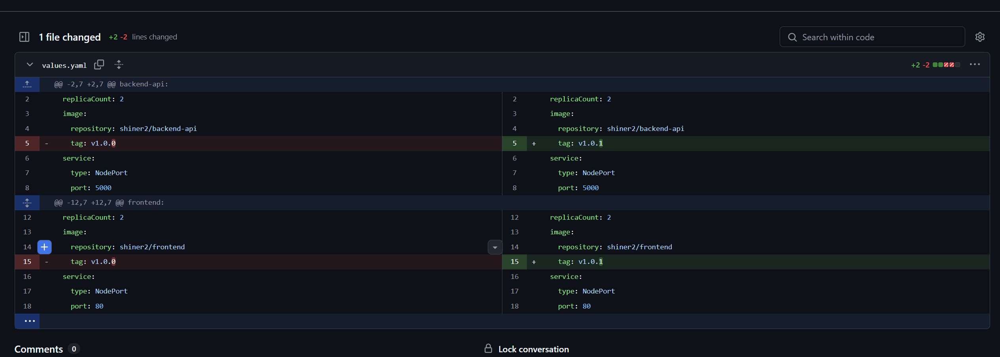
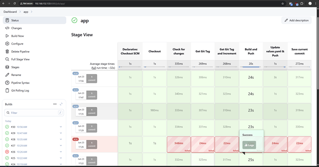

Ở Jenkins, tạo một pipeline mới với cài đặt như sau

Code cho pipeline nằm ở file Jenkinsfile nằm ở ngoài cùng

Trước khi chạy code phải tạo 2 credentials là github và dockerhub sử dụng PAT và user-name.

Sau khi tạo xong có thể bắt đầu build thử trên Jenkins nếu cấu hình y hệt trên ảnh

Để thực hiện việc build tự động có thể cấu hình webhook cho github để có thể tự update mỗi lần push code. Hoặc có thể dùng SCM poll để update sau mỗi khoảng thời gian nhất định

Mỗi lần build sẽ có tag khác nhau để update phiên bản

Log sau khi build thành công: https://docs.google.com/document/d/15vJ0LygWFo4vdh3tDC4cPlzT4MTCG7J3KAPGfsPhlSk/edit?usp=sharing

Ảnh sau khi build thành công:

