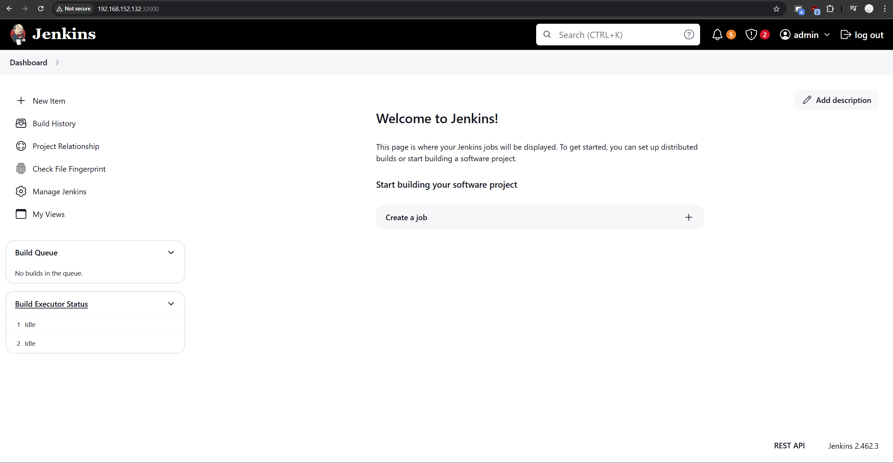

Tham khảo cài đặt tại: https://www.jenkins.io/doc/book/installing/kubernetes/     

Tại thư mục jenkins bên ngoài PhamNgocHaiDuong-cuoi-ky-gd-1\jenkins apply lần lượt 4 file .yaml

Các lệnh lần lượt là
```
kubectl apply -f j1.yaml
kubectl apply -f j2.yaml
kubectl apply -f j3.yaml
kubectl apply -f j4.yaml
```

Sau khi chạy xong, lên địa chỉ 
```<worker-node>:32000```


Để lấy mật khẩu
```
kubectl exec -n devops-tools -it jenkins-5874c666f4-zmn2s – cat /var/jenkins_home/secrets/initialAdminPassword
```
Thay thế “jenkins-5874c666f4-zmn2s” bằng mã đằng sau khi chạy lệnh: 
```
kubectl get pods -n devops-tools -l app=jenkins-server
```


Sau đó sẽ truy cập được UI jenkins

