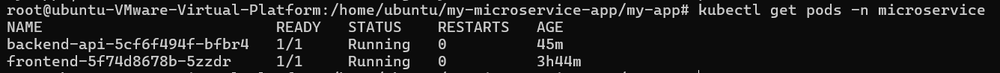
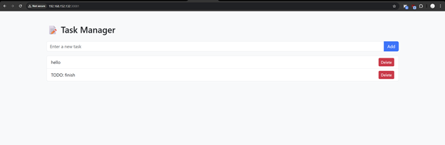
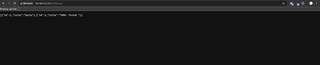

Code của app nằm trong frontend và backend-api

Chạy lệnh 
```
helm install my-app . -n microservice --create-namespace
```
Sau đó app sẽ được triển khai trên kubernetes


frontend được expose ở cổng 30081 ở node worker


backend được expose ở cổng 30500 ở node worker
