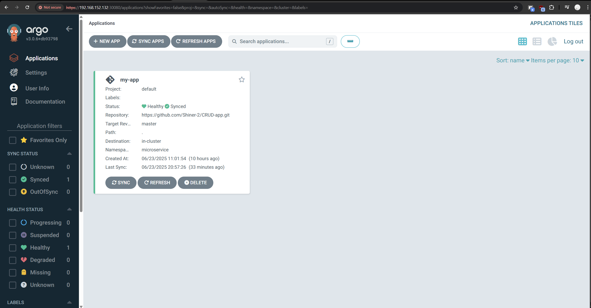
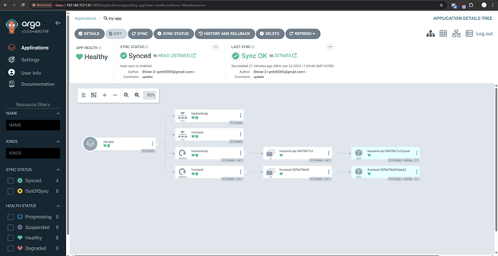

Tải dựa trên: https://argo-cd.readthedocs.io/en/stable/

Chạy các lệnh sau

```
kubectl create namespace argocd
kubectl apply -n argocd -f https://raw.githubusercontent.com/argoproj/argo-cd/stable/manifests/install.yaml
kubectl patch svc argocd-server -n argocd \
  -p '{"spec": {"type": "NodePort", "ports": [{"port": 80, "targetPort": 8080, "nodePort": 30080, "protocol": "TCP", "name": "http"}]}}'
```
Sau đó có thể truy cập qua http://<IP-của-node>:30080 (cần kiểm tra xem agroCD hoạt động ở master1 hay worker1), trong bài em đang ở worker1 (đã expose qua NodePort trong lệnh trên)

Sau đó sẽ hiển thị giao diện gần giống như dưới (chưa có app)


Sau khi cài đặt app, để import vào agroCD thì dùng lệnh
```
kubectl apply -f argoCD-application.yaml
```
Với argoCD-application.yaml nằm ở ngoài cùng

