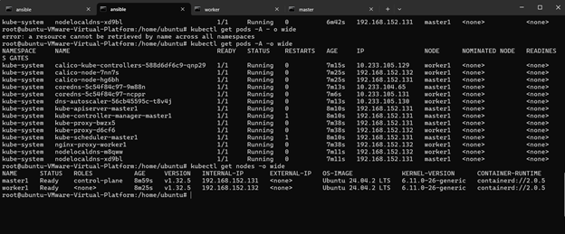

# Cài đặt bằng kubespray (lấy từ lab đã thực hành)


# 1. Yêu cầu máy
ansible	Node control, cài ansible, docker, kubespray
master1	master + etcd	
worker1	worker	4GB	
Tất cả dùng Ubuntu 24.04
# 2. Tại máy Ansible
Clone và chạy container Kubespray:
git clone https://github.com/kubernetes-sigs/kubespray
cd kubespray
<!-- < Tự Tải docker ở đây nữa -->
```
docker run --rm -it \
  --mount type=bind,source="$(pwd)"/inventory/sample,dst=/inventory \
  --mount type=bind,source="${HOME}"/.ssh/id_rsa,dst=/root/.ssh/id_rsa \
  quay.io/kubespray/kubespray:v2.28.0 bash
``` 
# 3. Tạo file inventory:
Sửa nội dung /inventory/inventory.ini:
```
[kube_control_plane]
master1 ansible_host=<ip_master> ansible_port=<port_ssh_sang_master1> ansible_user=<user_có_quyền_lên_root>

[etcd:children]
kube_control_plane

[kube_node]
worker1 ansible_host=<ip_worker> ansible_port=<port_ssh_sang_worker1> ansible_user=<user_có_quyền_lên_root>

[k8s_cluster:children]
kube_control_plane
kube_node
```
# 4. Chạy cài đặt K8s:
```
ansible-playbook -i inventory/sample/inventory.ini cluster.yml --become --ask-pass --ask-become-pass
```
●	Nhập mật khẩu SSH + mật khẩu sudo.
●	Nếu không có node nào failed, là thành công.

# 5. Cài kubectl (trên Ansible hoặc worker1):
Link: https://kubernetes.io/docs/tasks/tools/install-kubectl-linux/
```
curl -LO "https://dl.k8s.io/release/$(curl -sL https://dl.k8s.io/release/stable.txt)/bin/linux/amd64/kubectl"

sudo install -o root -g root -m 0755 kubectl /usr/local/bin/kubectl
```
# 6. Cấu hình kubeconfig:
Trên master1:
```
sudo cat /etc/kubernetes/admin.conf
```
Copy file kubeconfig về máy Ansible, sửa phần ip của API Server, lưu vào file, ví dụ k8s-config.yaml: server: https://127.0.0.1:6443 => https://<ip_master1>:6443
rồi gán env variable KUBECONFIG:
export KUBECONFIG=k8s-config.yaml
kubectl get nodes -o wide
kubectl get pods -A -o wide
Thấy Node ở trạng thái Ready, Pod ở trạng thái Running là hoàn tất.
 
# 7 Ảnh output
