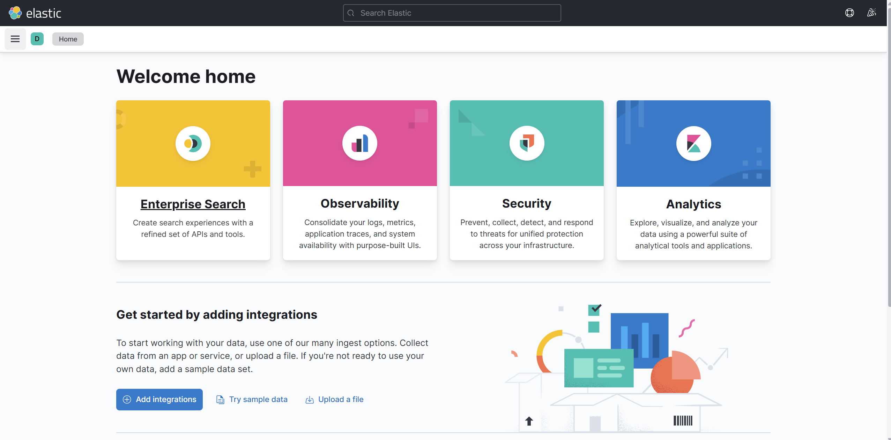

Chạy lệnh sau

```
cd ansible-efk
ansible-playbook -i inventory/hosts site.yml
```

Sau đó có thể truy cập được webUI


Thêm một số dòng sau vào code backend để lấy log
```
import logging
logging.basicConfig(level=logging.INFO)
```
