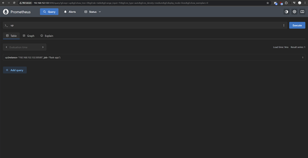
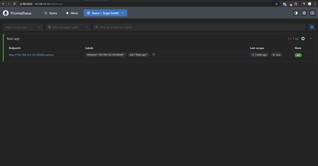

Chạy các lệnh sau
```
cd ansible-prometheus
ansible-playbook -i inventory.ini deploy-prometheus.yml
```

Sau đó có thể truy cập vào prometheus UI


Để expose các metrics, thêm các dòng sau vào code backend
```
from prometheus_flask_exporter import PrometheusMetrics
metrics = PrometheusMetrics(app, path="/metrics")
```

Sau đó khi truy cập vào Target health ở trên promotheus sẽ thấy được metrics đã được expose

