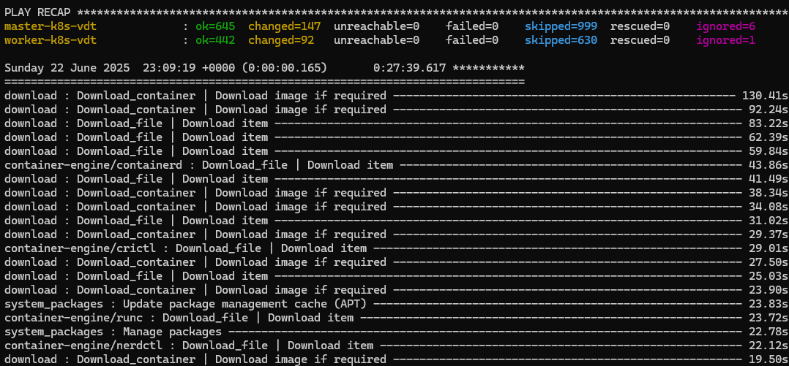
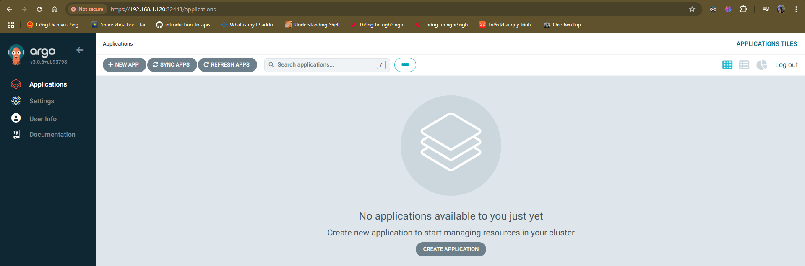
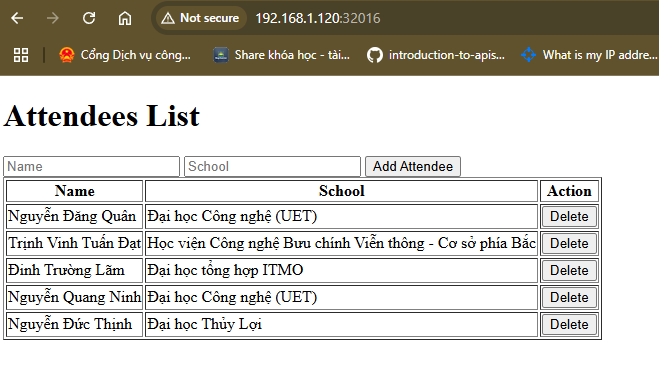

# Kubernetes cluster deployment
## 1. Overview
Kubernetes, also known as K8s, is an open source system for automating deployment, scaling, and management of containerized applications.
### K8s Architecture

A K8s cluster consists of a control plane plus a set of worker machines, called nodes, that run containerized applications. Every cluster needs at least one worker node in order to run Pods.
#### Control plane components
- **etcd**: Key-value store for storing cluster data.
- **API server**: Exposes the Kubernetes API. The API server is the front end for the Kubernetes control plane.
- **Scheduler**: Watches for newly created Pods with no assigned node, and selects the best node for them to run on. Factors taken into account for scheduling decisions include: node's resource availability, node's labels and taints, pod requirements and affinities.
- **Kube Controller Manager**: Within the Control Plane there are multiple controllers, they are the control loops designed to watch the state of your cluster and make or request changes as they are needed. Logically, each controller is a separate process, but to reduce complexity, they are all compiled into a single binary and run in a single process.
- **Cloud Controller Manager**: Lets you link your cluster into your cloud provider's API, and separates out the components that interact with that cloud platform from components that only interact with your cluster.
The cloud-controller-manager only runs controllers that are specific to your cloud provider. If you are running Kubernetes on your own premises, the cluster does not have a cloud controller manager.
#### Node components
- **kubelet**: An agent that runs on each node in the cluster.
- **kube-proxy**: Maintains network rules on nodes.  These network rules allow network communication to your Pods from network sessions inside or outside of your cluster.
## 2. K8s cluster deployment using Kubespray
**Kubespray** is an open-source project designed to simplify the deployment K8s clusters. It provides a robust and flexible solution for setting up production-ready Kubernetes clusters on various infrastructure environments, including cloud providers, virtual machines, and bare-metal servers.
### Preparation
- Server 1: Management server (*management*) - 1GB RAM - 2 CPUs - IP address: **192.168.1.114**.
- Server 2: Master node (*master-k8s-vdt*) - 3GB RAM - 2 CPUs - IP address: **192.168.1.120**.
- Server 3: Worker node (*worker-k8s-vdt*) - 4GB RAM - 2 CPUs - IP address: **192.168.1.121**.

Our cluster consists of 2 nodes: `master-k8s-vdt` and `worker-k8s-vdt`. To deploy a k8s cluster using Kubespray, we need to create an SSH key pair on `management` and copy the public key to the 2 nodes `master-k8s-vdt` and `worker-k8s-vdt`.
On `management`, create an [inventory file](./k8s_deployment/inventory.ini) to specify the hosts and run the **kubespray** container:
```
docker run --rm -it --mount type=bind,source="$(pwd)"/inventory/k8s-vdt/,dst=/inventory \
  --mount type=bind,source="${HOME}"/.ssh/id_rsa,dst=/root/.ssh/id_rsa \
  quay.io/kubespray/kubespray:v2.28.0 bash
```
Inside the container run the kubespray playbooks:
```
ansible-playbook -i /inventory/inventory.ini cluster.yml --ask-become-pass
```

### Installing kubectl
To manage the k8s cluster, install **kubectl** on `management`.
Link: https://kubernetes.io/docs/tasks/tools/install-kubectl-linux/\
Download the binary on the server `management`:
```
curl -LO "https://dl.k8s.io/release/$(curl -L -s https://dl.k8s.io/release/stable.txt)/bin/linux/amd64/kubectl"
```
Install **kubectl**:
```
sudo install -o root -g root -m 0755 kubectl /usr/local/bin/kubectl
```
Copy the content of the file /etc/kubernetes/admin.conf on the master node `master-k8s-vdt`  to the server `management` under the path $HOME/.kube/config.
Edit the config file, changing the line "server: https://127.0.0.1:6443" to "server: https://192.168.1.120:6443" (192.168.64.148 is the IP of the master node, 6443 is the port of the kube-api-server).
List all nodes in the cluster:
```
kubectl get nodes -o wide
```

List all pods in the cluster:
```
kubectl get pods -A -o wide
```


# Deploy web application using DevOps tools & practices
## 1. Deploy Jenkins on the k8s cluster
Follow the official documentation: https://www.jenkins.io/doc/book/installing/kubernetes/\
Manifest file for deploying Jenkins on the cluster: [jenkins-install.yaml](./jenkins-install.yaml)\
Jenkins is successfully deployed and exposed via NodePort 32000.

## 2. Deploy ArgoCD on the k8s cluster
Official documentation for installing ArgoCD: https://argo-cd.readthedocs.io/en/stable/getting_started/\
Install Argocd:
```
kubectl create namespace argocd
kubectl apply -n argocd -f https://raw.githubusercontent.com/argoproj/argo-cd/stable/manifests/install.yaml
```
Manifest file can be found [here](https://raw.githubusercontent.com/argoproj/argo-cd/stable/manifests/install.yaml).\
List all resources in the argocd namespace:
```
kubectl get all -n argocd
```

As we can see, ArgoCD is not yet exposed via NodePort. To expose it via NodePort, apply this [manifest file](./k8s_helm_chart/argocd_svc.yaml).\
Now ArgoCD is exposed via NodePort 32080 and 32443.

We can successfully access ArgoCD using any of the nodes' IP address.

## 3. Run an app with Helm chart
First of all we need to create a persistent storage for to store database data. Manifest file for creating a class storage, a persistent volume and a persistent volume claim can be found [here](./k8s_helm_chart/volume.yaml).
I prepared another server `nfs-server` with the IP address 192.168.1.104 to serve as an NFS server, and installed NFS client on the worker node `worker-k8s-vdt` so that all the database data will be mounted to a path in the NFS server.
Manifest file for deploying the database can be found [here](./k8s_helm_chart/mongodb-install.yaml).\
After the database is ready, proceed to the next step. Create a [config repo](https://github.com/mthanghoang/demo-app.git) for the application that contains necessary files for deploying.
After this write 2 separate ArgoCD manifests for the frontend and backend service.\
[ArgoCD manifest file for frontend service](./k8s_helm_chart/argocd-frontend.yaml).\
[ArgoCD manifest file for backend service](./k8s_helm_chart/argocd_backend.yaml).
Run the following commands to apply:
```
kubectl apply -f argocd-frontend.yaml
kubectl apply -f argocd-backend.yaml
```

Screenshot when accessing web URL:

Screenshot when accessing api URL:


