# Triển khai Web Application sử dụng các DevOps Tools & Practices

## Tổng quan
Triển khai web application sử dụng các DevOps tools & practices. Sinh viên chọn 1 app bất kỳ theo cấu trúc microservices (ví dụ web app và api service).

### Ứng dụng được lựa chọn
WebApp hiển thị danh sách sinh viên tham gia chương trình VDT 2025 lĩnh vực Cloud 

#### Kiến trúc hệ thống:
- **Service Backend**: Spring Boot 
- **Service Frontend**: React Vite JS 
- **Database**: PostgreSQL

### Demo ứng dụng

#### Frontend Interface

**Hiển thị danh sách sinh viên:**

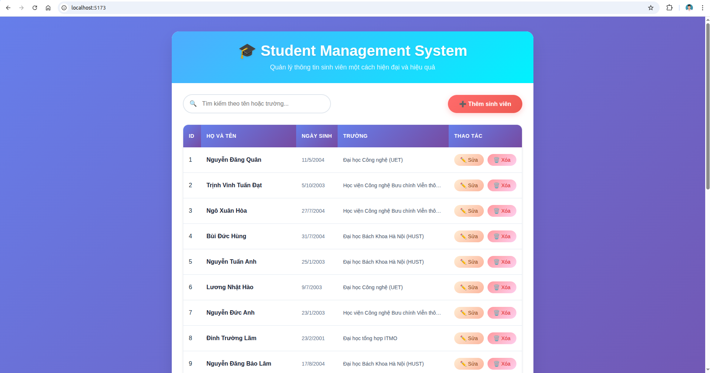

**Thêm sinh viên mới:**

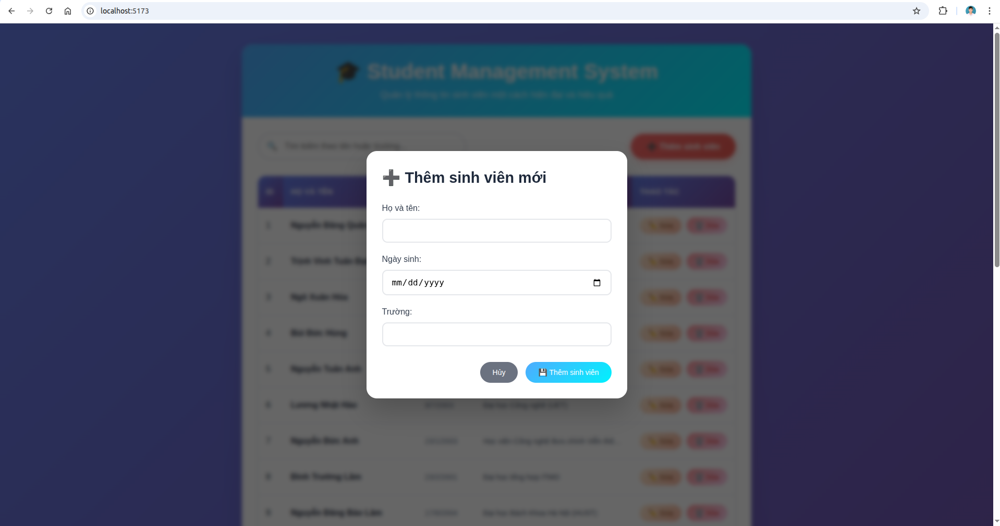

**Xóa sinh viên:**

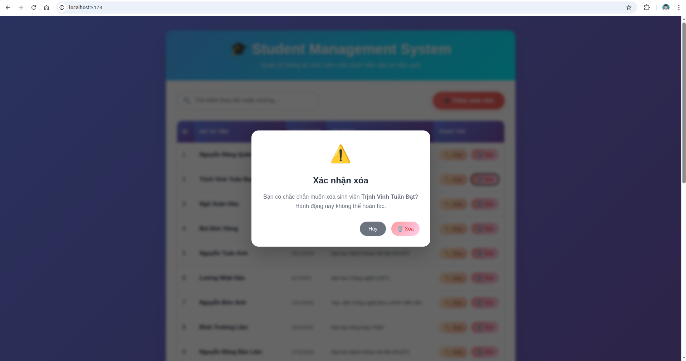

**Tìm kiếm theo tên:**

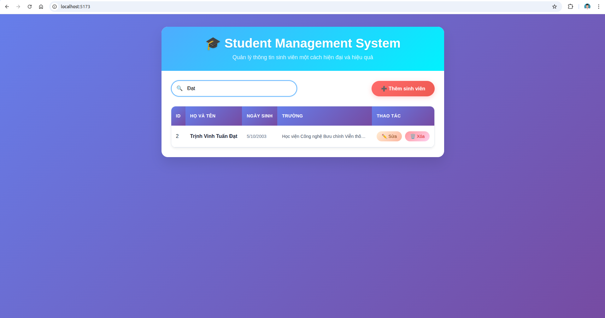

#### Backend API

**API lấy danh sách sinh viên:**

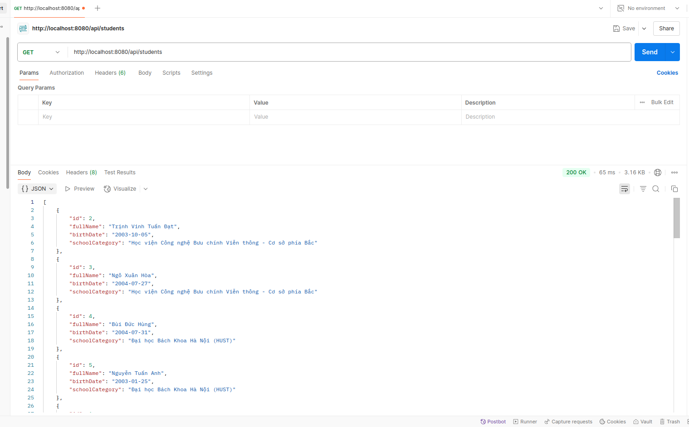

#### Database

**PostgreSQL Database:**

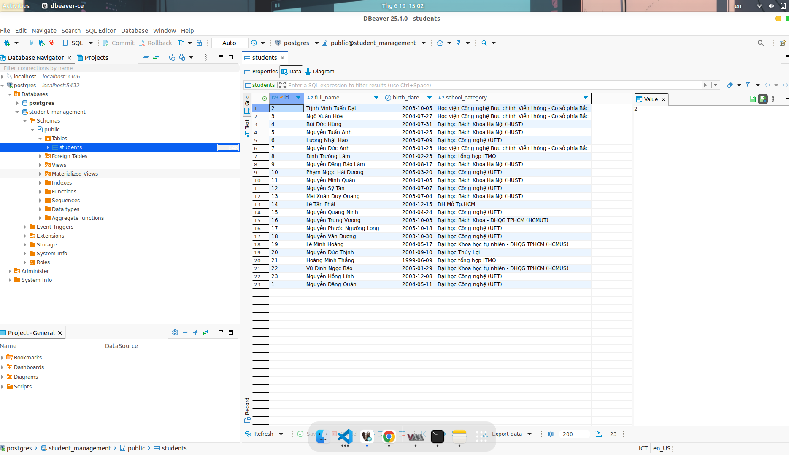

---

## K8S Helm Chart (1.5đ)

### Yêu cầu 1

#### Nhiệm vụ:
- Cài đặt ArgoCD lên Kubernetes Cluster, expose được ArgoCD qua NodePort
- Cài đặt Jenkins lên Kubernetes Cluster, expose được Jenkins qua NodePort

#### Output 1:

### Cài đặt ArgoCD lên Kubernetes Cluster

Thực hiện cài đặt theo tài liệu: https://argo-cd.readthedocs.io/en/stable/getting_started/

#### Install ArgoCD

```bash
kubectl create namespace argocd
kubectl apply -n argocd -f https://raw.githubusercontent.com/argoproj/argo-cd/stable/manifests/install.yaml
```

**File Manifest cài đặt ArgoCD:** [File Manifest cài đặt Argocd](./manifest/install-argocd.yaml)

#### Expose ArgoCD qua NodePort

File Manifest triển khai dịch vụ ArgoCD qua NodePort (nodePort: 30000):

```yaml
apiVersion: v1
kind: Service
metadata:
  name: argocd-server-nodeport
  namespace: argocd
spec:
  type: NodePort
  ports:
    - port: 80
      targetPort: 8080
      nodePort: 30000
  selector:
    app.kubernetes.io/name: argocd-server
```

#### Truy cập ArgoCD

Truy cập ArgoCD qua đường dẫn: **https://192.168.122.93:30000/**

Trong đó:
- `192.168.122.93` là NodeIP
- `30000` là NodePort của ArgoCD

#### Giao diện ArgoCD

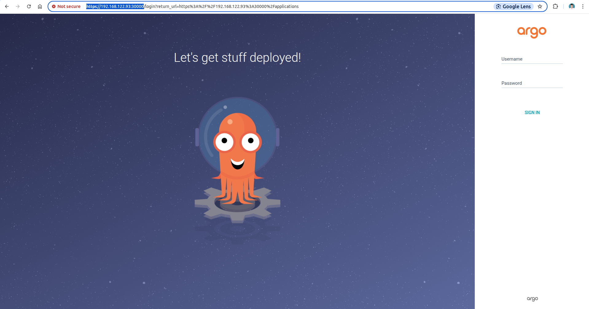

---

### Cài đặt Jenkins lên Kubernetes Cluster

#### Install Jenkins

```bash
kubectl create namespace jenkins
kubectl apply -f jenkins.yaml
```

**File Manifest cài đặt Jenkins:** [File Manifest cài đặt Jenkins](./manifest/jenkins.yaml)

#### Truy cập Jenkins

Truy cập Jenkins qua đường dẫn: **http://192.168.122.93:30999/**

Trong đó:
- `192.168.122.93` là NodeIP  
- `30999` là NodePort của Jenkins

#### Giao diện Jenkins

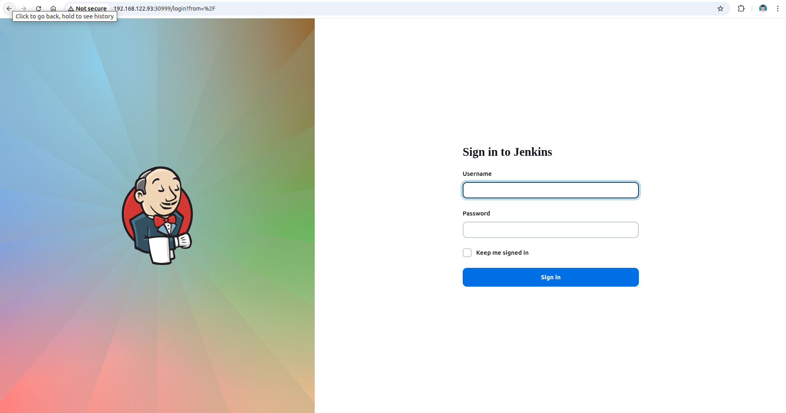

---

### Yêu cầu 2

#### Nhiệm vụ:
- Viết hoặc tìm mẫu Helm Chart cho app bất kỳ, để vào 1 folder riêng trong repo app
- Tạo Repo Config cho app trên, trong repo này chứa các file values.yaml với nội dung của các file values.yaml là các config cần thiết để chạy ứng dụng trên k8s bằng Helm Chart

#### Output 2:
- **Các Helm Chart** sử dụng để triển khai app lên K8S Cluster
- **Các file values.yaml** trong config repo của app  
- **Manifest của ArgoCD Application**
- **Ảnh chụp giao diện** màn hình hệ thống ArgoCD trên trình duyệt
- **Ảnh chụp giao diện** màn hình trình duyệt khi truy cập vào Web URL, API URL
### Kiến trúc Repository

#### Tổng quan

Dự án được tổ chức thành 4 repository chính, phân chia rõ ràng giữa source code và configuration:

---

####  Repository Structure

##### Backend
| Repository | Mô tả | Link |
|------------|-------|------|
| **vdt_2025_backend** | Source code backend | [🔗 GitHub](https://github.com/Maybetuandat/vdt_2025_backend) |
| **vdt_2025_backend_config** | Configuration backend | [🔗 GitHub](https://github.com/Maybetuandat/vdt_2025_backend_config) |

##### Frontend  
| Repository | Mô tả | Link |
|------------|-------|------|
| **vdt_2025_frontend** | Source code frontend | [🔗 GitHub](https://github.com/Maybetuandat/vdt_2025_frontend) |
| **vdt_2025_frontend_config** | Configuration frontend | [🔗 GitHub](https://github.com/Maybetuandat/vdt_2025_frontend_config) |

##### Database
| Repository | Mô tả | Link |
|------------|-------|------|
| **vdt_2025_database** | Repo chứa các file helm chart và value deployment  | [🔗 GitHub](https://github.com/Maybetuandat/vdt_db) |
---
### Các Helm Chart sử dụng để triển khai app lên K8S Cluster

#### Danh sách Helm Charts

#### 1. Helm Chart triển khai backend deployment
**[Source code Helm Chart Backend](https://github.com/Maybetuandat/vdt_2025_backend/tree/main/backend-chart)**: Source code nằm trong thư mục `backend-chart`

#### 2. Helm Chart triển khai frontend deployment  
**[Source code Helm Chart Frontend](https://github.com/Maybetuandat/vdt_2025_frontend/tree/main/helm-chart)**: Source code nằm trong thư mục `helm-chart`

---
#### 3. Helm Chart triển khai database deployment  
**[Source code Helm Chart Database](https://github.com/Maybetuandat/vdt_db)**: Source code nằm trong thư mục `database-chart`

---
### Tạo Repo Config cho backend và frontend

#### Cách thức hoạt động
> **Repo config** sẽ chứa các file `values.yaml` với nội dung của các file `values.yaml` là các config cần thiết để chạy ứng dụng trên K8s bằng Helm Chart

### Thông số triển khai

| Service | Replicas | NodePort | Mô tả |
|---------|----------|----------|-------|
| **Backend** | 3 | 30002 | API Service |
| **Frontend** | 1 | 30001 | Web Application |
| **Database** | 1 | 30432 | PostgreSQL Database |

---

### Repository Configuration

#### 1. Repo config cho backend
**[Repo config backend](https://github.com/Maybetuandat/vdt_2025_backend_config)**

#### `values-prod.yaml` của backend config:
```yaml
replicaCount: 3
image:
  repository: maybetuandat/vdt_backend
  pullPolicy: IfNotPresent
  tag: "1.0"
  
service:
  type: NodePort
  port: 8080
  nodePort: 30002

database:
  host: vdt-database-postgres-chart
  port: 5432
  name: student_management
  user: postgres
  password: "123456"

resources: {}
```

#### 2. Repo config cho frontend
**[Repo config frontend](https://github.com/Maybetuandat/vdt_2025_frontend_config)**

#### `values-prod.yaml` của frontend config:
```yaml
replicaCount: 1
image:
  repository: maybetuandat/vdt_fe
  pullPolicy: IfNotPresent
  tag: "1.0"

securityContext: {}

service:
  type: NodePort
  port: 80
  targetPort: 80
  nodePort: 30001
  portName: vdt-web-port

resources: {}

volumes: []

volumeMounts: []

nodeSelector: {}

tolerations: []

affinity: {}
```
#### 3. Values config cho database
```yaml
replicaCount: 1

image:
  repository: maybetuandat/vdt_db
  tag: "1.0"
  pullPolicy: IfNotPresent

service:
  type: NodePort
  port: 5432
  nodePort: 30432

persistence:
  enabled: true
  storageClass: "standard" 
  size: 1Gi

env:
  POSTGRES_DB: student_management
  POSTGRES_USER: postgres
  POSTGRES_PASSWORD: "123456"


healthCheck:
  enabled: true
```

### Manifest của ArgoCD Application
Manifest của ARgoCD Application sử dụng để triển khai các backend service và frontend service  lên K8s Cluster
Đối với frontend và backend đều sử dụng 2 repo:
- Repo source code chứa các file helm chart
- Repo config chứa các file value-prod.yaml để lưu trữ các giá trị biên sử dụng để triển khai lên cụm K8S
#### 1. Manifest triển khai backend 
```yaml
apiVersion: argoproj.io/v1alpha1
kind: Application
metadata:
  name: vdt-backend
  namespace: argocd
spec:
  project: default
  sources:
    - repoURL: 'https://github.com/Maybetuandat/vdt_2025_backend_config'
      targetRevision: HEAD
      ref: values
    - repoURL: 'https://github.com/Maybetuandat/vdt_2025_backend'
      targetRevision: HEAD
      path: 'backend-chart'
      helm:
        valueFiles:
        - $values/helm-values/values-prod.yaml
  destination:
    server: 'https://kubernetes.default.svc'
    namespace: vdt-app
  syncPolicy:
    syncOptions:
    - CreateNamespace=true
    automated:
      prune: true
      selfHeal: true
```
Backend sẽ đươc expose ra NodePort: 30002

Manifest expose ra NodePort: [Service](https://github.com/Maybetuandat/vdt_2025_backend/blob/main/backend-chart/templates/service.yaml)

#### 2. Manifest triển khai frontend
```yaml
apiVersion: argoproj.io/v1alpha1
kind: Application
metadata:
  name: vdt-frontend
  namespace: argocd
spec:
  project: default
  sources:
    - repoURL: 'https://github.com/Maybetuandat/vdt_2025_frontend_config'
      targetRevision: HEAD
      ref: values
    - repoURL: 'https://github.com/Maybetuandat/vdt_2025_frontend'
      targetRevision: HEAD
      path: 'helm-chart'
      helm:
        valueFiles:
        - $values/helm-values/values-prod.yaml
  destination:
    server: 'https://kubernetes.default.svc'
    namespace: vdt-app
  syncPolicy:
    syncOptions:
    - CreateNamespace=true
    automated:
      prune: true
      selfHeal: true
```
Frontend sẽ đươc expose ra NodePort: 30001

Manifest expose ra NodePort: [Service](https://github.com/Maybetuandat/vdt_2025_frontend/blob/main/helm-chart/templates/service.yaml)

#### 3. Manifest sử dụng để triển khai database
``` yaml
apiVersion: argoproj.io/v1alpha1
kind: Application
metadata:
  name: vdt-database
  namespace: argocd
spec:
  project: default
  source:
    repoURL: 'https://github.com/Maybetuandat/vdt_db'
    targetRevision: HEAD
    path: 'database-chart'
    helm:
      valueFiles:
      - values.yaml
  destination:
    server: 'https://kubernetes.default.svc'
    namespace: vdt-app
  syncPolicy:
    syncOptions:
    - CreateNamespace=true
    automated:
      prune: true
      selfHeal: true
```
Database sẽ đươc expose ra NodePort: 30432

Manifest expose ra NodePort: [Service](https://github.com/Maybetuandat/vdt_db/blob/main/database-chart/templates/postgres-service.yaml)

### Ảnh chụp màn hình giao diện ArgoCD và Deployment

#### Giao diện ArgoCD trên trình duyệt

#### Tổng quan các Application
Hình ảnh danh sách toàn bộ các application trong ArgoCD:

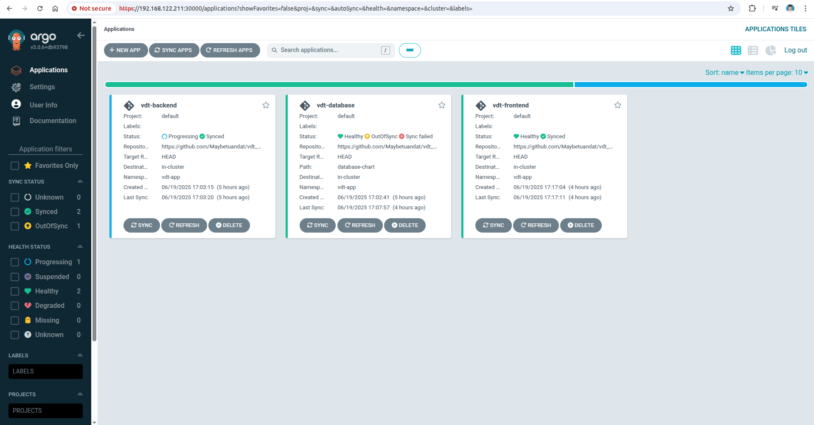

---

#### Backend Application

#### Chi tiết Backend Application


#### Service Backend
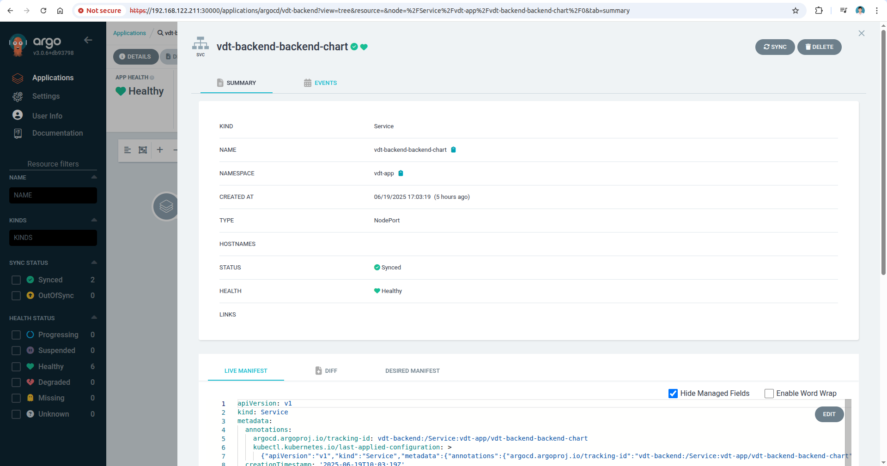

#### Thông tin chi tiết Backend Application
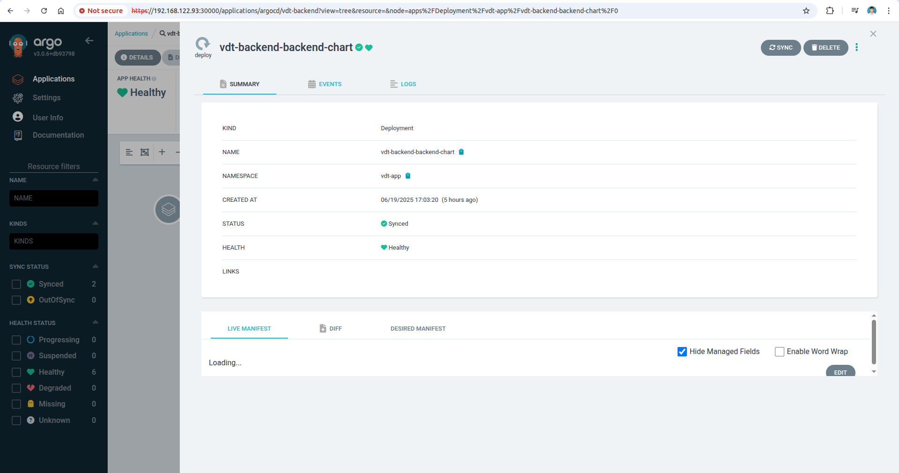

---

#### Frontend Application

#### Chi tiết Frontend Application
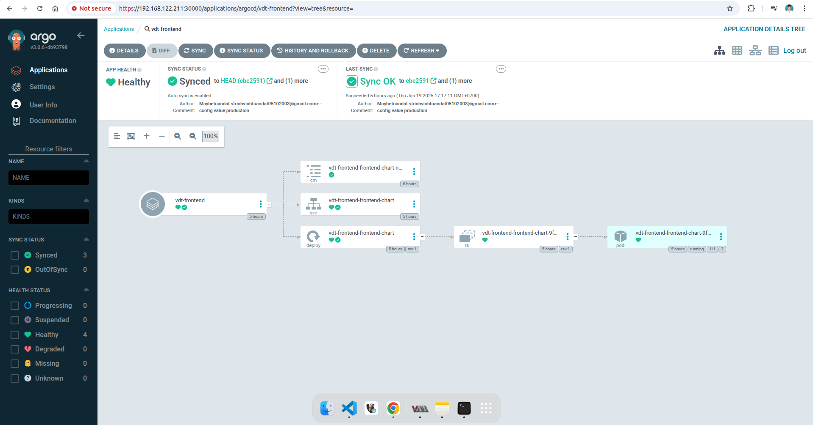

#### ConfigMap của Frontend Application
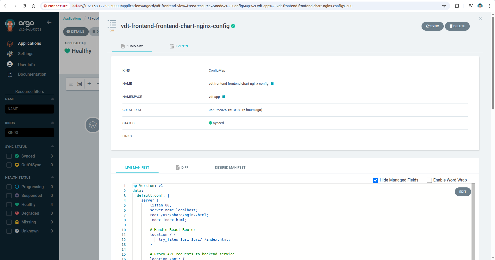

#### Thông tin chi tiết Frontend Application
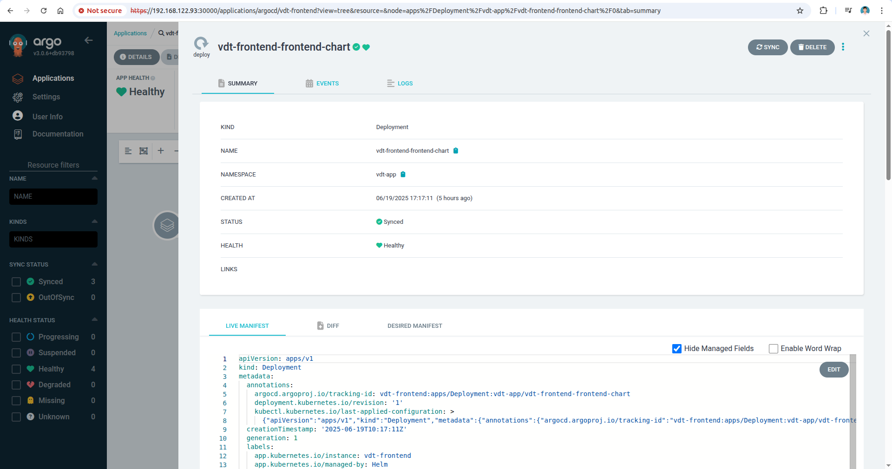

---

#### Database Application

#### Chi tiết Database
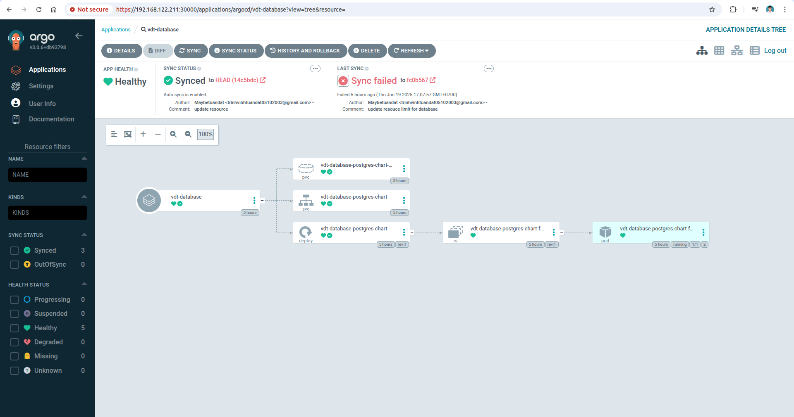

#### Thông tin chi tiết Database
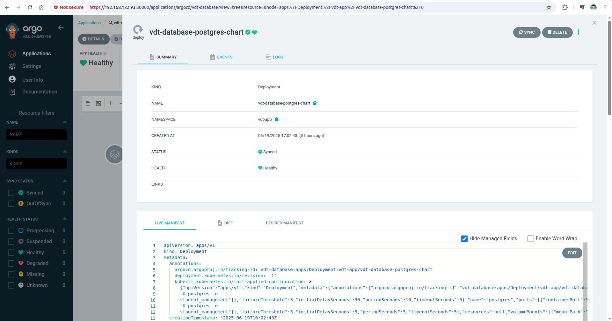

---

### Ảnh chụp màn hình trình duyệt khi truy cập vào WEB URL, API URL

#### Truy cập Frontend Application
Hình ảnh khi truy cập vào frontend:

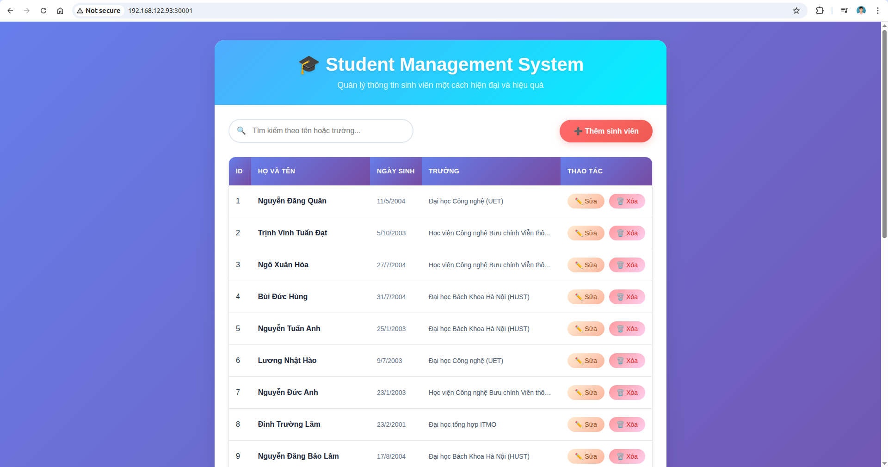

#### Truy cập API Application
Hình ảnh khi truy cập vào API:

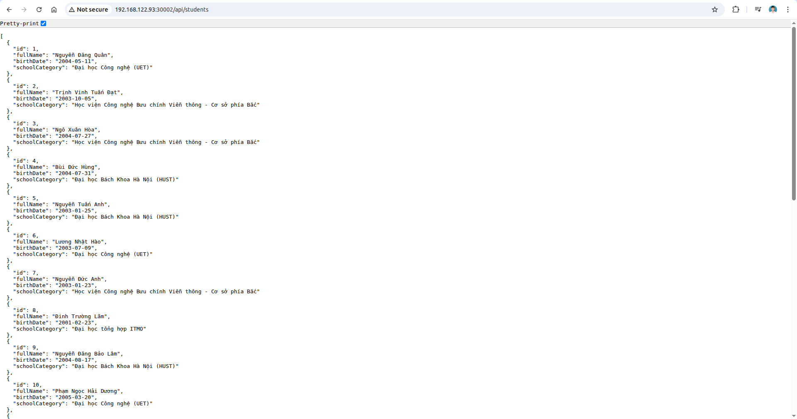

# Kết luận

Hệ thống đã triển khai thành công web application với kiến trúc microservices sử dụng Kubernetes, ArgoCD và Helm Charts. Ứng dụng quản lý sinh viên VDT 2025 bao gồm Frontend (React), Backend (Spring Boot) và Database (PostgreSQL) đã được containerized và deploy lên K8s cluster.

Kết quả:
- **ArgoCD và Jenkins** được cài đặt và expose thành công qua NodePort
- **Helm Charts** được thiết kế cho từng service với cấu trúc module hóa
- **GitOps workflow** với repo source code và config repository tách biệt
- **Multi-source ArgoCD Applications** quản lý deployment tự động

Các NodePort đươc expose:
- **Frontend** : 30001
- **Backend** : 30002
- **Database** : 30432
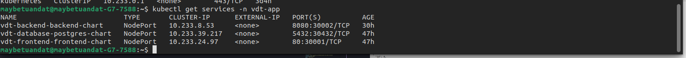