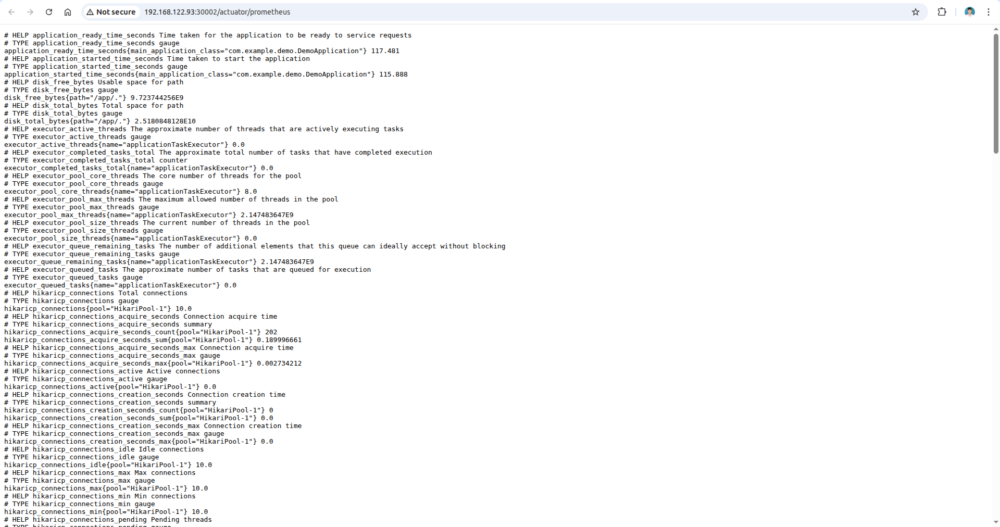

# Monitoring (1.5đ)

## Yêu cầu

- **Expose metric của app ra 1 http path**
  - Tham khảo: [https://github.com/korfuri/django-prometheus](https://github.com/korfuri/django-prometheus)

- **Sử dụng ansible playbooks để triển khai container Prometheus server**
  - Cấu hình prometheus add target giám sát các metrics đã expose ở trên

## Output

- Các file setup để triển khai Prometheus
- Hình ảnh khi truy cập vào Prometheus UI thông qua trình duyệt  
- Hình ảnh danh sách target của App được giám sát bởi Prometheus

---

## Định hướng cách thực hiện

### 1. Cấu hình expose metrics
- **Backend**: Sử dụng Spring Boot với thư viện Micrometer Registry Prometheus để expose metrics tại endpoint `/actuator/prometheus`
- **Frontend**: Sử dụng nginx exporter để thu thập metrics từ nginx

### 2. Triển khai monitoring infrastructure
- Tạo một máy ảo VM riêng
- Sử dụng Ansible playbooks để triển khai Prometheus và Grafana

### 3. Cấu hình dashboard
- Thiết lập Grafana để hiển thị biểu đồ cho các metrics
- Tạo dashboard monitoring cho cả backend và frontend

---

## Cấu hình cho Frontend và Backend

### Backend Spring Boot

**Tài liệu tham khảo**: [Spring Boot Prometheus Integration](https://www.baeldung.com/spring-boot-prometheus)

#### Enable metrics cho Spring Boot

Thêm cấu hình vào file `application.properties`:


#### Custom metrics implementation

Tạo class **MetricsController** với các custom metrics:
- `student_requests_total`: Tổng số requests đến endpoint students
- `student_request_duration`: Thời gian xử lý cho các endpoint

**File MetricsController**: [MetricsController](https://github.com/Maybetuandat/vdt_2025_backend/blob/main/src/main/java/com/example/demo/controller/MetricsController.java)


#### Integrate metrics vào endpoints

Trong mỗi endpoint, thực hiện:
- Tăng counter cho tổng số requests
- Tính toán thời gian xử lý request


### Frontend Nginx Exporter

#### Cấu hình nginx status và exporter

**Files cấu hình**:
- [ConfigMap cho nginx](https://github.com/Maybetuandat/vdt_2025_frontend/blob/main/helm-chart/templates/configmap.yaml)
- [Nginx Exporter Deployment](https://github.com/Maybetuandat/vdt_2025_frontend/blob/main/helm-chart/templates/nginx-exporter-deployment.yaml)

---

## Kết quả Metrics Exposure

### Backend Metrics
Dữ liệu được expose tại `/actuator/prometheus`:



### Custom Metrics Examples
Các custom metrics đã implement:


### Frontend Metrics
Dữ liệu nginx metrics được expose:


---

## Triển khai Prometheus và Grafana với Ansible

### Ansible Configuration

**Folder chứa các file cấu hình**: [Ansible Playbooks](ansible/)

### Deployment Command

```bash
ansible-playbook -i inventory.ini deploy-prometheus.yml --ask-become-pass
```

Lệnh này sẽ triển khai:
- Prometheus server
- Grafana dashboard
- Cấu hình tự động các targets

---

## Kết quả Monitoring

### Prometheus UI

Giao diện Prometheus web UI:


### Grafana Configuration

#### Data Source Setup
Cấu hình Prometheus làm data source cho Grafana:


#### Dashboard Visualization
Các biểu đồ monitoring được hiển thị trên Grafana:


---

## Kết luận

Phần monitoring đã được triển khai thành công với các thành phần chính:

- **Backend metrics**: Sử dụng Micrometer Prometheus để expose metrics tại `/actuator/prometheus`, bao gồm custom metrics cho student endpoints
- **Frontend metrics**: Triển khai nginx-exporter để thu thập metrics từ web server
- **Infrastructure monitoring**: Sử dụng Ansible để tự động hóa việc triển khai Prometheus server và Grafana dashboard
- **Visualization**: Grafana hiển thị metrics với các biểu đồ trực quan cho performance monitoring


