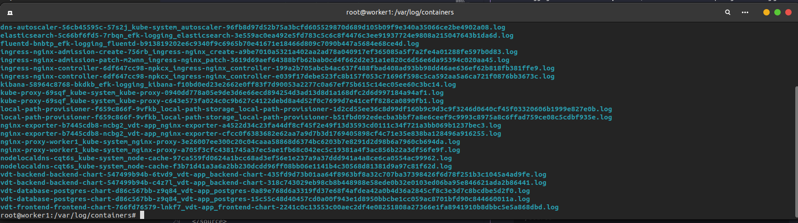
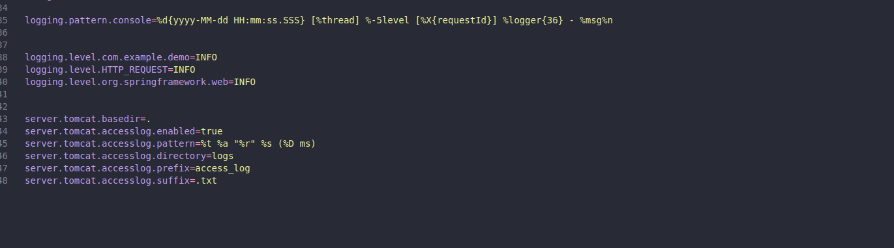
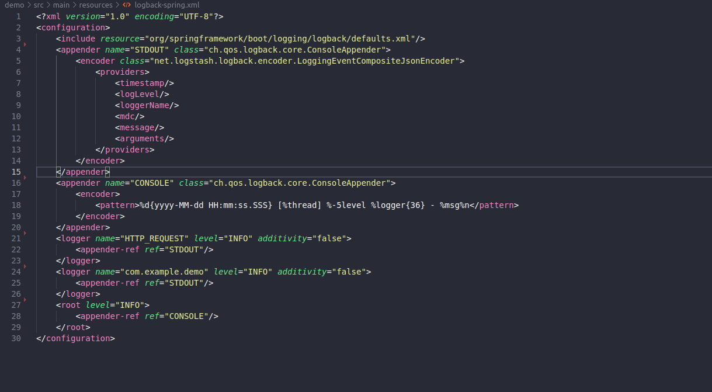
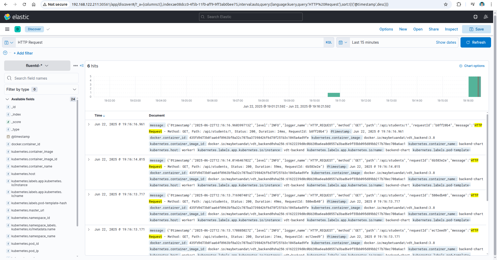
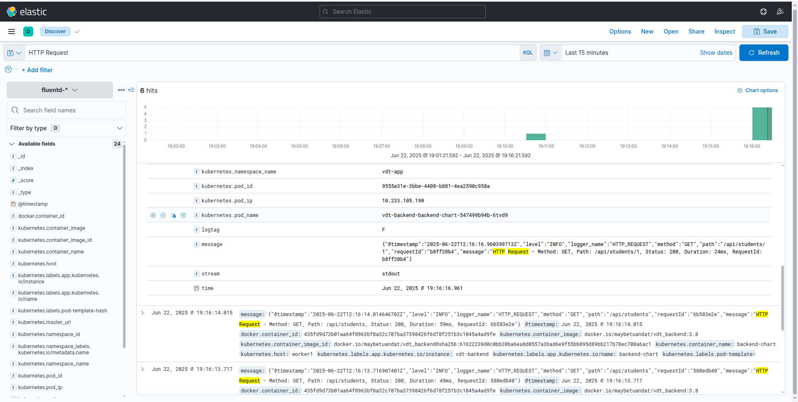
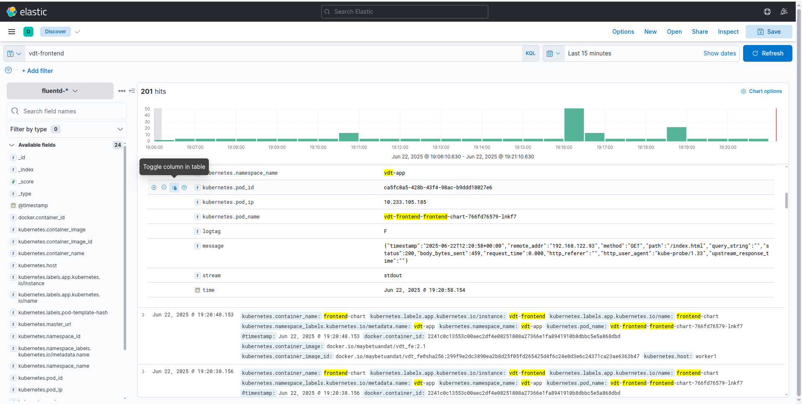
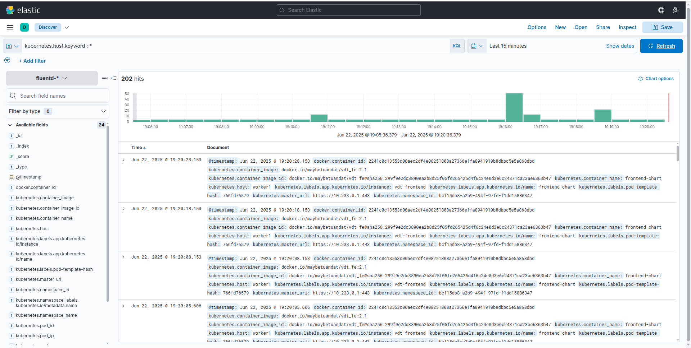

# Logging (1.5đ)

## Yêu cầu
Sử dụng **Ansible Playbooks** để triển khai stack **EFK** (Elasticsearch, Fluentd, Kibana), sau đó cấu hình logging cho **web service** và **api service**, đảm bảo khi có HTTP request gửi vào thì log ghi nhận đầy đủ thông tin sau:

- **Request Path** (VD: `/api1/1`, `/api2/3`, ...)
- **HTTP Method** (GET, POST, PUT, DELETE, ...)
- **Response Code** (200, 201, 202, 302, ...)

---

## Triển khai

Khi cụm k8s được chạy, log sẽ được lưu ở `/var/log/container` trên node mà chạy pods



### 1. Chuẩn bị log cho backend và frontend

#### 1.1. Backend
- Thực hiện thêm thư viện


- Thực hiện tạo một class có trách nhiệm format và đẩy ra log khi có request gửi đến


- Thực hiện cấu hình trong file application.properties



- File sử dụng để định dạng log



#### 1.2 Frontend
- Thực hiện cấu hình lại file configmap của frontend: [Configmap Frontend](https://github.com/Maybetuandat/vdt_2025_frontend/blob/main/helm-chart/templates/configmap.yaml)

### 2. Tạo configmap để customize cấu hình fluent.conf mặc định

```yaml
<source>
  @type tail
  @id in_tail_container_logs
  path /var/log/containers/*.log
  pos_file /var/log/fluentd-containers.log.pos
  tag kubernetes.*
  read_from_head true
  exclude_path ["/var/log/containers/fluent*", "/var/log/containers/elasticsearch*", "/var/log/containers/kibana*"]
  <parse>
    @type cri
  </parse>
</source>

<filter kubernetes.**>
  @type kubernetes_metadata
  @id filter_kube_metadata
  kubernetes_url "https://#{ENV['KUBERNETES_SERVICE_HOST']}:#{ENV['KUBERNETES_SERVICE_PORT']}"
  verify_ssl false
  ca_file /var/run/secrets/kubernetes.io/serviceaccount/ca.crt
  bearer_token_file /var/run/secrets/kubernetes.io/serviceaccount/token
</filter>


<filter kubernetes.**>
  @type grep
  <regexp>
    key $.kubernetes.namespace_name
    pattern ^(vdt-app|default)$
  </regexp>
</filter>

<match kubernetes.**>
  @type copy
  <store>
    @type stdout
    @id out_stdout
  </store>
  <store>
    @type elasticsearch
    @id out_es
    @log_level info
    host elasticsearch.efk-logging.svc.cluster.local
    port 9200
    scheme http
    logstash_format true
    logstash_prefix fluentd
    suppress_type_name true
    include_timestamp true
    <buffer>
      @type memory
      flush_mode interval
      flush_interval 5s
      chunk_limit_size 1M
      retry_type exponential_backoff
      retry_max_times 3
      retry_max_interval 30
    </buffer>
  </store>
</match>
```

### 3. Kết quả

Các log được tạo bởi API service, Web service đã có đầy đủ 3 thành phần quan trọng:
- **Request Path** (được đặt tên key là 'request_path')
- **HTTP Method** (được đặt tên key là 'http_method')
- **Response Code** (được đặt tên key là 'response_code')

Ngoài ra còn có log được tạo từ cụm K8s.

#### Log được hiển thị trên giao diện Kibana khi truy cập vào API backend





#### Log được hiển thị khi truy cập vào giao diện frontend



#### Log hiển thị của hệ thống cụm k8s



## Kết luận

- Hệ thống logging EFK đã được triển khai thành công và hoạt động ổn định. Cấu hình Fluentd thu thập log từ tất cả container trong cụm Kubernetes và chuyển tiếp đến Elasticsearch để lưu trữ và đánh index.

- Backend Spring Boot và Frontend Nginx đều đã được cấu hình để ghi log chi tiết cho mỗi HTTP request, bao gồm đầy đủ thông tin về Request Path, HTTP Method và Response Code như yêu cầu. Định dạng log được chuẩn hóa để dễ dàng tìm kiếm và phân tích.

- Kibana cung cấp giao diện trực quan để truy vấn và visualize log data. 

## Tổng thể
EFK đã đáp ứng đầy đủ yêu cầu về logging cho hệ thống microservices, cung cấp khả năng observability toàn diện và reliable cho production environment.