# Security

## Yêu cầu 1 (1đ)

### Mô tả yêu cầu

1. **Dựng HAProxy Loadbalancer** *(0.5đ)*
   - Triển khai trên 1 VM riêng (trong trường hợp cụm lab riêng của sinh viên)
   - Sử dụng mode TCP
   - Mở port trên LB trỏ đến NodePort của App trên K8S Cluster

2. **Sử dụng giải pháp Ingress** *(0.5đ)*
   - Triển khai Ingress cho các deployment
   - Đảm bảo các truy cập đến các port App sử dụng HTTPS
   - **Lưu ý**: Cho phép sinh viên sử dụng self-signed cert để làm bài

---

## Output 1

### Các file cần nộp:

- **File cấu hình của HAProxy Loadbalancer** cho App
- **File cấu hình ingress**
- **Kết quả truy cập** vào App từ trình duyệt thông qua giao thức HTTPS hoặc dùng curl

---

## 1. Dựng HAProxy Loadbalancer

### 1.1 Tạo máy ảo mới

Thực hiện tạo một máy ảo mới với các thông số sau:

- **Tên máy ảo**: HAProxy-LoadBalancer
- **Địa chỉ IP tĩnh**: 192.168.122.121
- **CPU**: 2 cores
- **RAM**: 4GB

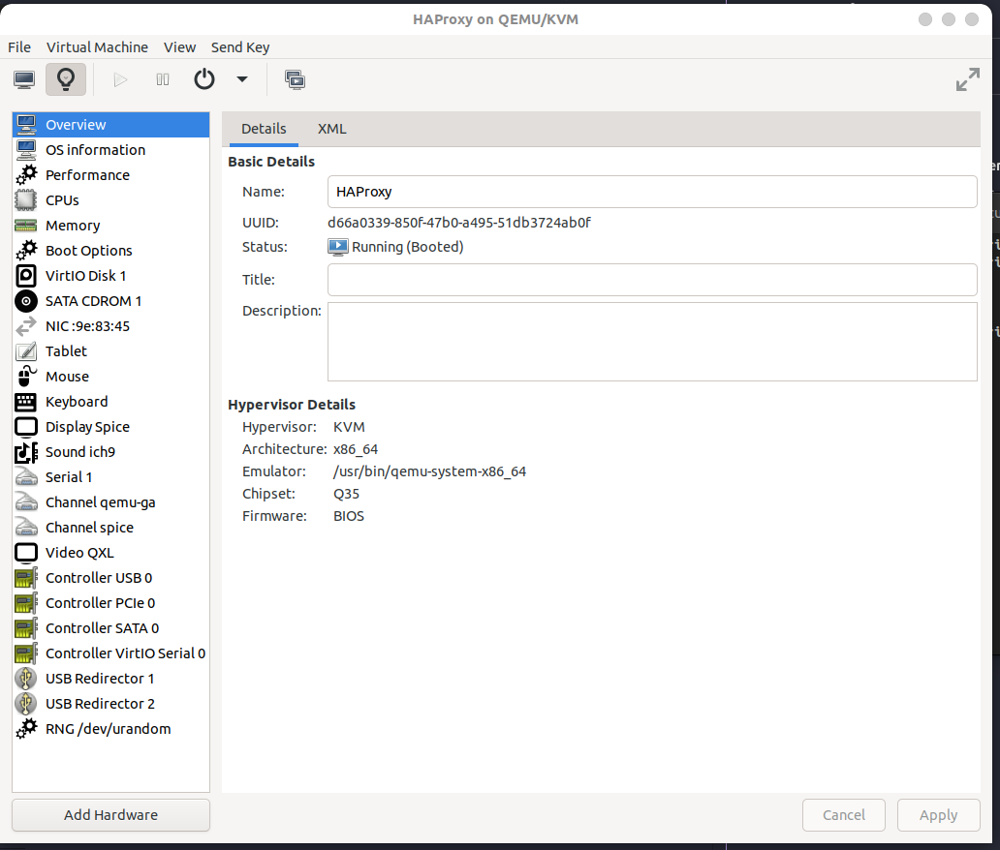

**Cấu hình CPU:**
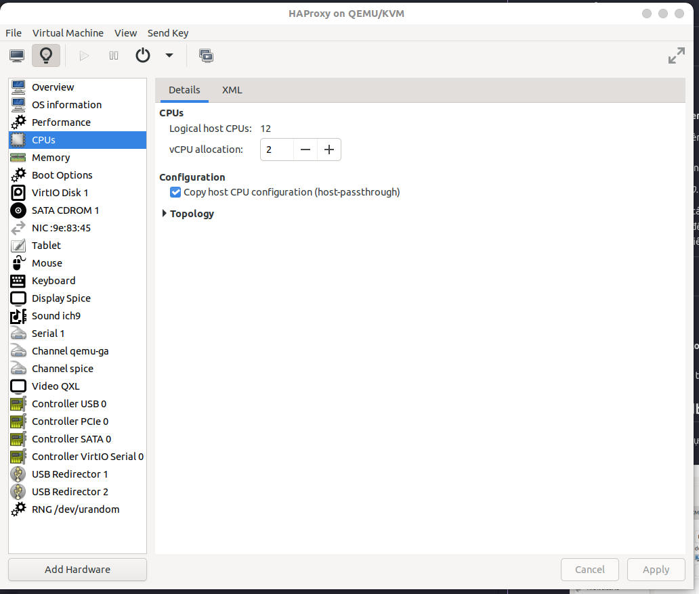

**Cấu hình RAM:**
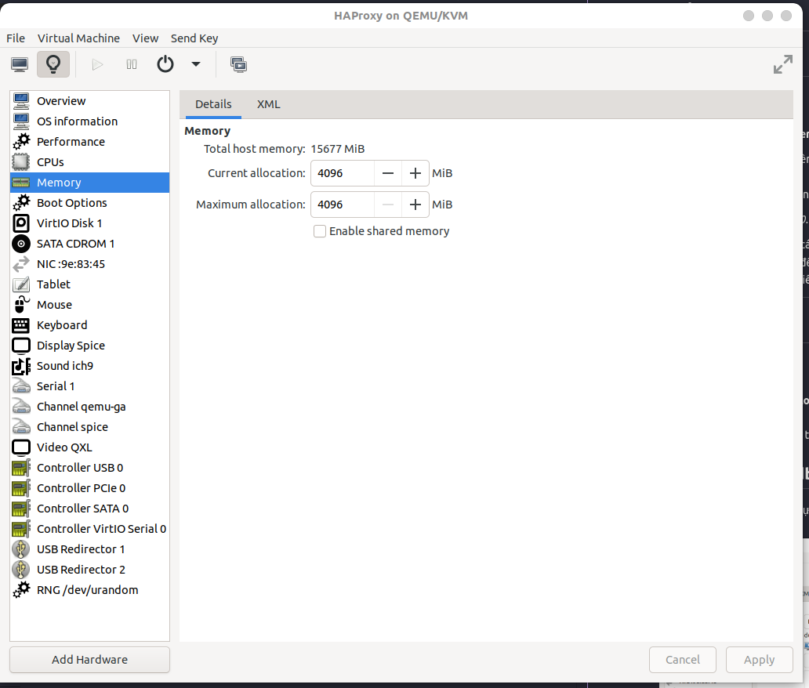

**Cấu hình địa chỉ IP tĩnh:**
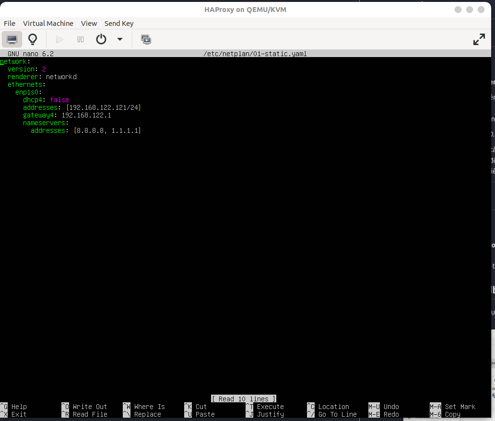

### 1.2 Cài đặt HAProxy

```bash
sudo apt update
sudo apt install haproxy -y
```

### 1.3 Cấu hình HAProxy

**File cấu hình:** `haproxy.cfg`

```bash
global
    daemon
    maxconn 4096
    log stdout local0

defaults
    mode tcp
    timeout connect 5000ms
    timeout client 50000ms
    timeout server 50000ms
    option tcplog
    log global

listen stats
    bind *:8404
    mode http
    stats enable
    stats uri /stats


frontend frontend_http
    bind *:80
    mode http
    redirect scheme https


frontend frontend_https
    bind *:443
    mode tcp
    default_backend backend_ingress_https

backend backend_ingress_https
    mode tcp
    balance roundrobin
    server k8s-node1 192.168.122.93:32368 check
```

---

## 2. Sử dụng giải pháp Ingress

### 2.1 Cài đặt Ingress Controller

```bash
kubectl apply -f https://raw.githubusercontent.com/kubernetes/ingress-nginx/controller-v1.8.1/deploy/static/provider/baremetal/deploy.yaml
```

**Kết quả sau khi cài đặt Ingress Controller:**
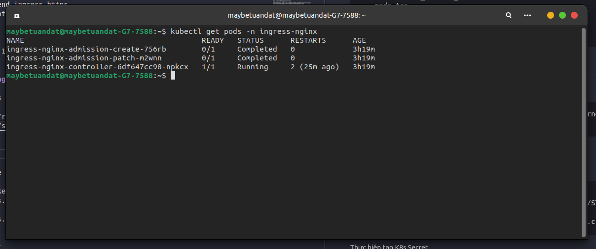

### 2.2 Tạo TLS Certificate

```bash
openssl genrsa -out tls.key 2048
openssl req -new -key tls.key -out tls.csr -subj "/C=VN/ST=Hanoi/L=Hanoi/O=VDT2025/CN=*.vdt-app.local"
openssl x509 -req -in tls.csr -signkey tls.key -out tls.crt -days 365 -extensions v3_req
```

### 2.3 Tạo Kubernetes Secret

```bash
kubectl create secret tls vdt-tls-secret \
  --cert=tls.crt \
  --key=tls.key \
  -n vdt-app
```

### 2.4 Cấu hình Ingress

**File cấu hình Ingress cho các service:**

- **Backend Ingress**: [ingress.yaml](https://github.com/Maybetuandat/vdt_2025_backend/blob/main/backend-chart/templates/ingress.yaml)
- **Frontend Ingress**: [ingress.yaml](https://github.com/Maybetuandat/vdt_2025_frontend/blob/main/helm-chart/templates/ingress.yaml)

### 2.5 Cấu hình DNS

Thêm các domain vào file `/etc/hosts` trỏ đến địa chỉ IP của HAProxy:

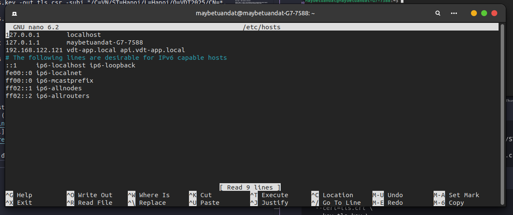

---

## 3. Kết quả kiểm tra

### 3.1 Truy cập Frontend

**URL**: `https://vdt-app.local`

**Cảnh báo SSL Certificate:**
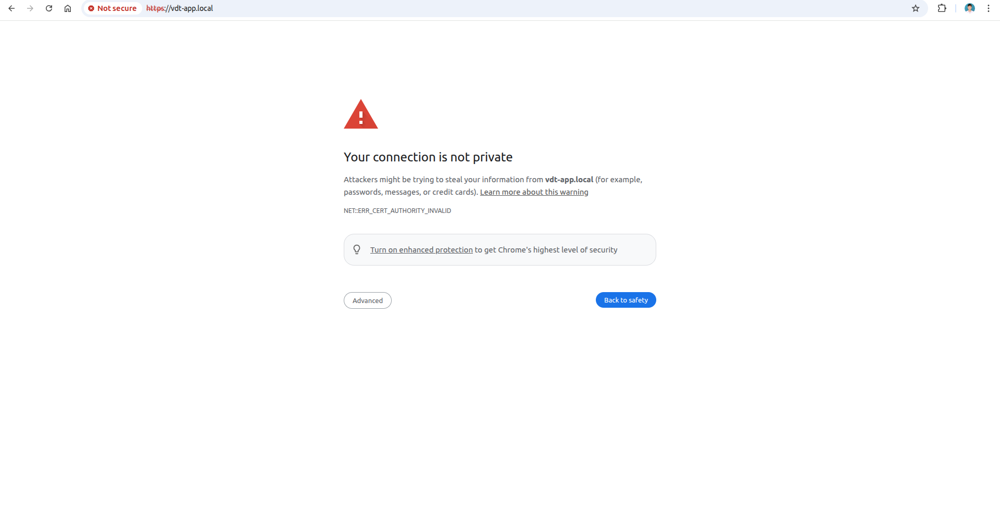

Do sử dụng self-signed certificate, trình duyệt sẽ hiển thị cảnh báo bảo mật. Cần xác nhận để tiếp tục.

**Giao diện Frontend sau khi xác nhận:**


### 3.2 Truy cập Backend API

**URL**: `https://api.vdt-app.local`

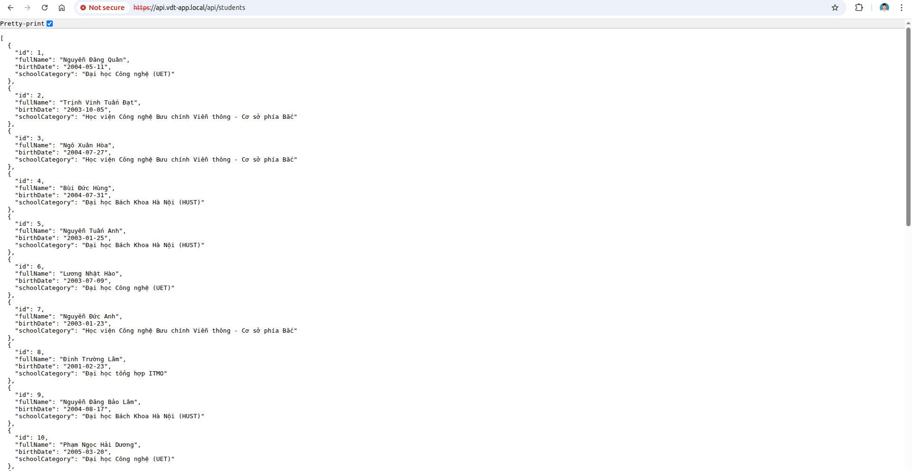

### 3.3 Monitoring HAProxy

**Thống kê HAProxy Stats:**
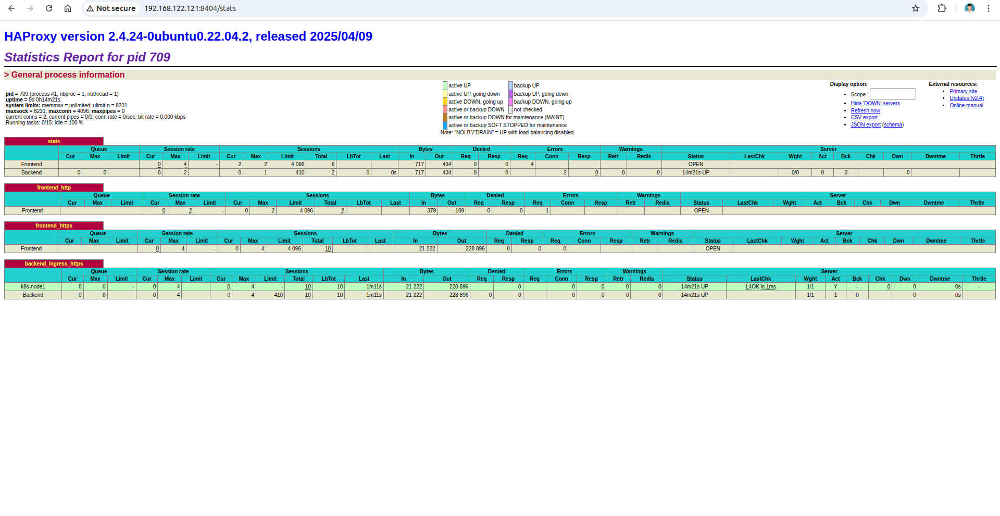

### 3.4 Trạng thái Ingress trong Kubernetes

**Ingress running trong namespace vdt-app:**
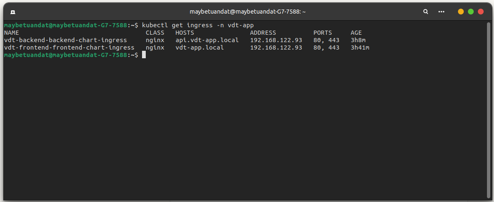

**Chi tiết Ingress Controller:**
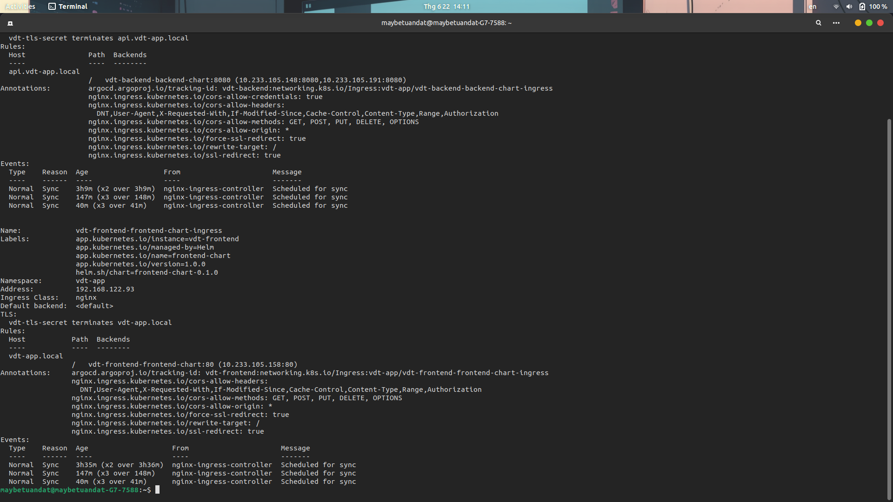

---

## Kết luận

Đã hoàn thành triển khai thành công:

1. **HAProxy Loadbalancer** với mode TCP trên VM riêng
2. **Ingress Controller** với SSL/TLS termination
3. **Self-signed Certificate** cho HTTPS
4. **Routing** cho cả Frontend và Backend API
5. **Monitoring** thông qua HAProxy Stats

