# Security Authentication và Authorization - JWT Authentication

## 1. Yêu cầu

Thực hiện xác thực và phân quyền cho API service với các yêu cầu sau:

### 1.1 Yêu cầu xác thực (0.5 điểm)
- Đảm bảo một số URL của API service khi truy cập phải có xác thực thông qua một trong số các phương thức: cookie, basic auth, token auth
- Nếu không có token hoặc token không hợp lệ sẽ trả về HTTP response code 403

### 1.2 Yêu cầu phân quyền (0.5 điểm)
- **Người dùng có role USER**: 
  - Truy cập vào GET request trả về code 200
  - Truy cập vào POST/DELETE thì trả về 403
- **Người dùng có role ADMIN**: 
  - Truy cập vào GET request trả về code 200
  - Truy cập vào POST/DELETE thì trả về 2xx

### 1.3 Output yêu cầu
- File trình bày giải pháp sử dụng để authen/authorization cho các service
- Kết quả HTTP Response khi curl hoặc dùng postman gọi vào các URL khi truyền thêm thông tin xác thực và khi không truyền thông tin xác thực
- Kết quả HTTP Response khi curl hoặc dùng postman vào các URL với các method GET/POST/DELETE khi lần lượt dùng thông tin xác thực của các user có role là user và admin

---

## 2. Giải pháp đề xuất

Sử dụng **Spring Security** kết hợp **JWT (JSON Web Token)** để thực hiện xác thực và phân quyền người dùng.

**Tài liệu tham khảo:** [Spring Boot 3.0 JWT Authentication with Spring Security](https://www.geeksforgeeks.org/spring-boot-3-0-jwt-authentication-with-spring-security-using-mysql-database/)

---

## 3. Thiết kế kiến trúc cho Authentication/Authorization

### 3.1 Mô hình cơ sở dữ liệu

#### 3.1.1 Quan hệ giữa các entity
Thực hiện tạo thêm thực thể **User** và **Role** với quan hệ Many-to-Many (n-n)

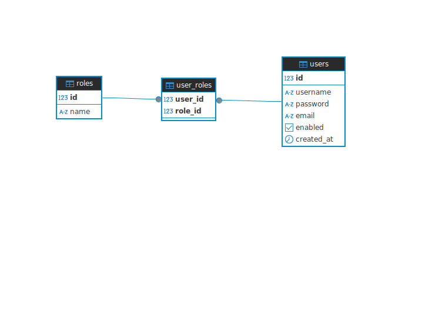

#### 3.1.2 Bảng Role
Bảng **Role** sẽ gồm 2 role chính là **ADMIN** và **USER**

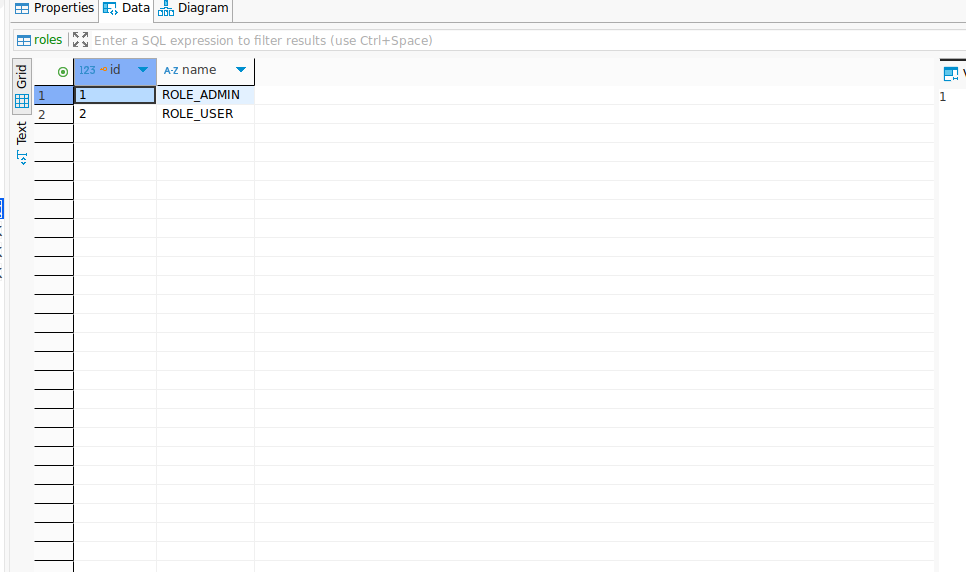

#### 3.1.3 Bảng User
Bảng **User** sẽ có các thông tin cơ bản của user (username, password, email...)

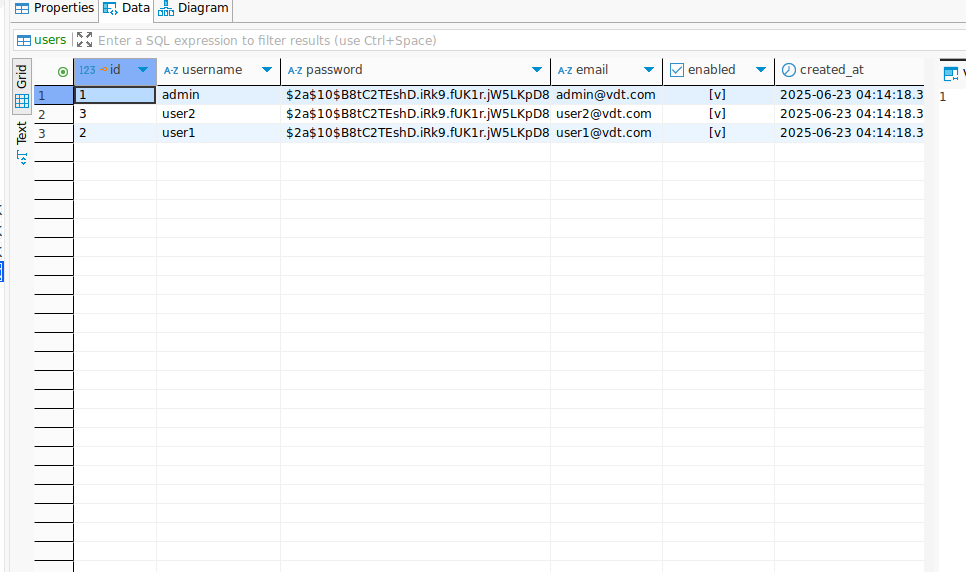

#### 3.1.4 Bảng User_Role
Do hai bảng có quan hệ n-n nên sinh ra bảng trung gian **User_Role** chứa user_id và role_id là foreign key

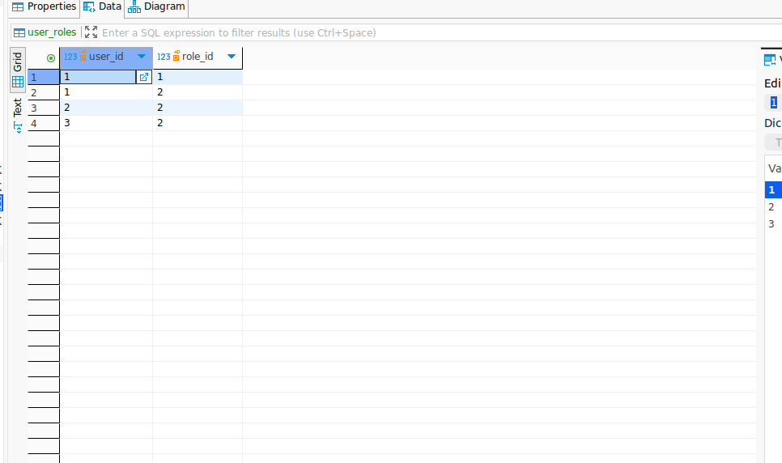

### 3.2 Cấu trúc thiết kế
- **Entity User**: Chứa thông tin người dùng
- **Entity Role**: Chứa thông tin vai trò
- **Entity UserRole**: Bảng trung gian liên kết User và Role
- **JWT Utility**: Xử lý sinh và xác thực JWT token
- **Security Configuration**: Cấu hình bảo mật cho Spring Security
- **Authentication Controller**: Xử lý đăng nhập và đăng ký

---

## 4. Các bước thực hiện

### Bước 1: Thêm Dependencies
Thêm các dependency cần thiết vào file `pom.xml` bao gồm:
- Spring Security Starter
- JWT API và implementation libraries
- BCrypt cho mã hóa password

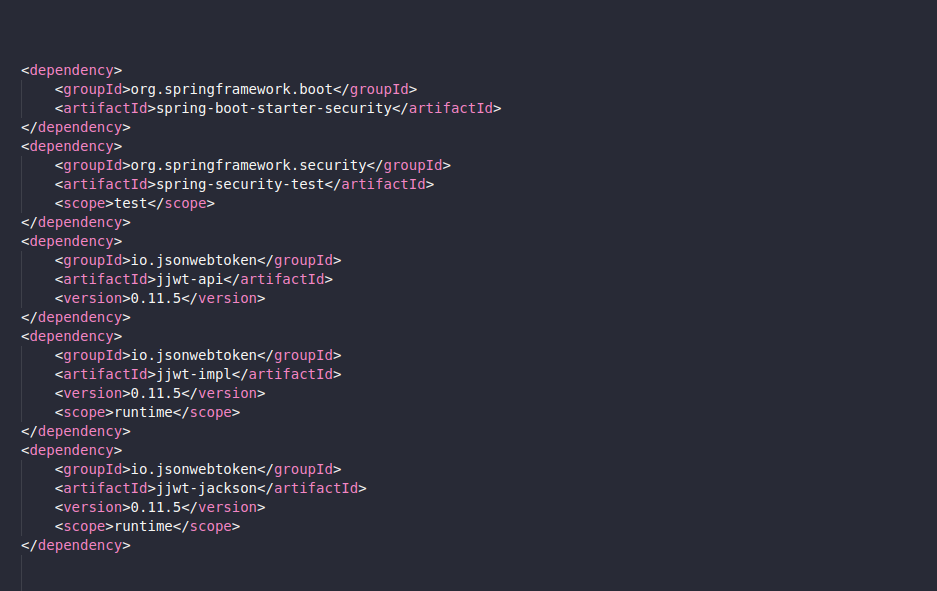

### Bước 2: Cấu hình Security Config
Tạo class **SecurityConfig** để cấu hình Spring Security các rule phân quyền:
- Cho phép truy cập không cần xác thực với endpoint `/auth/**`
- Yêu cầu role USER hoặc ADMIN cho GET requests đến `/api/students/**`
- Yêu cầu role ADMIN cho POST/PUT/DELETE requests đến `/api/students/**`

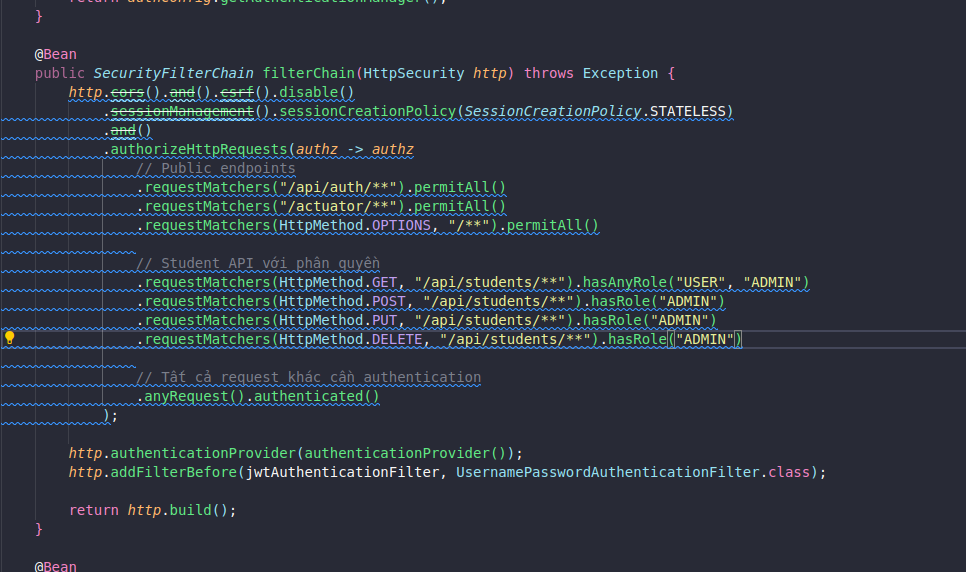

### Bước 3: Tạo JWT Authentication Filter
Tạo class **JwtAuthenticationFilter** extends OncePerRequestFilter:
- Đọc JWT token từ Authorization header (Bearer token)
- Validate token và extract username
- Set authentication context cho request
- Xử lý các exception khi token không hợp lệ

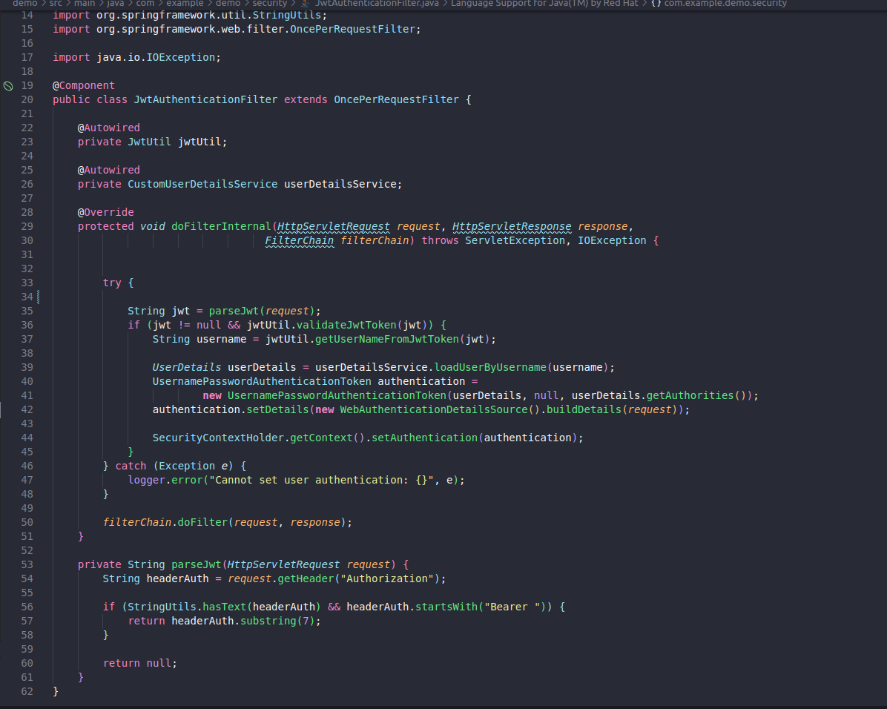

### Bước 4: Tạo JWT Utility
Tạo class **JwtUtil** để quản lý JWT token:
- Generate JWT token với username và roles
- Validate token signature và expiration

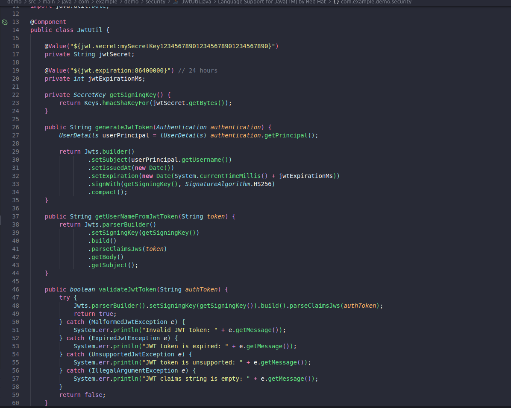

### Bước 5: Tạo Authentication Controller
Tạo class **AuthenticationController** để xử lý:
- Login endpoint (`/auth/login`) - nhận username/password, trả về JWT token

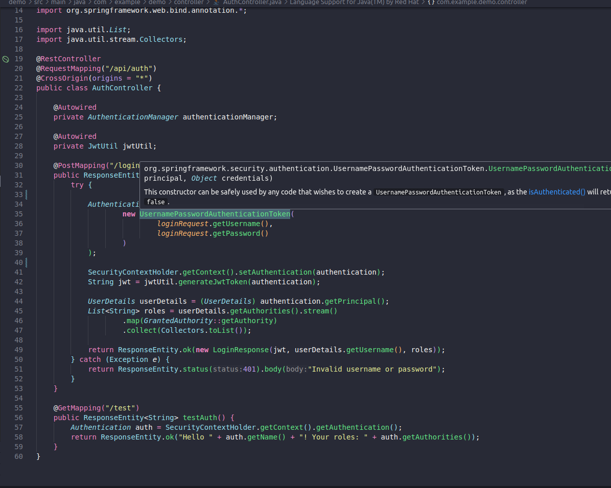

---

## 5. Kết quả kiểm thử với Postman

### 5.1 Test với user có role USER

#### 5.1.1 Đăng nhập và nhận JWT token
Thực hiện đăng nhập với user có role USER và nhận JWT token để sử dụng cho các request tiếp theo.

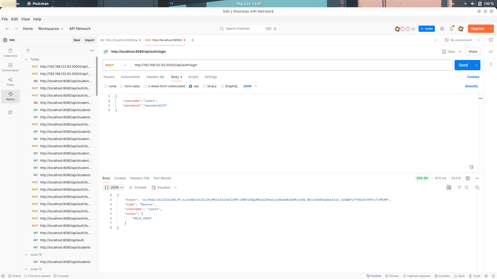

#### 5.1.2 Test GET requests (Thành công - 200)
Thực hiện test các API GET như `/api/students` và `/api/students/2`. Khi request cần đính kèm JWT token vào trong header Authorization.

**GET /api/students:**

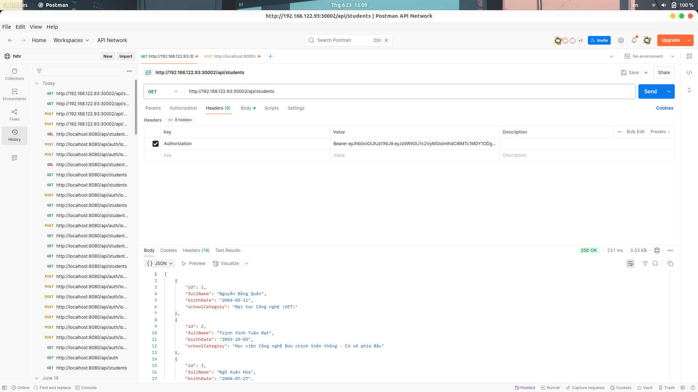

**GET /api/students/2:**

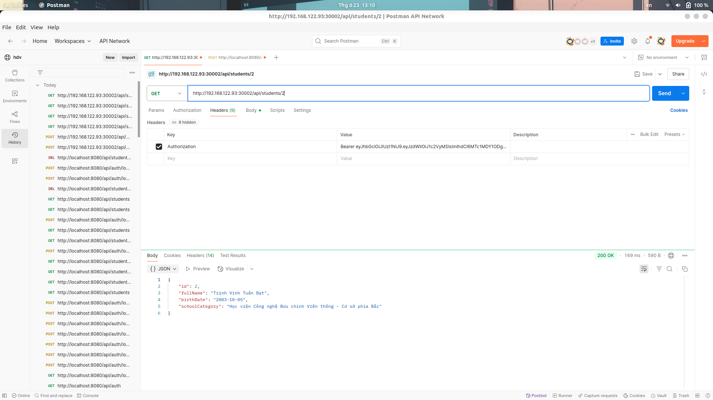

**Kết quả:** Trả về status code 200 và dữ liệu sinh viên

#### 5.1.3 Test POST/PUT/DELETE requests (Thất bại - 403)
Do đăng nhập bằng role USER nên không có quyền thực thi các method POST/DELETE.

**POST request:**


**DELETE request:**

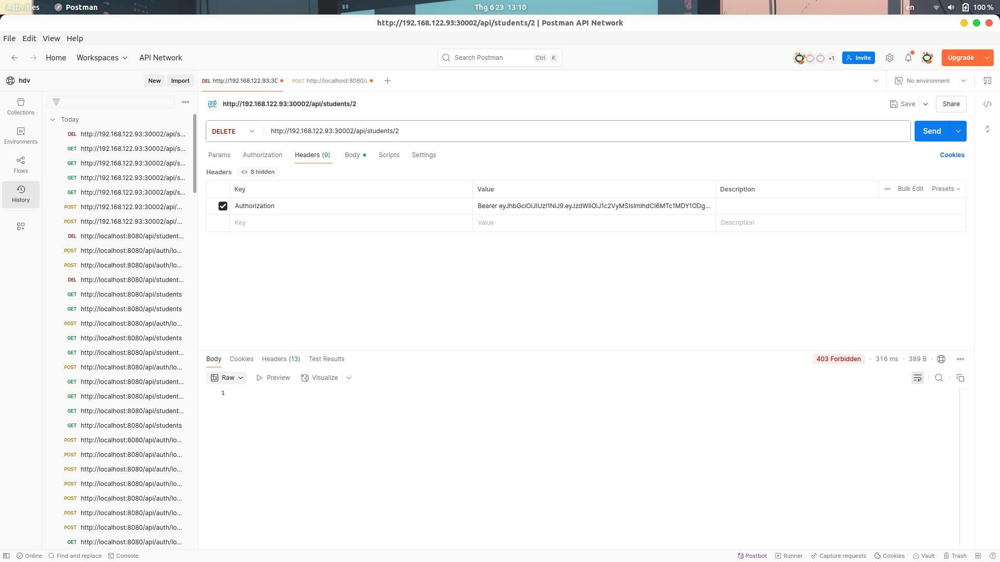

**Kết quả:** Trả về status code 403 Forbidden cho tất cả các method này

### 5.2 Test với user có role ADMIN

#### 5.2.1 Đăng nhập và nhận JWT token
Thực hiện đăng nhập với user có role ADMIN và nhận JWT token với quyền cao hơn.

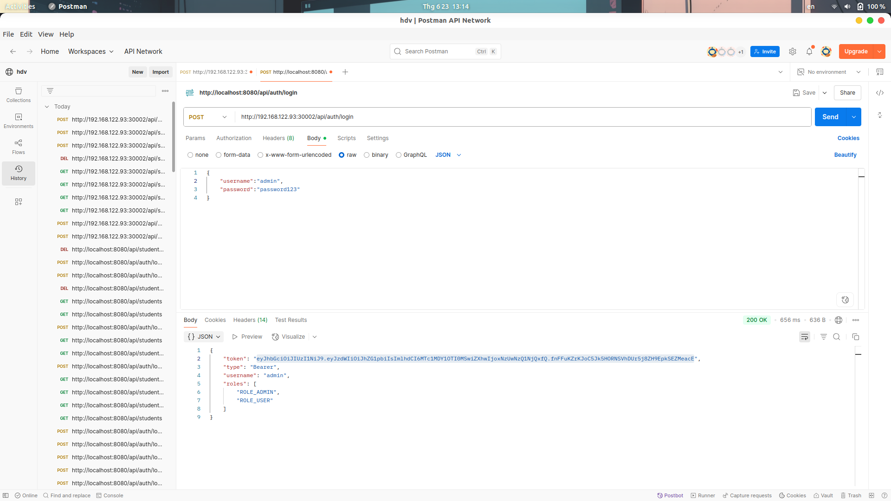

#### 5.2.2 Test GET requests (Thành công - 200)
Thực hiện GET students với token của admin.

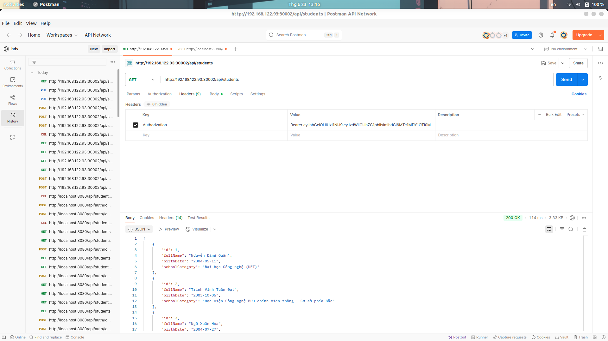

**Kết quả:** Trả về status code 200 và dữ liệu sinh viên

#### 5.2.3 Test DELETE requests (Thành công - 200)
Thực hiện xóa sinh viên.

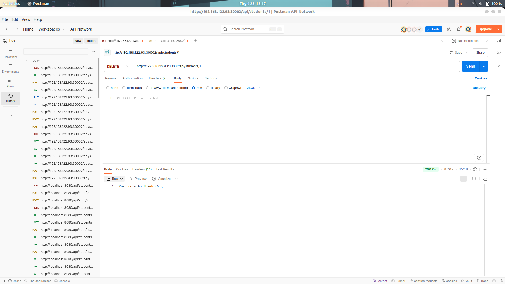

**Kết quả:** Trả về status code 200, sinh viên được xóa thành công

#### 5.2.4 Test POST requests (Thành công - 201)
Thực hiện thêm sinh viên mới với request body:

```json
{
  "fullName": "Nguyen Van A",
  "birthDate": "2005-08-15",
  "schoolCategory": "High School"
}
```


**Kết quả:** Trả về status code 201, sinh viên được tạo thành công

#### 5.2.5 Test PUT requests (Thành công - 200)
Thực hiện update students thành công (sửa fullName từ "Nguyen Van A" thành "Trịnh Vinh Tuấn Đạt").

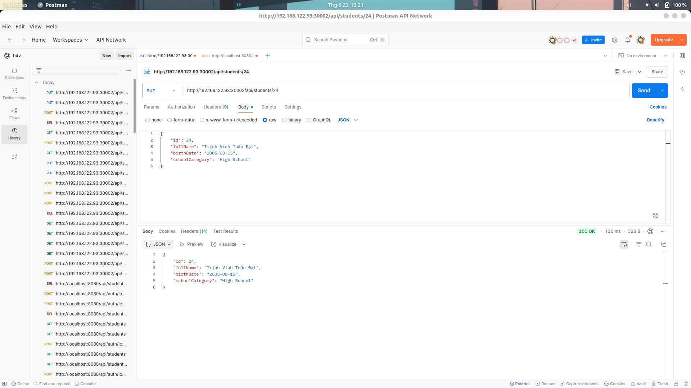

**Kết quả:** Trả về status code 200, thông tin sinh viên được cập nhật

### 5.3 Test trường hợp không có token (Thất bại - 403)
Bỏ header JWT token và thực hiện lại method PUT.


**Kết quả:** Trả về lỗi 403 Forbidden do không có token xác thực

---

## 6. Kết luận

Hệ thống xác thực và phân quyền đã được triển khai thành công với các tính năng:

- **Xác thực JWT token**
- **Phân quyền chính xác** theo role USER và ADMIN
- **Bảo mật API endpoints** theo yêu cầu đề bài
- **Response code chính xác** (200, 201, 403) tương ứng với từng trường hợp