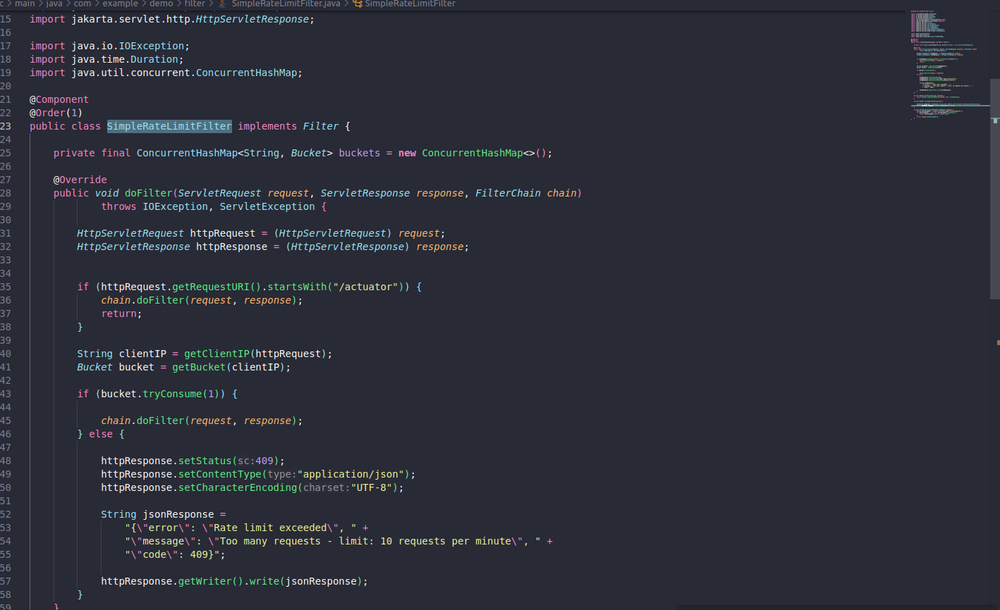
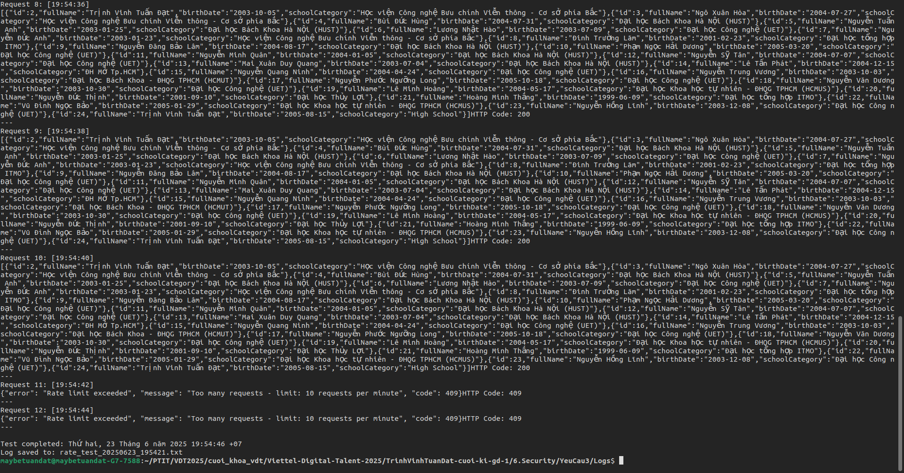

# Yêu cầu 3 (1đ): Rate Limiting

## Yêu cầu
Sử dụng 1 trong số các giải pháp để rate limit cho Endpoint của API Service, sao cho nếu có quá **10 request trong 1 phút** gửi đến Endpoint của API service thì các request sau đó bị trả về **HTTP Response 409**.

---

## Giải pháp đề xuất

Thực hiện đưa ra 2 giải pháp được đưa ra: 
- **Rate limit ở HAProxy**
- **Rate limit ở backend**


## 1. Rate Limit ở HAProxy

### Mô tả luồng hoạt động
Sau khi thành công dựng lên HAProxy, luồng hoạt động khi thực hiện một request sẽ là:

```
Browser -> HAProxy -> Ingress Controller -> Backend
                                         -> Frontend
```

Do đó có thể đưa ra giải pháp cho việc rate limit sẽ xử lý ngay ở HAProxy. Khi trong một phút có request > 10 sẽ thực hiện trả về mã lỗi 409. Đây cũng là một trong những giải pháp hiện nay đối với các hệ thống để phòng chống DDOS.

### Cấu hình HAProxy

Thực hiện sửa file `haproxy.cfg`:

```bash
global
    daemon
    maxconn 4096
    log stdout local0

defaults
    mode tcp
    timeout connect 5000ms
    timeout client 50000ms
    timeout server 50000ms
    option tcplog
    log global
listen stats
    bind *:8404
    mode http
    stats enable
    stats uri /stats
frontend frontend_http
    bind *:80
    mode http
    redirect scheme https

frontend frontend_https
    bind *:443
    mode tcp
    default_backend backend_ingress_https

frontend api_proxy
    bind *:8080
    mode http
    option httplog
    
    
    stick-table type ipv6 size 100k expire 60s store http_req_rate(60s)
    
    
    http-request track-sc0 src
    
    
    http-request return status 409 content-type "application/json" string '{"error":"Rate limit exceeded","message":"Maximum 10 requests per minute allowed","code":429}' if { sc_http_req_rate(0) gt 10 }
    
    default_backend api_backend

backend api_backend
    mode http
    balance roundrobin
    option httpchk GET /actuator/health
    
    server api1 192.168.122.93:30002 check inter 5s fall 3 rise 2

backend backend_ingress_https
    mode tcp
    balance roundrobin
    server k8s-node1 192.168.122.93:32368 check
```

### Tài liệu tham khảo
Dựa trên trang tài liệu chính thức của HAProxy:
1. [Four Examples of HAProxy Rate Limiting](https://www.haproxy.com/blog/four-examples-of-haproxy-rate-limiting)
2. [Traffic Policing](https://www.haproxy.com/documentation/haproxy-configuration-tutorials/security/traffic-policing/)

## 2. Kiểm thử Rate Limiting

### Script test
Câu lệnh thực hiện test và log khi thực hiện curl:

```bash
LOG_FILE="rate_test_$(date '+%Y%m%d_%H%M%S').txt"
LOG_ID="TEST_$(date '+%Y%m%d%H%M%S')"

{
    echo "=== Rate Limiting Test - ID: $LOG_ID ==="
    echo "Time: $(date)"
    echo ""
    
    for i in {1..12}; do
        echo "Request $i: [$(date '+%H:%M:%S')]"
        curl -s -w "HTTP Code: %{http_code}\n" http://192.168.122.121:8080/api/students
        echo "---"
        sleep 2
    done
    
    echo ""
    echo "Test completed: $(date)"
} | tee $LOG_FILE

echo "Log saved to: $LOG_FILE"
```

### Kết quả kiểm thử

**File thực thi lệnh test rate limit:** [Script.sh](Logs/ratelimitwithHAProxy.sh)

**Hình ảnh khi test rate limit:**


**File logs khi thực hiện curl:** [Log rate limit with HAProxy](Logs/rate_test_20250623_103856.txt)

**Hình ảnh thống kê ở HAProxy**

### Phân tích kết quả

Từ kết quả kiểm thử có thể thấy:
- 10 request đầu tiên được xử lý bình thường (HTTP 200)
- Từ request thứ 11 trở đi, HAProxy trả về HTTP 409 với message rate limit exceeded
- Cơ chế rate limiting hoạt động chính xác theo yêu cầu đề bài


## 2. Rate limit ở backend 

### Nguyên lý hoạt động

Rate limiting ở backend được triển khai dựa trên Token Bucket Algorithm với cơ chế hoạt động như sau:

- Mỗi IP client được cấp một bucket riêng biệt để đảm bảo tính độc lập
- Mỗi bucket được cấu hình chứa tối đa 10 tokens trong khoảng thời gian 1 phút
- Sau mỗi phút, bucket sẽ được refill lại đầy đủ 10 tokens
- Mỗi request từ client sẽ tiêu thụ 1 token từ bucket tương ứng với IP của họ
- Khi bucket hết tokens, các request tiếp theo sẽ bị từ chối với mã lỗi 409

### Cách triển khai

**Tài liệu tham khảo:** [Rate Limiting a Spring API Using Bucket4j](https://www.baeldung.com/spring-bucket4j)

**Bước 1: Thêm thư viện Bucket4j**


**Bước 2: Tạo Rate Limiting Filter**



**Bước 3: Kiểm tra kết quả**

Sử dụng script curl để test rate limiting:

```bash
LOG_FILE="rate_test_$(date '+%Y%m%d_%H%M%S').txt"
LOG_ID="TEST_$(date '+%Y%m%d%H%M%S')"

{
    echo "=== Rate Limiting Test - ID: $LOG_ID ==="
    echo "Time: $(date)"
    echo ""
    
    for i in {1..12}; do
        echo "Request $i: [$(date '+%H:%M:%S')]"
        curl -s -w "HTTP Code: %{http_code}\n" http://192.168.122.93:30002/api/students
        echo "---"
        sleep 2
    done
    
    echo ""
    echo "Test completed: $(date)"
} | tee $LOG_FILE

echo "Log saved to: $LOG_FILE"
```

**File thực thi test:** [rateLimitSpring](./Logs/ratelimitinSpring.sh)

### Kết quả kiểm tra

**Kết quả thực thi với curl:**



**File log chi tiết:** [rate_test_20250623_195421.txt](./Logs/rate_test_20250623_195421.txt)

### Kết quả

Giải pháp rate limiting ở backend đã thỏa mãn yêu cầu đề bài:
- Giới hạn 10 requests trong 1 phút 
- Trả về mã lỗi 409 khi vượt quá giới hạn
- Tự động reset sau mỗi phút
- Hoạt động ổn định và hiệu quả
## 3. So sánh hai giải pháp Rate Limiting

### Bảng so sánh tổng quan

| Tiêu chí | HAProxy Rate Limiting | Backend Rate Limiting |
|----------|----------------------|----------------------|
| **Vị trí xử lý** | Load Balancer layer | Application layer |
| **Hiệu năng** | Cao (xử lý ở tầng TCP/HTTP) | Trung bình (xử lý trong application) |
| **Tài nguyên tiêu thụ** | Thấp | Cao hơn (RAM, CPU của backend) |
| **Bảo mật** | Tốt (chặn sớm, bảo vệ backend) | Trung bình (traffic vẫn đến backend) |
| **Cấu hình** | Đơn giản | Cần code và build lại |
| **Monitoring** | HAProxy stats | Application metrics |

# Kết luận

Nhìn chung cả hai giải pháp đều có thể xử lý request limit theo yêu cầu đề bài. Tuy nhiên, giải pháp HAProxy thể hiện ưu thế vượt trội với hiệu năng cao hơn và tiêu thụ ít tài nguyên hệ thống hơn.

HAProxy rate limiting hoạt động ở tầng load balancer, chặn các request vượt ngưỡng trước khi chúng đến backend, từ đó bảo vệ tốt hơn cho hệ thống và tối ưu hóa performance. Trong khi đó, backend rate limiting mặc dù linh hoạt hơn nhưng vẫn để các request đi qua toàn bộ network  trước khi xử lý.

